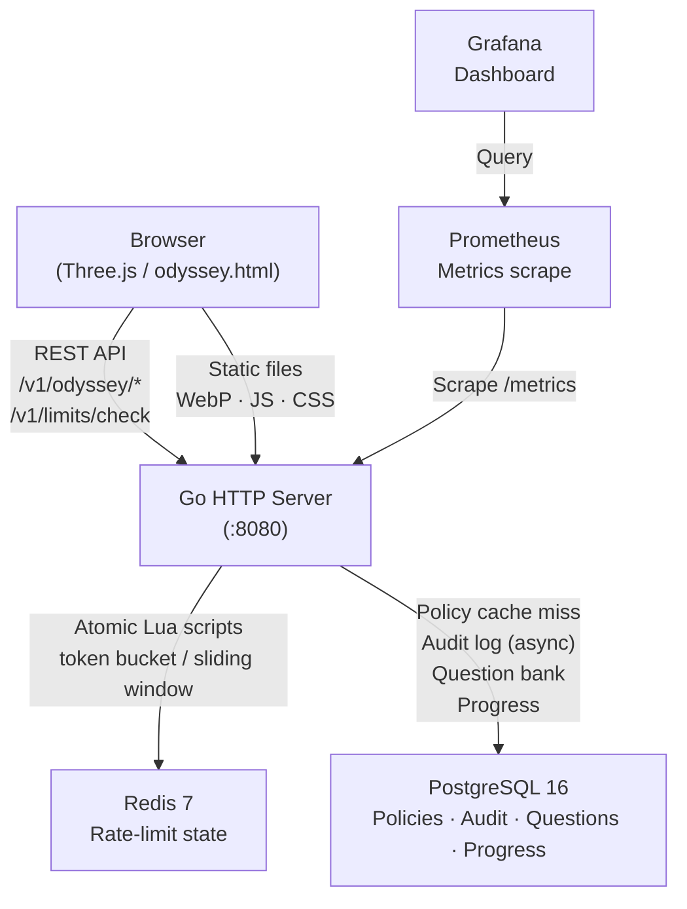
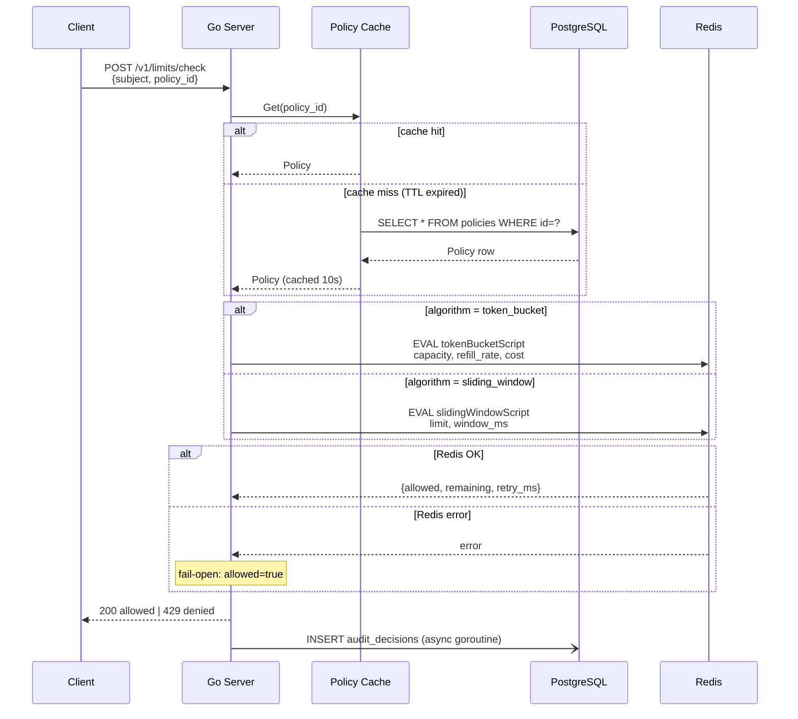
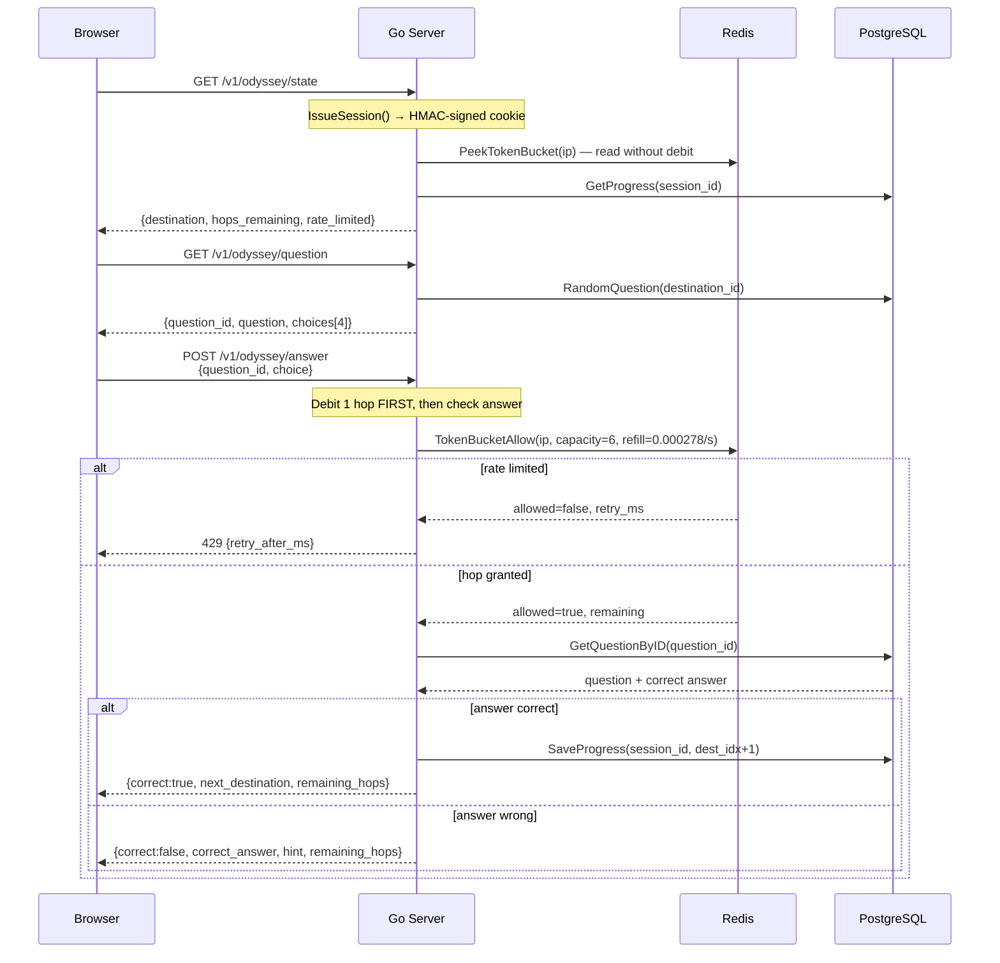
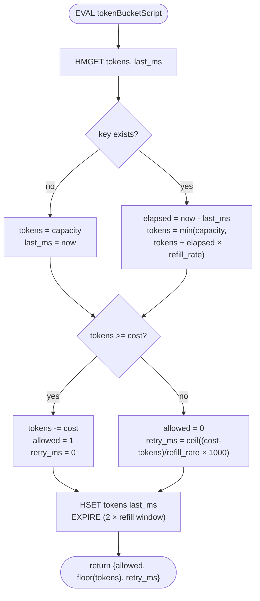
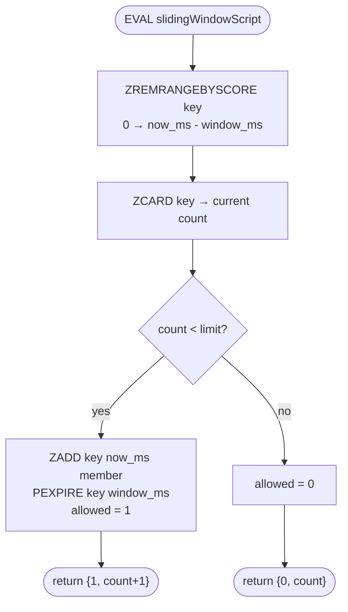
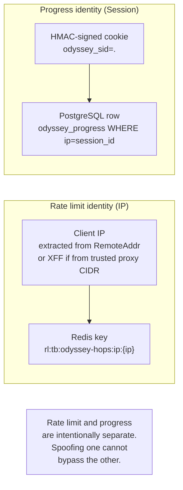
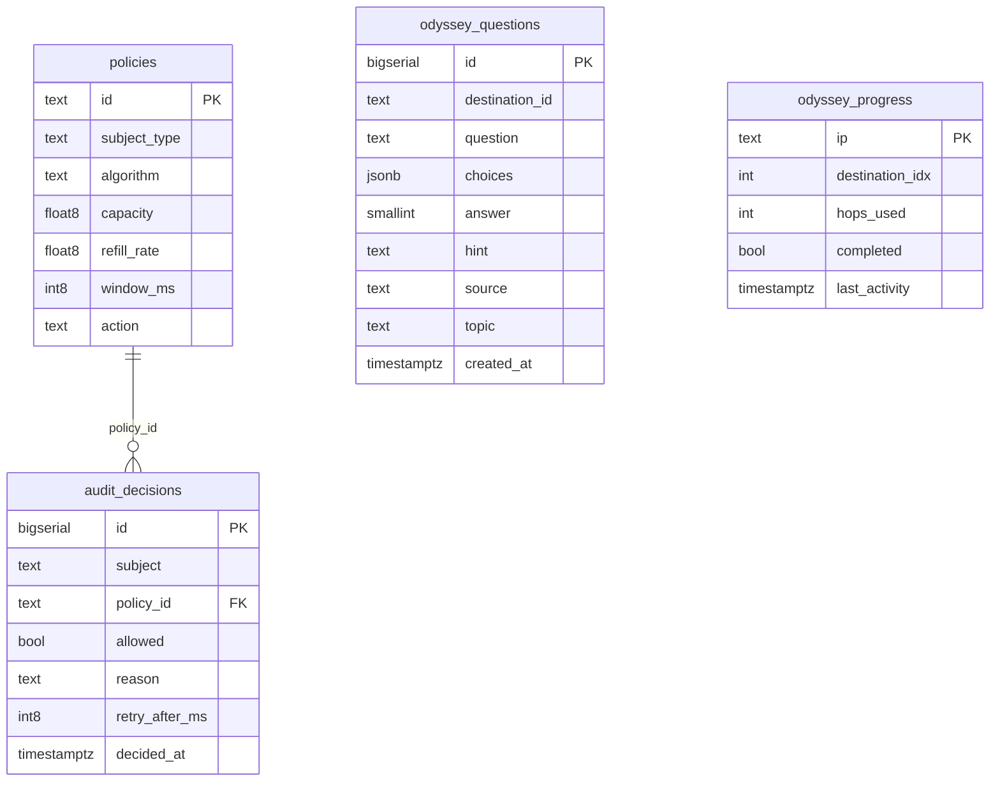
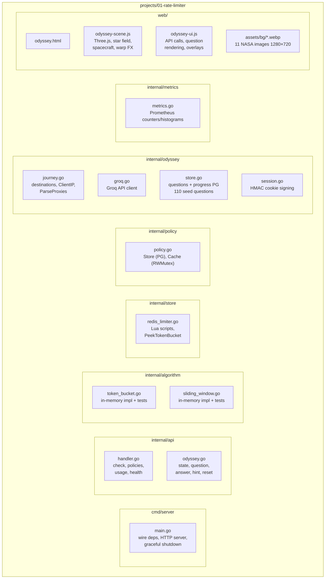

# Architecture — Rate Limiter

## System overview

## Rate-limit check flow

## Interstellar Odyssey — answer flow

## Token bucket algorithm (Redis Lua)

## Sliding window algorithm (Redis Lua)

## Security model

## Data model

## Component layout

