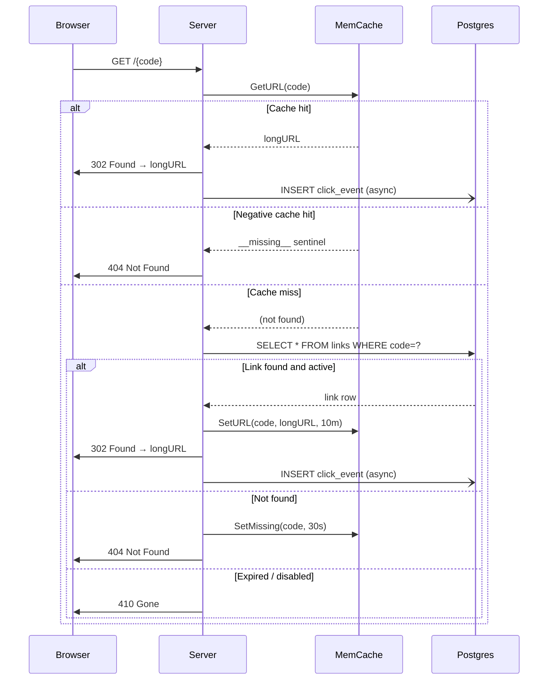
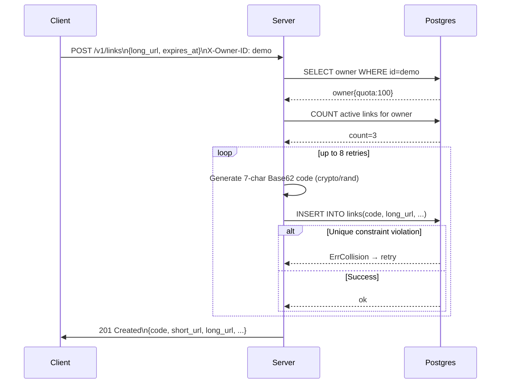
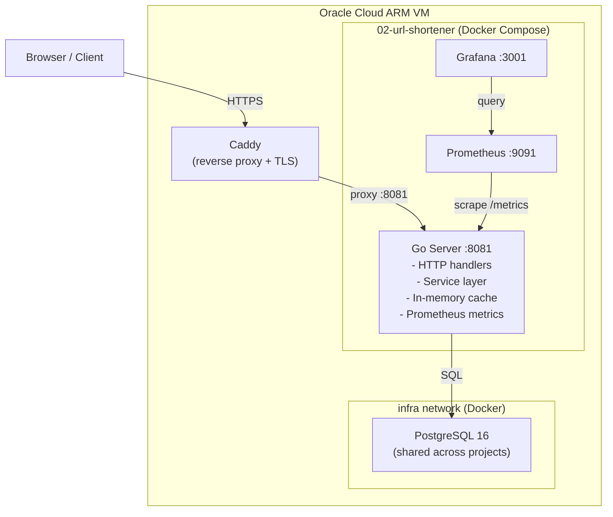
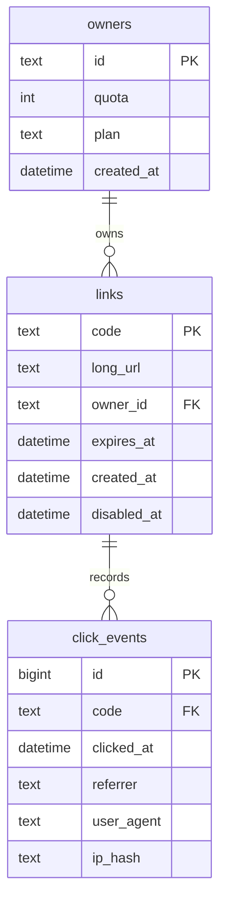
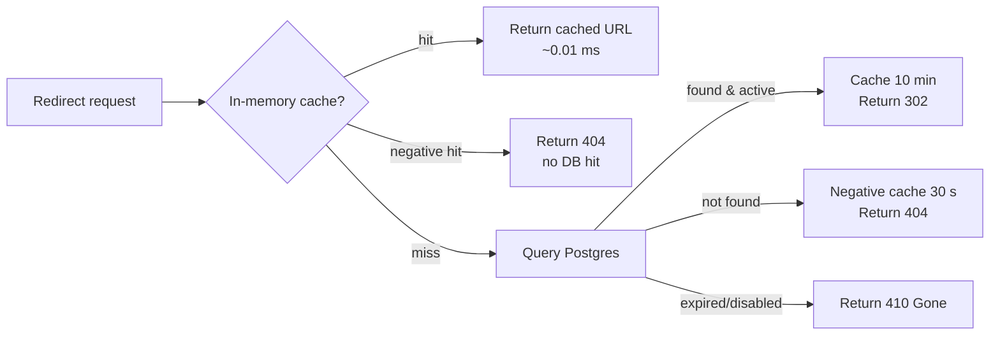
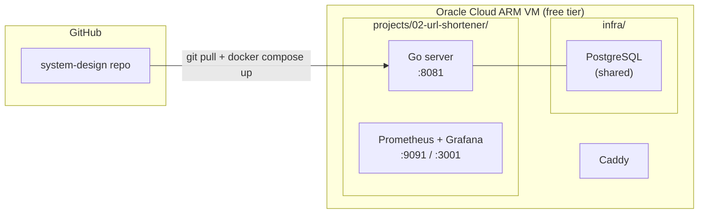

# Architecture — URL Shortener (Project 02)

## Overview

A production-pattern URL shortener built in Go, designed as a study in **read-heavy system design**.
Short codes are 7-character Base62 strings. Redirects are served from an in-memory cache with
PostgreSQL as the durable backing store.  Click events are recorded asynchronously so the redirect
hot-path stays under 1 ms.

---

## Stack

| Layer | Technology | Notes |
|---|---|---|
| HTTP server | Go + gorilla/mux | Single binary, no framework |
| Cache | In-process `sync.Map` + TTL | Replaces Redis; resets on restart |
| Database | PostgreSQL 16 | Shared instance across all projects on the VM |
| Metrics | Prometheus + Grafana | Golden-signals dashboard |
| Reverse proxy | Caddy (host-level) | TLS termination, routes by subdomain |
| Container runtime | Docker + Docker Compose | Multi-stage ARM64 build |

---

## Request Flow — Redirect (hot path)

---

## Request Flow — Create Link

---

## Component Diagram

---

## Database Schema

---

## Caching Strategy

**Why negative caching?**  
A thundering herd of requests for a non-existent code would hammer Postgres.
Caching the 404 for 30 seconds absorbs the burst with zero DB load.

---

## Deployment Topology

---

## Key Design Decisions

| Decision | Choice | Rationale |
|---|---|---|
| Cache backend | In-process `sync.Map` | Eliminates Redis as an external dependency; acceptable for a single-instance demo |
| Redirect status | `302 Found` | Intentional — prevents browsers from caching the redirect, ensuring click events are always recorded |
| Click recording | Async goroutine | Keeps redirect p99 latency unaffected by DB write latency |
| Code generation | `crypto/rand` Base62 | Cryptographically unpredictable — prevents enumeration attacks |
| Negative caching | 30-second TTL sentinel | Absorbs thundering herd on invalid codes without DB fan-out |
| Quota enforcement | Count active links at create time | Simple and consistent; avoids complex distributed counters |
| Shared Postgres | One container, per-project DB | Efficient on a free-tier VM with limited RAM; each project owns its schema |
