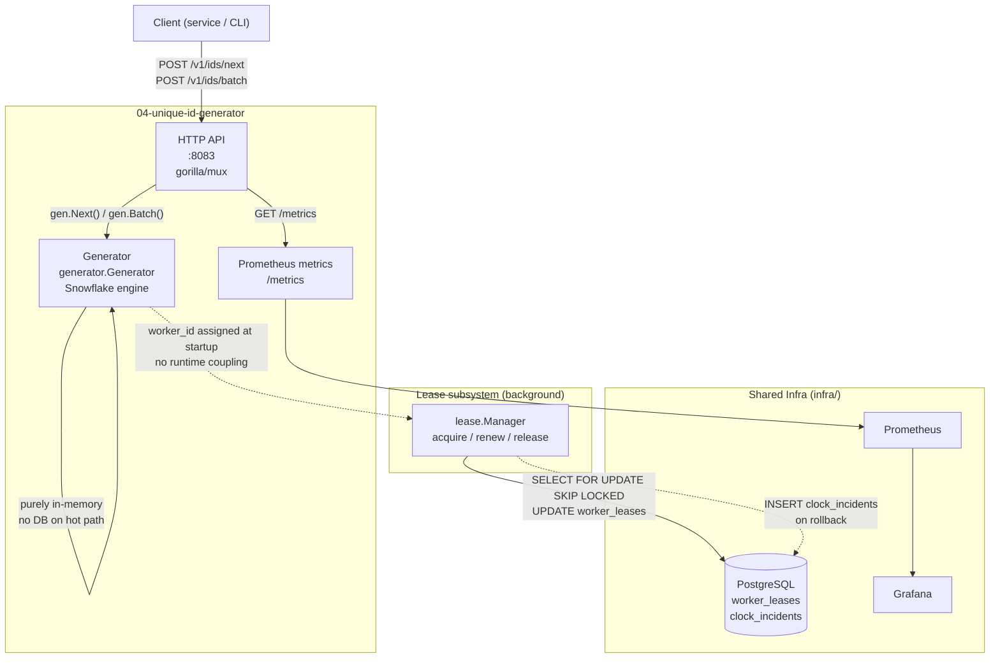
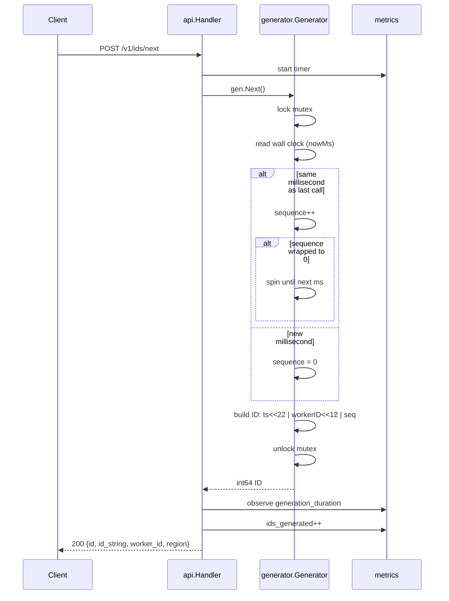
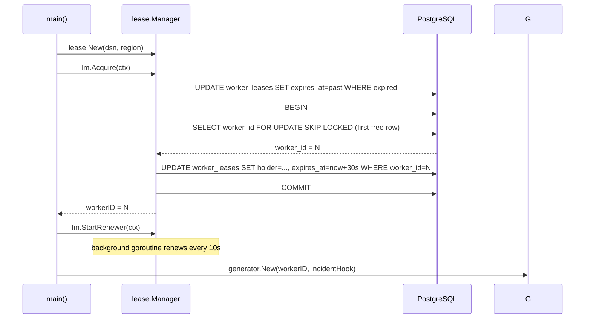

# Architecture — Unique ID Generator

## System diagram



## Sequence diagram — generate a single ID



## Sequence diagram — startup lease acquisition



## Components

### `generator` package
Pure in-memory Snowflake ID engine. Holds a mutex, the last-used millisecond, and a sequence counter. No network or disk I/O on the hot path — a single `Next()` call takes nanoseconds.

### `lease` package
Manages the PostgreSQL-backed worker ID lease. On startup it claims one of the 1024 pre-seeded `worker_leases` rows using `SELECT FOR UPDATE SKIP LOCKED` to prevent two instances claiming the same ID. A background goroutine renews the lease every 10 s; if renewal fails the TTL (30 s) provides a safe runway before the slot is reclaimed.

### `api` package
Thin HTTP transport. Validates inputs, calls the generator, records metrics, and serialises responses. Includes `id_string` alongside `id` in every response because JavaScript loses precision when parsing 64-bit integers from JSON.

### `metrics` package
Registers all Prometheus metrics with `promauto` (auto-registered at init time). HTTP middleware records request count and latency for every route.

### `main`
Wires the above together: wait for PostgreSQL → acquire lease → build generator → start renewer → serve HTTP. On SIGINT/SIGTERM: stop renewer → HTTP graceful shutdown → release lease.

## Data model

```
worker_leases (1024 rows, pre-seeded)
├── worker_id   SMALLINT  PK  0–1023
├── holder      TEXT          empty = unclaimed
├── region      TEXT
└── expires_at  TIMESTAMPTZ   < NOW() = claimable

clock_incidents (append-only audit)
├── id          BIGSERIAL  PK
├── worker_id   SMALLINT   FK → worker_leases
├── drift_ms    BIGINT     magnitude of rollback
└── detected_at TIMESTAMPTZ
```

## Capacity

| Parameter | Value |
|---|---|
| Max workers | 1024 |
| IDs per ms per worker | 4096 |
| Global max throughput | ~4.2 billion IDs/ms |
| Timestamp range | 2020–2089 (69 years) |
| ID size | 8 bytes (int64) |
