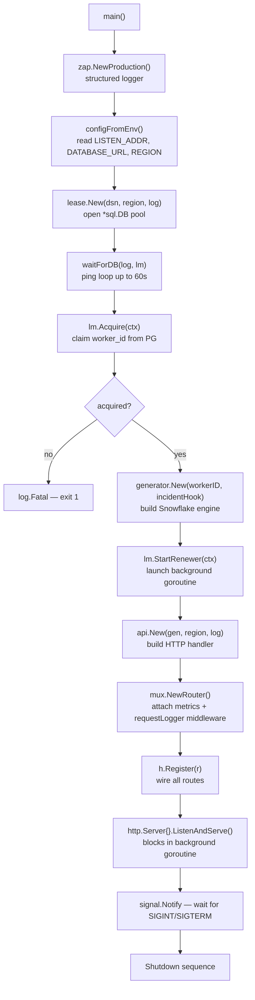
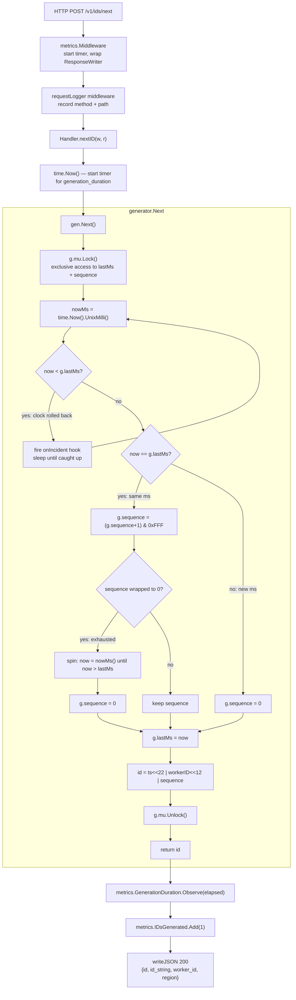
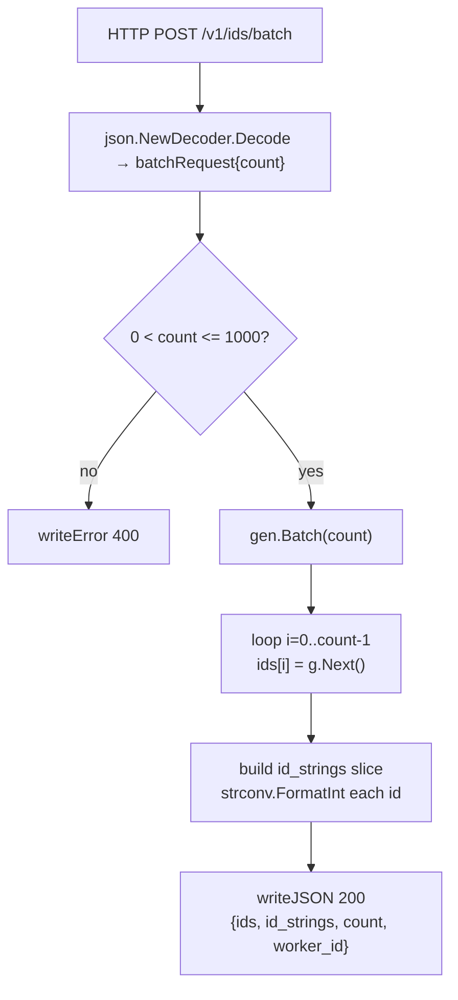
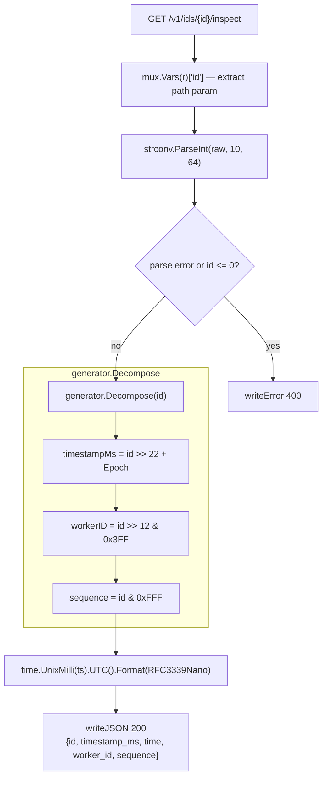
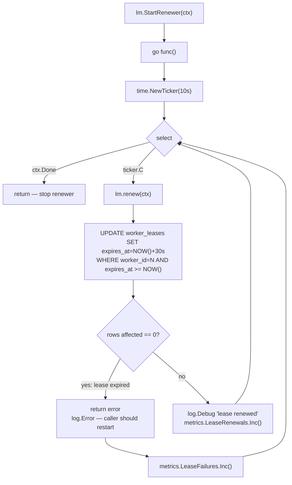
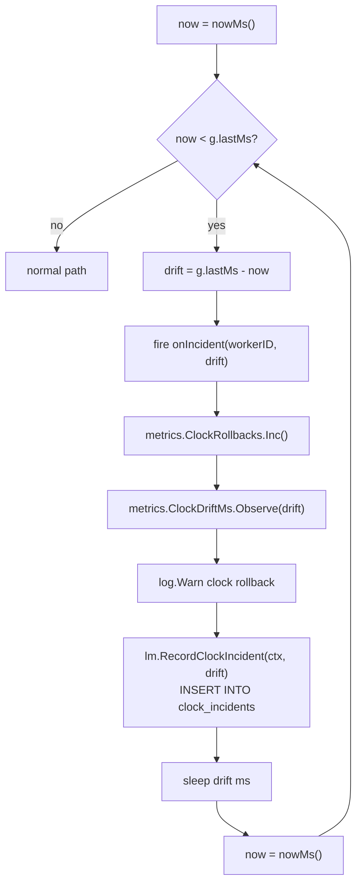
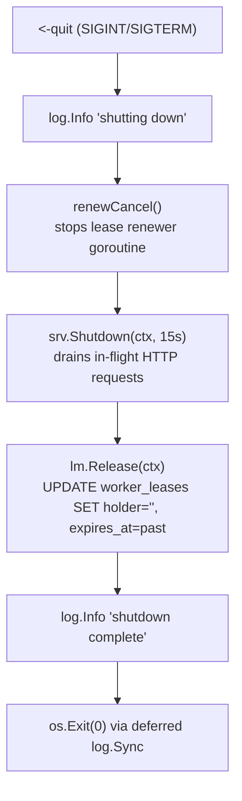
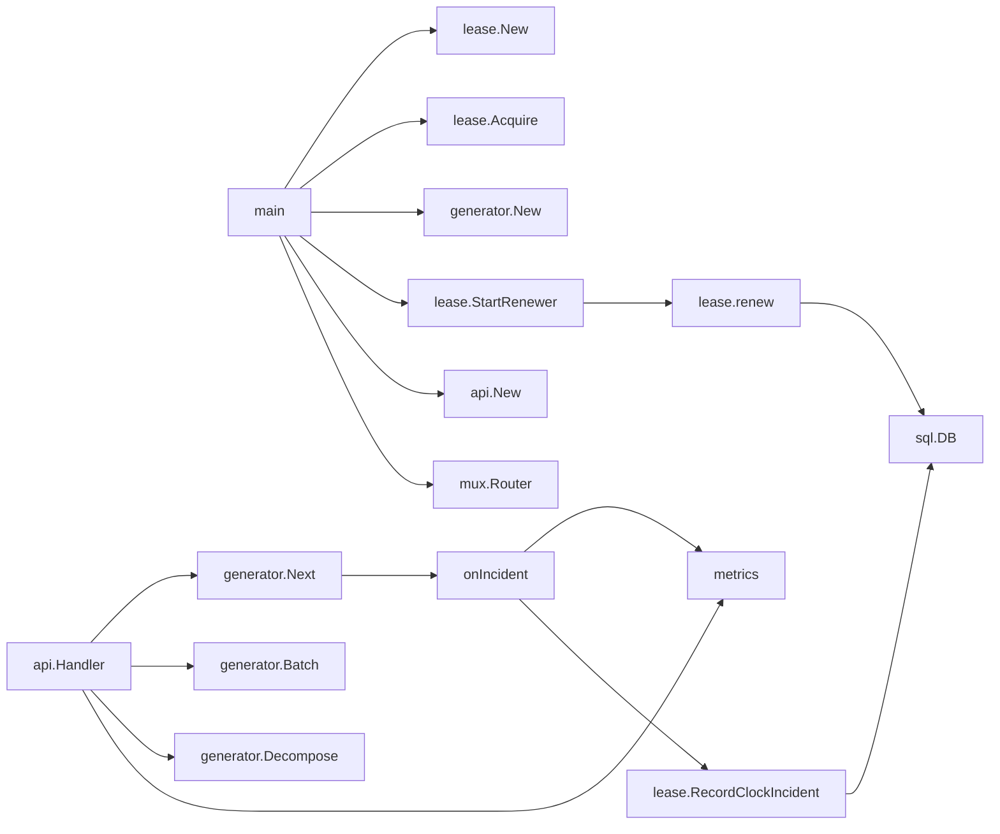

# Code Flow — Unique ID Generator

This document traces the function call graph from `main()` through every significant path. Each section covers one operation with a Mermaid flowchart and explanatory prose.

---

## 1. Startup

**Why each step matters:**
- `waitForDB` retries instead of failing fast because Docker Compose starts containers in parallel; PostgreSQL is often not ready when the app container boots.
- `lm.Acquire` happens before `generator.New` because the worker_id must be known before the generator can be constructed — there is no way to change a generator's worker_id after creation.
- `StartRenewer` is called after `Acquire` succeeds so the renewer never runs without a valid lease.

---

## 2. Generate a single ID — `POST /v1/ids/next`

**Key decisions:**
- The mutex wraps the entire `lastMs + sequence` read-modify-write as one atomic unit. Without it, two concurrent goroutines could read the same `lastMs`, both increment the same `sequence`, and produce the same ID.
- The sequence is masked with `& 0xFFF` (= `& maxSequence = 4095`) rather than using a modulo to avoid the division and keep the operation branch-free.
- `id_string` is always included alongside `id` because JSON numbers in JavaScript are 64-bit doubles (IEEE 754), which cannot represent all int64 values without loss of precision above 2^53.

---

## 3. Generate a batch — `POST /v1/ids/batch`

`Batch` is a simple loop over `Next()`. Each call acquires and releases the mutex individually — this is intentional. Holding the mutex for the entire batch would block other goroutines for longer than necessary and provide no correctness benefit since each ID is independently valid.

---

## 4. Inspect an ID — `GET /v1/ids/{id}/inspect`

`Decompose` is a pure function — it does not touch the generator's mutex or state. It simply reverses the bit shifts used during generation.

---

## 5. Lease renewal — background goroutine

The `AND expires_at >= NOW()` guard in the UPDATE is critical: if the lease expired before this renewal fired (e.g. the process was paused by the OS), the UPDATE affects 0 rows and we learn about it immediately rather than silently extending a slot we no longer legitimately hold.

---

## 6. Clock rollback handling — inside `generator.Next()`

The spin loop re-checks `now < g.lastMs` after sleeping to handle the case where the OS wakes the goroutine early. The loop exits only when wall time has fully caught up with `lastMs`.

---

## 7. Graceful shutdown

`renewCancel` is called before `srv.Shutdown` to prevent a race where the renewer fires an UPDATE after `Release` has already cleared the lease row.

---

## Call graph summary

