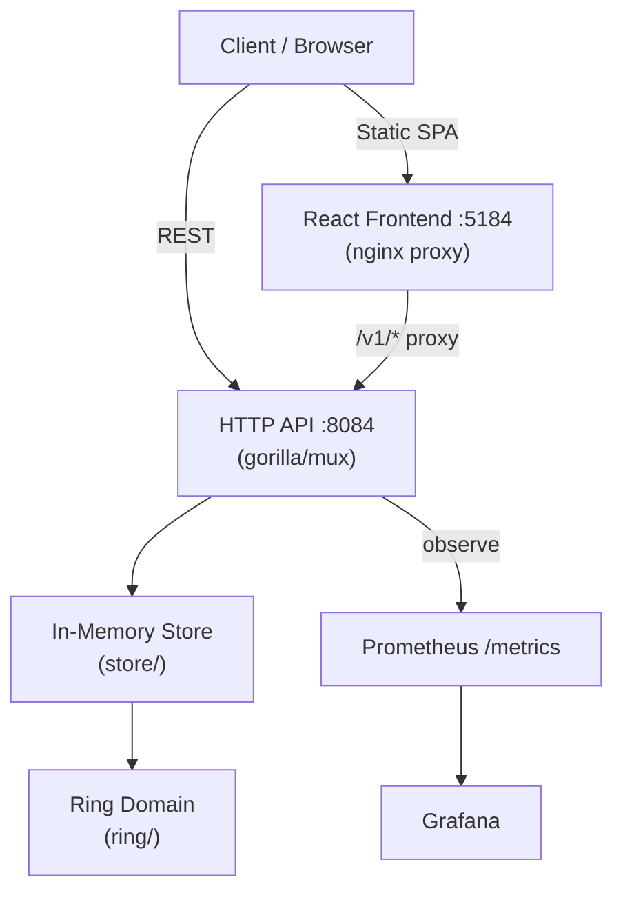
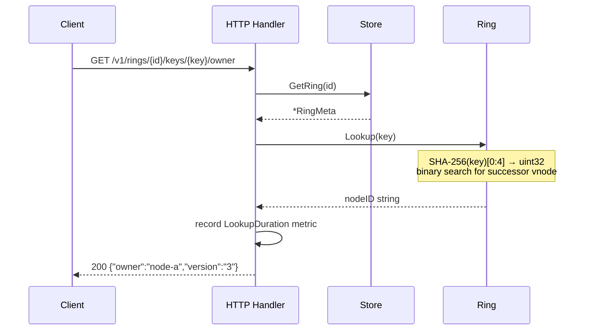

# Architecture — Consistent Hashing Service

## System diagram

## Sequence diagram — key lookup

## Components

### HTTP API (`api/`)
- Single `Handler` struct wrapping a `*mux.Router`.
- CORS header set globally (`Access-Control-Allow-Origin: *`) for the SPA.
- A `sync.Pool` of `[]byte` buffers is used for JSON serialisation to avoid per-request heap allocs.
- All static response bodies (`healthz`) are pre-built `[]byte` package-level vars.

### Ring domain (`ring/`)
- Core data structure: `[]VNode` sorted by `Position uint32`.
- `AddNode` places `weight × replicas` vnodes, each hashed as `SHA-256("nodeID#i")[0:4]`.
- `Lookup` does `sort.Search` (binary search) — O(log V) where V = total vnodes.
- `LookupN` walks clockwise collecting distinct physical nodes for replication.
- `Stats` computes arc fractions and standard deviation — a measure of balance quality.
- `SimulateKeys(n)` distributes n synthetic keys for distribution visualisation.
- All public methods acquire `sync.RWMutex`; reads hold RLock, mutations hold Lock.
- `version` is an `atomic.Uint64` — incremented on every topology change.

### Store (`store/`)
- Simple `map[string]*RingMeta` guarded by `sync.RWMutex`.
- MVP: fully in-memory. Ring state is lost on process restart.
- Production extension: JSON-snapshot to PostgreSQL on every topology change; reload on startup.

### Metrics (`metrics/`)
- Prometheus counters, histograms, and gauges registered in `init()`.
- Updated synchronously in HTTP handlers after each mutation.

### Frontend (`web/`)
- React 18 + Vite SPA.
- SVG ring visualisation with animated arc segments, vnode dots, key position indicator.
- 6-step tutorial: Problem → Ring → Vnodes → Weights → Lookup → Rebalance.
- Communicates with the Go API via fetch; dev server proxies `/v1` to `:8084`.
- nginx proxy in the Docker image forwards `/v1/` to the Go container.

## Data flows

### Add node
1. `POST /v1/rings/{id}/nodes` → handler validates, calls `store.GetRing`.
2. `Ring.AddNode(node)` — generates V vnodes, appends to slice, re-sorts.
3. Arc lengths and stddev recomputed.
4. KeyMovement estimated on 10k synthetic keys (before vs after arc distribution).
5. Prometheus gauges updated.
6. Stats returned in response body.

### Key lookup
1. `GET /v1/rings/{id}/keys/{key}/owner` → handler retrieves ring.
2. `Ring.Lookup(key)` → SHA-256 the key → binary search for successor vnode.
3. `LookupDuration` histogram observed.
4. `{"owner":"nodeID","version":"N"}` returned.

## Capacity table

| Metric | Value |
|---|---|
| Lookup latency p50 | ~1 µs (measured: 1.04 µs) |
| Lookup throughput | ~1M req/s per core |
| VNodes per 10-node ring | 1,500 (150 per node) |
| Ring stddev (150 vnodes, 4 nodes) | ~0.014 |
| AddNode latency (150 vnodes) | ~10 ms (SHA-256 × 150) |
| Memory per vnode | 16 bytes (`uint32` + `string` header) |
| Memory for 10k vnodes | ~160 KB |
| Key movement (1/N guarantee) | ~25% for 3→4 nodes (measured: 21%) |
