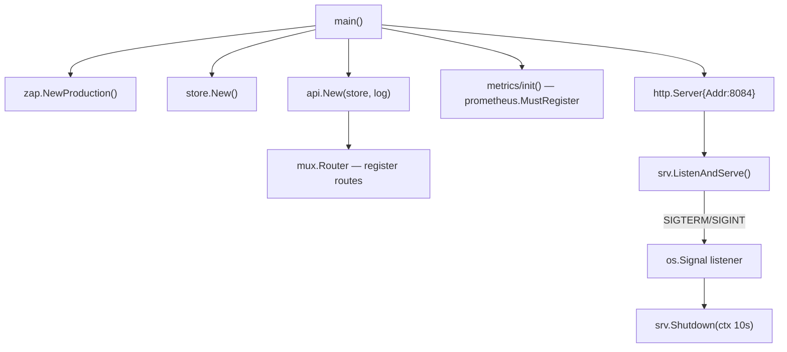
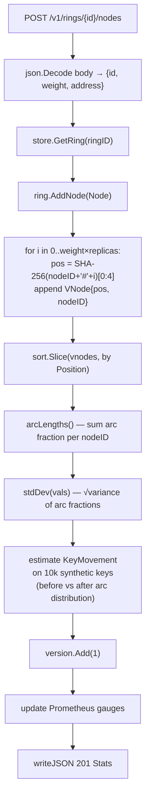
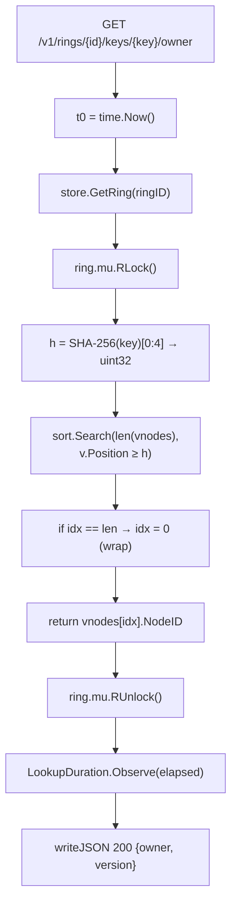
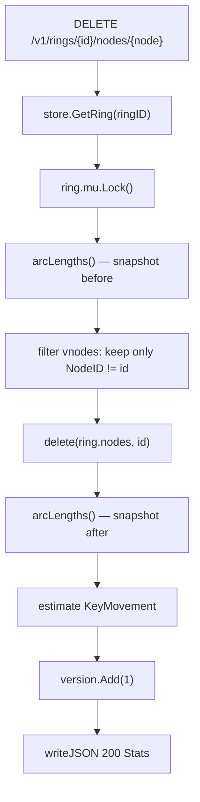
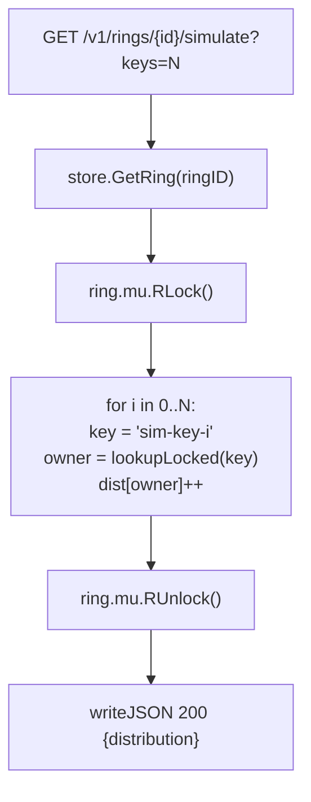
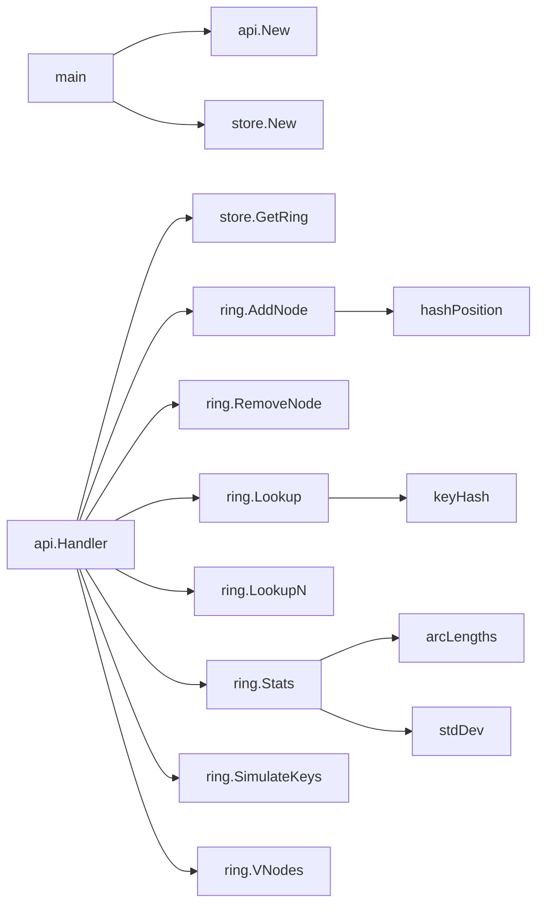

# Code Flow — Consistent Hashing Service

## Startup flow

`main()` is wiring-only: it constructs dependencies, starts the server, and blocks on signal.

---

## Add Node operation

**Why SHA-256 per vnode?** Uniform distribution across the 32-bit space requires a high-quality hash. MD5 is faster but SHA-256 avoids clustering on similar node names (e.g. `node-1`, `node-2`).

**Why re-sort after every AddNode?** The slice stays small (typically <5000 vnodes for a 30-node cluster). Re-sorting is O(V log V) ≈ 65K comparisons — negligible. An insertion sort would be O(V) but more complex code for no practical gain.

---

## Key Lookup operation

**Why RLock not Lock?** Lookups are read-only. Many goroutines can hold RLock simultaneously. Only AddNode/RemoveNode acquire the exclusive Lock, so concurrent reads are never blocked by each other.

---

## Remove Node operation

**Filter rather than mark-deleted** because the ring is small and a linear scan is O(V) with zero allocations (reuse the same slice backing array via `[:0]`).

---

## Simulation operation

`lookupLocked` is the same binary search as `Lookup` but without acquiring the mutex again — avoiding a deadlock since the caller already holds RLock.

---

## Call graph summary

