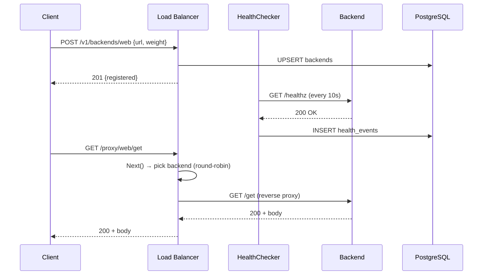

# Architecture — 06 Load Balancer

## System Diagram

```mermaid
graph TD
    Client([Browser / curl])
    LB[Load Balancer :8086]
    B1[Backend echo1]
    B2[Backend echo2]
    B3[Backend echo3]
    PG[(PostgreSQL\nloadbalancer DB)]
    PROM[Prometheus]
    GRAF[Grafana]

    Client -->|GET /proxy/{svc}/...| LB
    Client -->|Control plane REST| LB
    LB -->|reverse proxy| B1
    LB -->|reverse proxy| B2
    LB -->|reverse proxy| B3
    LB -->|health events| PG
    LB -->|/metrics| PROM
    PROM --> GRAF
    LB -.->|active health probe /healthz| B1
    LB -.->|active health probe /healthz| B2
    LB -.->|active health probe /healthz| B3
```

## Request Sequence (happy path)



## Components

### Load Balancer (`balancer/`)
Owns all service pools. Each pool holds `[]*Backend` and a routing `Algorithm`. Three algorithms: round-robin (atomic counter), least-connections (scan with latency EWMA bias), weighted round-robin (total-weight modulo). `Next()` skips unhealthy backends.

### Health Checker (`balancer.HealthChecker`)
Runs one goroutine per service pool. Every 10 s it probes each backend's `/healthz`. On status transition it logs the change, publishes a `HealthEvent`, and updates the EWMA latency. The event is consumed by `main.drainEvents` which writes to Postgres.

### API (`api/`)
Two planes on one router (gorilla/mux):
- **Control plane**: `POST /v1/backends/{svc}`, `DELETE`, `PUT algorithm`, `GET stats`, `GET health`.
- **Data plane**: `ANY /proxy/{svc}/...` — builds a `httputil.ReverseProxy`, increments `ActiveConns` atomically, records latency, retries up to 2 times on 5xx.

### Store (`store/`)
PostgreSQL adapter. Tables: `backends` (UPSERT on conflict) and `health_events` (append-only time-series). On restart, `main.reloadBackends` hydrates the in-memory pool from the DB.

### Metrics (`metrics/`)
Prometheus counters/histograms/gauges registered at package init. Exposed at `GET /metrics`.

## Capacity Estimates

| Metric | Value |
|---|---|
| Target p50 proxy latency | < 5 ms (overhead) |
| Target p99 proxy latency | < 20 ms |
| Max backends per service | ~1 000 (memory bound) |
| Health check goroutines | 1 per service |
| DB writes (health events) | ~6 rows/min with 3 backends |
| Prometheus scrape interval | 15 s |

## Failure Modes

| Mode | Behaviour |
|---|---|
| Backend 5xx | Retried up to 2×; `retries_total` counter incremented |
| All backends unhealthy | Returns 503 immediately |
| Postgres down | Service starts without persistence; logs warn |
| Backend flapping | EWMA smooths latency; status transition logged each flip |
| Slow backend | Least-connections de-prioritises it via latency score |
