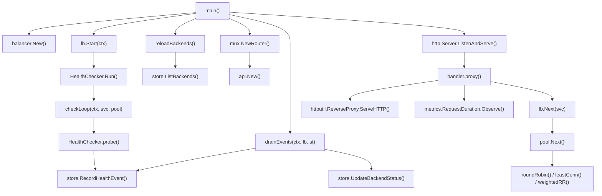
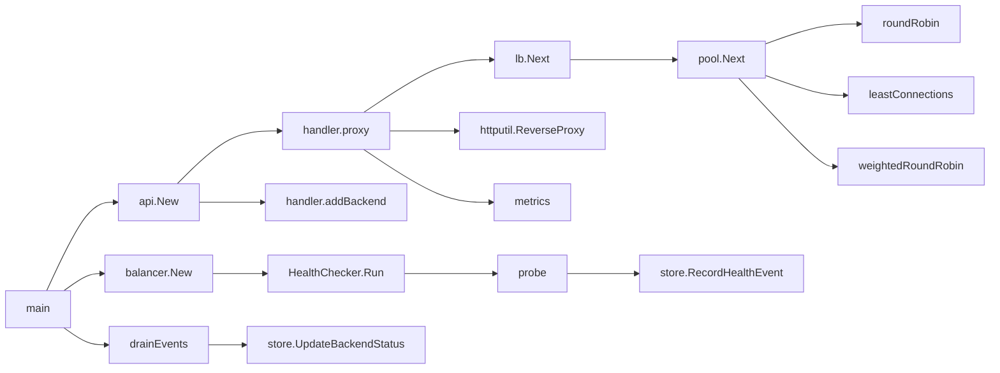

# Code Flow — 06 Load Balancer

## Full Call Graph (main → storage)

## Generate Request (proxy flow)

1. **`handler.proxy(w, r)`** — extracts `{service}` from the URL path.
2. **`lb.Next(service)`** — acquires a read lock on `lb.pools`, delegates to `pool.Next()`.
3. **`pool.Next()`** — calls the active algorithm (`roundRobin`, `leastConnections`, or `weightedRoundRobin`). Each filters `pool.backends` for `status == healthy` without a lock (backends' status field is guarded by their own `sync.RWMutex`).
4. Back in `handler.proxy`: atomically increments `backend.ActiveConns` and `backend.TotalConns`. Increments the Prometheus `active_connections` gauge.
5. Builds `httputil.ReverseProxy` pointed at the chosen backend URL, strips the `/proxy/{svc}` prefix, calls `proxy.ServeHTTP`.
6. On return: decrements `ActiveConns`, records latency via `backend.RecordLatency` (EWMA update) and `metrics.RequestDuration`.
7. If upstream returned ≥ 500, loops back to step 2 (max 2 retries). Each retry increments `metrics.RetryTotal`.

## Active Health Check

1. **`HealthChecker.checkLoop`** — one goroutine per service, fires a `time.Ticker` every 10 s.
2. On tick: iterates `pool.Backends()` snapshot, spawns one goroutine per backend calling `probe()`.
3. **`probe`** — HTTP GET `{backend_url}/healthz` with a 3 s client timeout.
4. Computes `latencyMs`, sets `StatusHealthy` or `StatusUnhealthy` on the backend, calls `backend.RecordLatency`.
5. Publishes a `HealthEvent` to the buffered channel `lb.Events` (drop if channel full — health events are best-effort).

## Add Backend (control plane)

1. **`handler.addBackend`** — decodes JSON `{url, weight}`, calls `lb.AddBackend(ctx, svc, url, weight)`.
2. **`lb.AddBackend`** — creates `Pool` if service is new; calls `pool.Add(backend)`. If the pool is new, starts a new `checkLoop` goroutine via `checker.WatchPool`.
3. Handler calls `store.UpsertBackend` to persist the registration.

## Call Graph Summary

