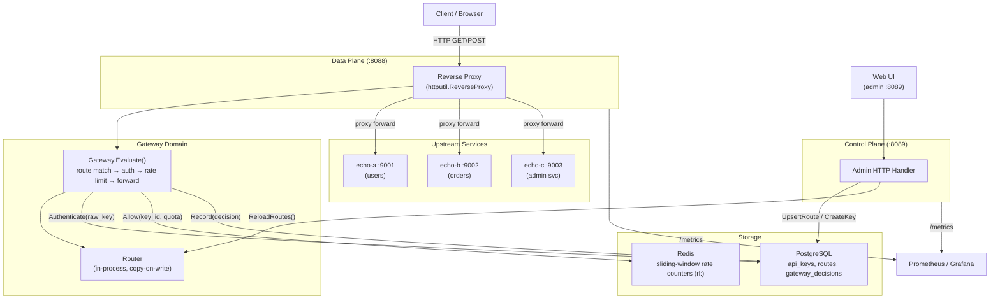
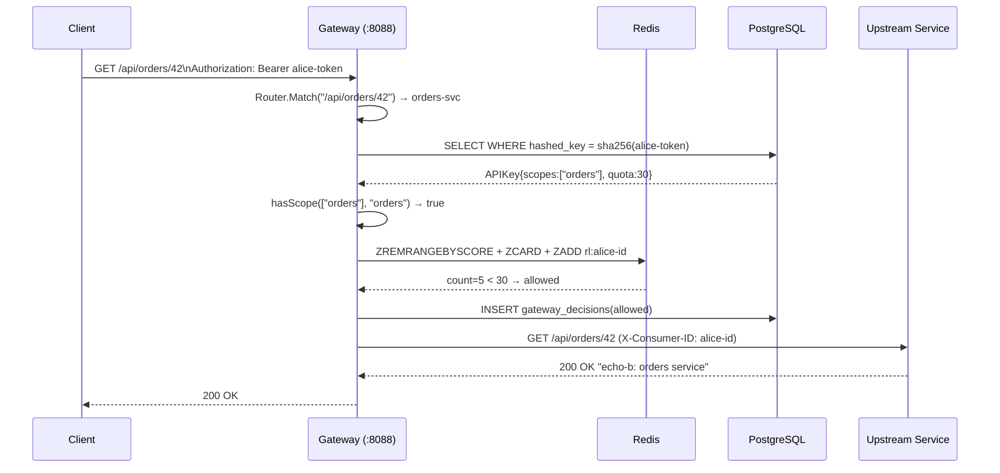

# Architecture — 07 API Gateway

## System Diagram

## Sequence Diagram — Happy-path request

## Components

### Data Plane (proxy)
The reverse proxy is the hot path. For each request it calls `Gateway.Evaluate()` which:
1. Looks up the longest-prefix-match route in the in-process `Router` (no network hop, O(n) over active routes, typically n < 100).
2. If `auth_required`, extracts the `Authorization: Bearer` or `X-API-Key` header, hashes it with SHA-256, and queries PostgreSQL once.
3. If the key has `quota_per_min > 0`, executes a 4-command Redis pipeline (ZREMRANGEBYSCORE + ZCARD + ZADD + EXPIRE) to enforce a sliding window. The pipeline is atomic at the Redis level.
4. Records the decision to PostgreSQL asynchronously (fire-and-forget with context, so a slow write does not block the proxy).
5. Forwards the request via `httputil.ReverseProxy` using a shared `sync.Pool`-backed buffer pool.

### Control Plane (admin)
CRUD endpoints for routes and API keys. Every successful upsert/delete immediately calls `gateway.ReloadRoutes()` which atomically replaces the in-process route table. A 30-second background goroutine also reloads routes from the DB to handle external DB edits or rolling deployments.

### Router
Copy-on-write: `Reload()` builds a new slice under a write lock, swapping it in atomically. `Match()` holds a read lock only for the duration of the linear scan. No allocations during matching.

### Rate Limiter
Redis sorted-set sliding window: each request is a member scored by its Unix nanosecond timestamp. The window is the last 60 seconds. On every request, expired entries are removed and the current count is read, all in one pipeline.

**Fail open**: if Redis is unavailable, the limiter returns `allowed=true` to avoid turning a cache failure into a service outage. This is a deliberate availability-vs-correctness tradeoff.

## Capacity Estimates

| Metric | MVP (single node) | Production |
|---|---|---|
| Proxy throughput | ~5,000 req/s | ~50,000 req/s (horizontal) |
| p50 proxy latency | <2 ms | <2 ms |
| p95 proxy latency | <10 ms | <10 ms |
| p99 proxy latency | <30 ms | <30 ms |
| Routes | <500 | <10,000 |
| API keys | <10,000 | <1,000,000 |
| Decision log growth | ~100 B/req → 36 GB/year at 10k rps | Partition + archive |
| Redis memory (rate limiting) | ~200 bytes/key/window | ~200 MB at 1M active keys |

## External Dependencies

| Dependency | Role |
|---|---|
| PostgreSQL 16 | Durable store for keys, routes, and decision log |
| Redis 7 | Sliding-window rate-limit counters |
| Prometheus | Metrics scraping |
| Grafana | Dashboards |
| hashicorp/http-echo | Lightweight demo backends |
