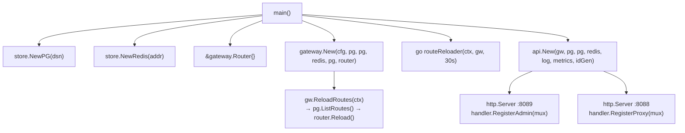
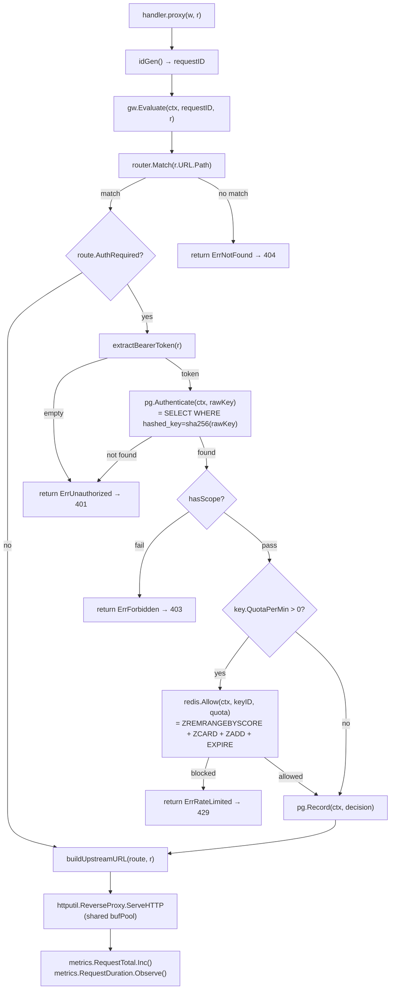
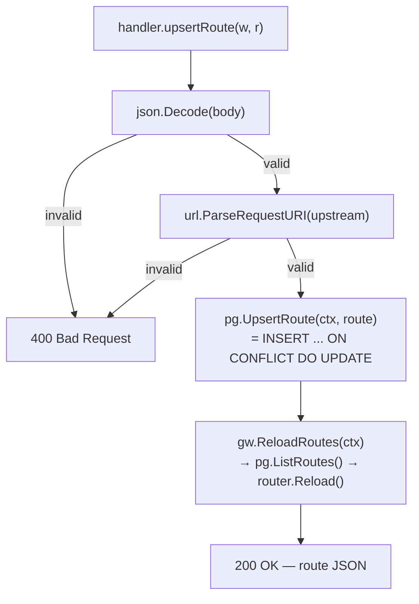
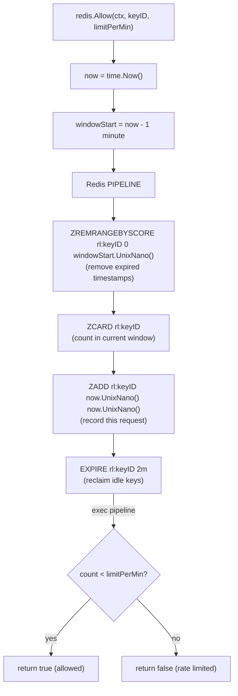
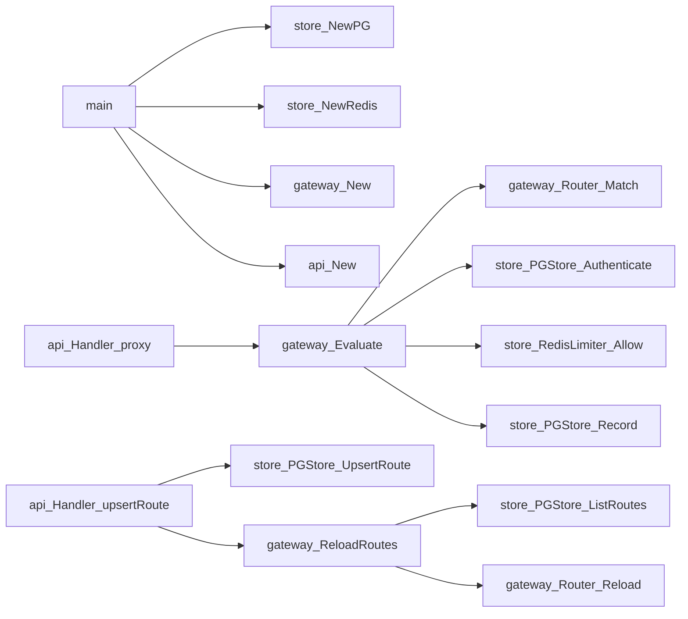

# Code Flow — 07 API Gateway

## Full Call Graph (main → storage)

## Operation: Proxy Request

## Operation: Upsert Route (admin)

## Operation: Rate Limit Check (Redis sliding window)

## Call Graph Summary

## Why each call is made

| Call | Reason |
|---|---|
| `router.Match()` | O(n) linear scan over active routes — avoids network round-trip; routes fit in L1/L2 cache |
| `pg.Authenticate()` | Raw key values are never stored; SHA-256 hash is the DB key, so a compromised DB does not expose credentials |
| `redis.Allow()` — pipeline | Four Redis commands in one round-trip; ZREMRANGEBYSCORE + ZCARD is the sliding-window algorithm; ZADD records the current request |
| `pg.Record()` — after forward | Decision logged after the upstream responds so the status code is known; context cancellation means a slow DB write cannot delay the client response |
| `gw.ReloadRoutes()` after admin upsert | Immediate consistency: operators expect route changes to take effect within the same HTTP response, not on the next 30-second tick |
