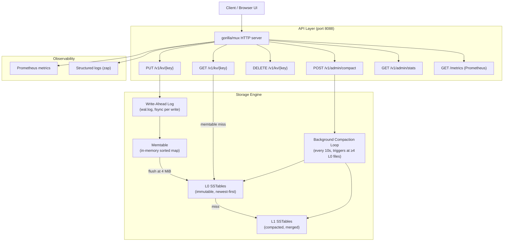
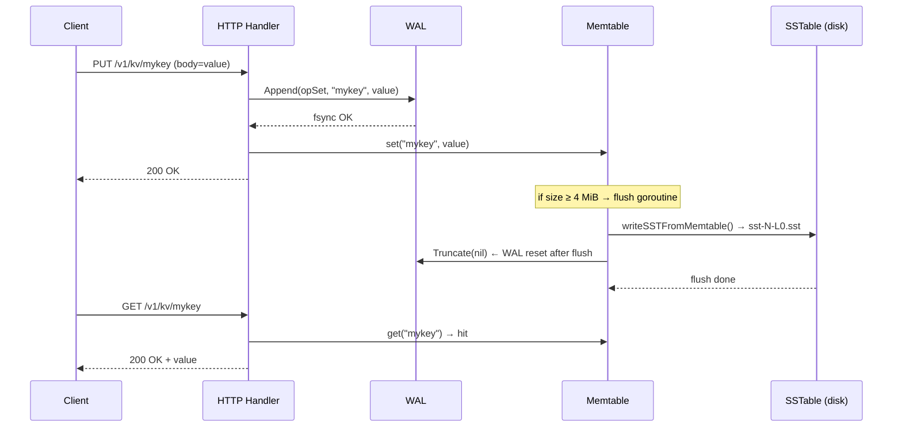

# Architecture — Basic Key-Value Store (08)

## Overview

A durable key-value database built on an LSM-tree (Log-Structured Merge-tree) storage engine.
All writes are sequential — the design never performs random I/O on the write path —
giving substantially higher write throughput than a B-tree at the cost of read amplification
and background compaction overhead.

---

## System Diagram



---

## Primary Happy-Path Sequence



---

## Components

| Component | File(s) | Responsibility |
|---|---|---|
| HTTP handler | `api/handler.go` | Request parsing, routing, response serialisation, size limits |
| WAL | `store/wal.go` | Append-only durability log, CRC per entry, atomic truncation |
| Memtable | `store/memtable.go` | In-memory sorted hashmap, RWMutex, tombstone support |
| SSTable writer | `store/sstable.go` | Immutable sorted file, CRC per entry, linear scan lookup |
| Compaction | `store/engine.go` | Merge L0 → L1, drop superseded entries and tombstones |
| Engine | `store/engine.go` | Orchestrates all storage components, exposes Set/Get/Delete/Compact |
| Metrics | `metrics/metrics.go` | Prometheus histograms and counters for op latency and rate |
| Main | `main.go` | Dependency wiring, signal handling, graceful shutdown |
| Web UI | `web/` | Canvas LSM-tree visualisation, live stats polling, tutorial |

---

## Data Model

```
Record  = { key: string, value: []byte, tombstone: bool }

WAL entry wire format:
  [op:1][keyLen:4][valLen:4][key:keyLen][val:valLen][crc32:4]

SSTable entry wire format:
  [flags:1][keyLen:4][valLen:4][key:keyLen][val:valLen][crc32:4]
  flags bit 0 = tombstone

SSTable filename:
  sst-<seqNum:020d>-L<level>.sst
```

---

## Capacity Estimates

| Dimension | Value |
|---|---|
| Memtable flush threshold | 4 MiB |
| Max value size (API) | 1 MiB |
| L0 compaction trigger | ≥ 4 L0 files |
| WAL fsync | per write (strong durability) |
| Read amplification (worst) | 1 memtable + N L0 files + 1 L1 file |
| Write amplification | ~2× (WAL + SSTable); compaction adds ~2× more |
| Throughput (single node, SSD) | ~2 000–5 000 fsync'd writes/sec |
| Storage growth | `keys × avg_value_size × write_amplification` |

---

## Known Limits / Production Gaps

- No sparse index or Bloom filter — reads scan every SSTable linearly.
- Single-node only; no replication or leader election.
- Compaction is single-threaded; large L0 backlogs will pause reads.
- No block cache — all SSTable reads go to the OS page cache.
- WAL replay on restart re-reads from offset 0 (no checkpoint pointer).
