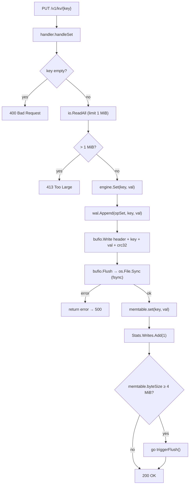
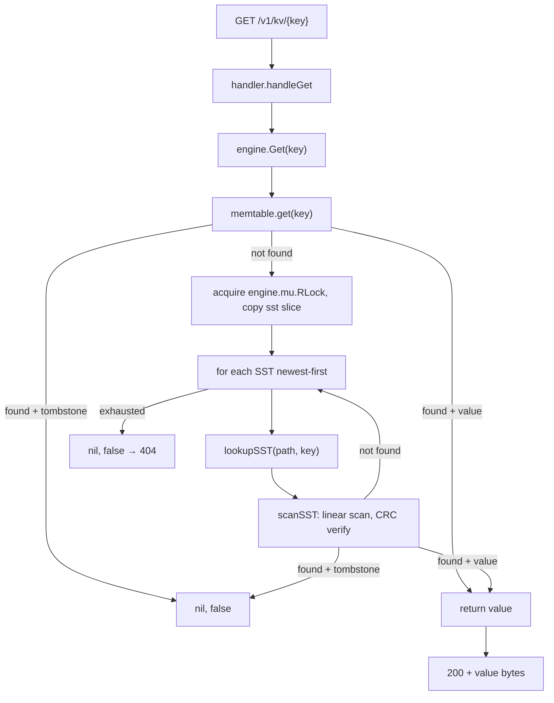
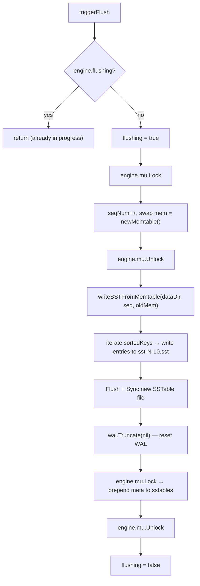
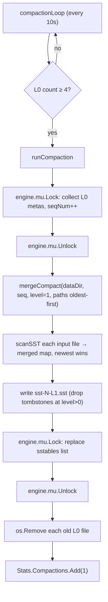
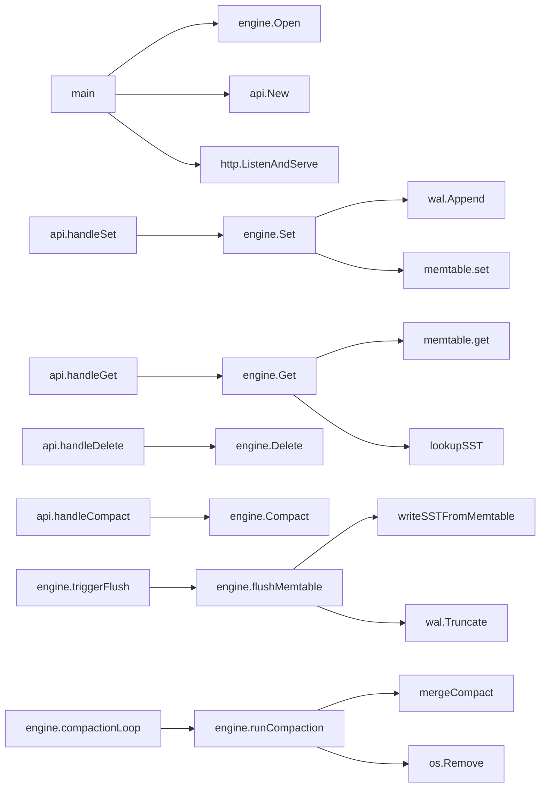

# Code Flow — Basic Key-Value Store (08)

## Write (SET) Path

### Why each step

- **WAL first, then memtable**: the WAL fsync is the durability guarantee. If we updated the memtable first and then crashed, the write would be visible to readers but unrecoverable.
- **bufio.Writer**: amortises syscall overhead; `Flush` triggers the actual write then `Sync` ensures the data reaches durable storage.
- **CRC32 per entry**: detects torn writes (e.g., partial last entry after a crash). The WAL replayer stops at the first bad CRC.
- **Async flush**: the HTTP handler returns before the flush completes. The write is already durable (it's in the WAL), so there is no correctness issue.

---

## Read (GET) Path

### Why each step

- **Memtable first**: the memtable always has the newest version of any recently written key, so checking it first both speeds up the common case and avoids stale reads from older SSTables.
- **Newest-first SSTable scan**: SSTables are ordered by sequence number descending. The first SSTable that contains the key is the authoritative version; earlier files are older.
- **Tombstone check at every level**: a deletion record (tombstone) in a newer SSTable supersedes a value in an older SSTable. We must honour it even if the value is readable.
- **RLock copy**: we copy the SSTable slice under a read lock then release before doing I/O, so compaction can proceed concurrently without holding the lock during slow disk reads.

---

## Memtable Flush

### Why each step

- **Swap memtable under lock**: we hold the engine lock only for the in-memory pointer swap (nanoseconds). The actual disk write happens outside the lock so writes can continue into the new memtable concurrently.
- **WAL truncation after flush**: once the SSTable is safely on disk, the WAL entries it covers are redundant. Truncation keeps the WAL small and speeds up crash recovery.
- **Prepend (newest-first)**: the read path scans newest-first; prepending the new SSTable ensures reads immediately see fresh data without re-sorting.

---

## Compaction

### Why each step

- **Oldest-first scan**: scanning older files first then letting newer files overwrite in the merged map gives newest-wins semantics cheaply — no per-key version comparison needed.
- **Drop tombstones at L1**: a tombstone in an L1 file means all older L0 files that could have contained the key are now merged away. The tombstone record is safe to drop, reclaiming the space.
- **Delete after manifest update**: we remove the old SSTable files only after the new SSTable and the new sstables slice are in place. A crash between the slice update and the file deletes leaves orphaned (but harmless) files; they will be ignored on next open because they are not in the in-memory list.

---

## Call Graph Summary

