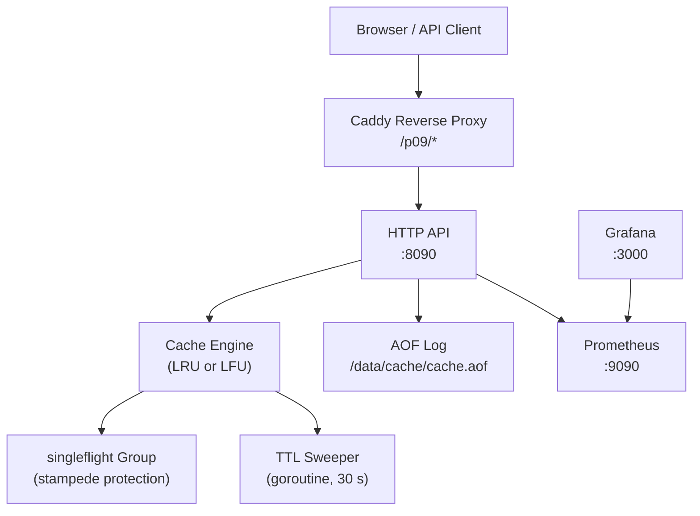
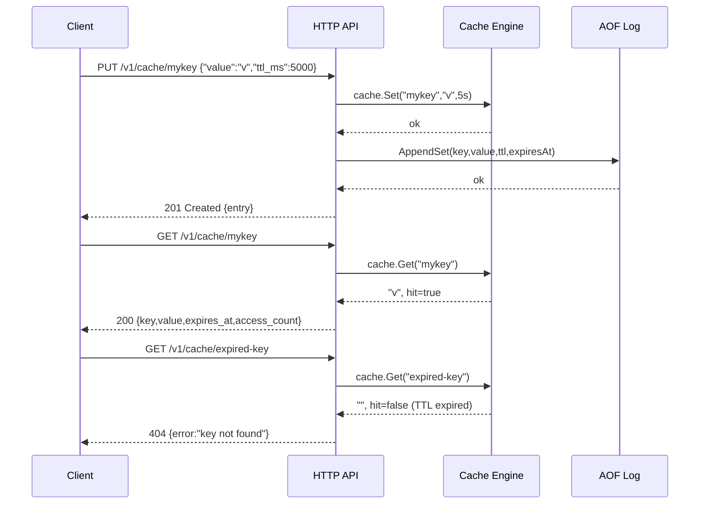

# Architecture — 09 Caching System

## System diagram

## Primary happy-path sequence

## Components

| Component | Responsibility |
|---|---|
| `main.go` | Wire dependencies; AOF warm-restart replay; signal handling |
| `cache/cache.go` | In-memory store; LRU (doubly-linked list) and LFU (min-heap) eviction; passive TTL on GET; active TTL sweeper goroutine; `singleflight` coalescing |
| `api/handler.go` | HTTP transport; request parsing; metrics instrumentation; static serving |
| `store/aof.go` | Append-only file log; NDJSON records; replay on startup (skips expired) |
| `metrics/metrics.go` | Prometheus counter/gauge/histogram registration |
| `web/` | Vanilla-JS SPA; live stats, hit-rate arc gauge, eviction-order visualisation, request flow animation, stampede demo |

## Data flows

**Write path**: `PUT /v1/cache/{key}` → parse body → `cache.Set(key, value, ttl)` → update LRU list or LFU heap → `aof.AppendSet(...)` → update Prometheus gauges → return 201.

**Read path**: `GET /v1/cache/{key}` → `cache.Get(key)` → check expiry (lazy) → update LRU/LFU order → return 200 or 404.

**Eviction**: Capacity-driven eviction fires synchronously inside `Set` before inserting the new entry. TTL sweeper fires every 30 s and removes all expired keys under the lock.

**Warm restart**: On process startup the AOF file is replayed top-to-bottom; SET records are loaded into the cache with their remaining TTL; DELETE and FLUSH records undo previous sets. Records whose `expires_at` is already in the past are skipped.

**Stampede protection**: `GetOrLoad` wraps `singleflight.Group.Do`. All concurrent goroutines requesting the same missing key share a single loader invocation; only the winner calls the backend.

## Capacity estimates

| Metric | Estimate |
|---|---|
| Default max memory | 64 MB |
| Average entry size | ~200 B (key 20 B + value 180 B) |
| Max keys at default | ~320 000 |
| p50 GET latency | < 1 µs (in-process mutex) |
| p99 GET latency | < 50 µs (lock contention at high concurrency) |
| AOF growth | ~300 B / SET; compaction not implemented (MVP) |
| Sweep overhead | O(n) scan every 30 s; negligible for < 1M keys |
