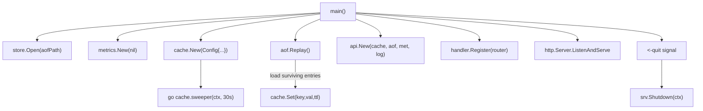
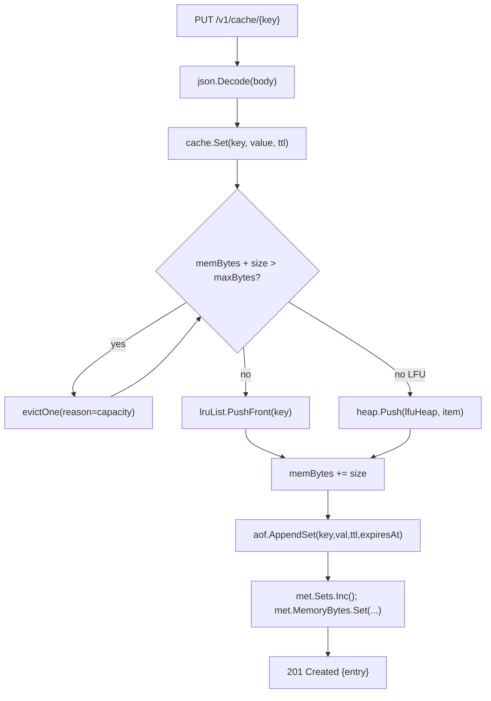
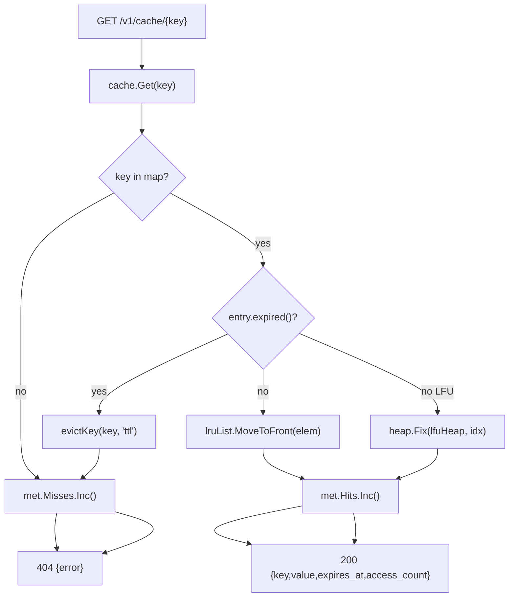
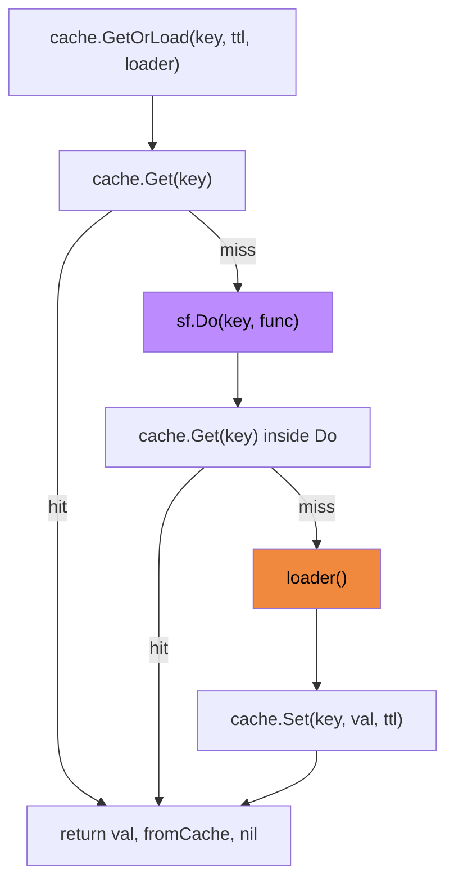
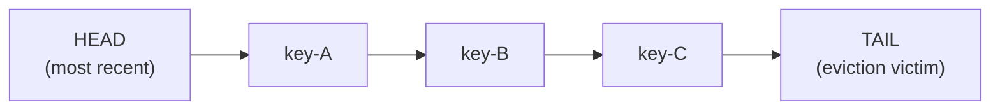
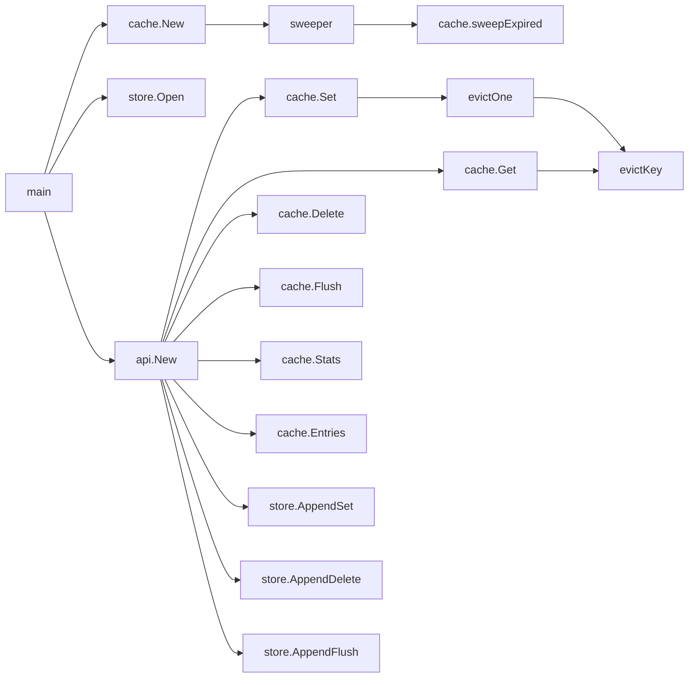

# Code Flow — 09 Caching System

## Full call graph from main()

## SET operation

## GET operation

## Singleflight (GetOrLoad) — stampede protection

Why `singleflight`: without it, N concurrent misses on the same key each independently call the loader — the backend sees N queries. With `singleflight`, only one goroutine calls the loader; the others block and receive the same result when it returns.

## LRU eviction order

On `Get("key-A")`: key-A moves to HEAD. On capacity eviction: TAIL element is removed.

## LFU eviction order (min-heap)

The min-heap orders entries by `access_count` (ascending). Tie-breaking uses `last_access` (oldest first). `heap.Fix` is called after every access increment to maintain the invariant. `heap.Pop` removes the minimum for eviction.

## Call graph summary

