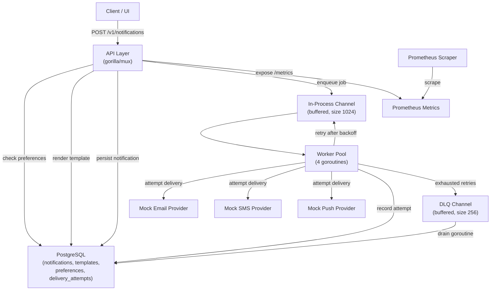
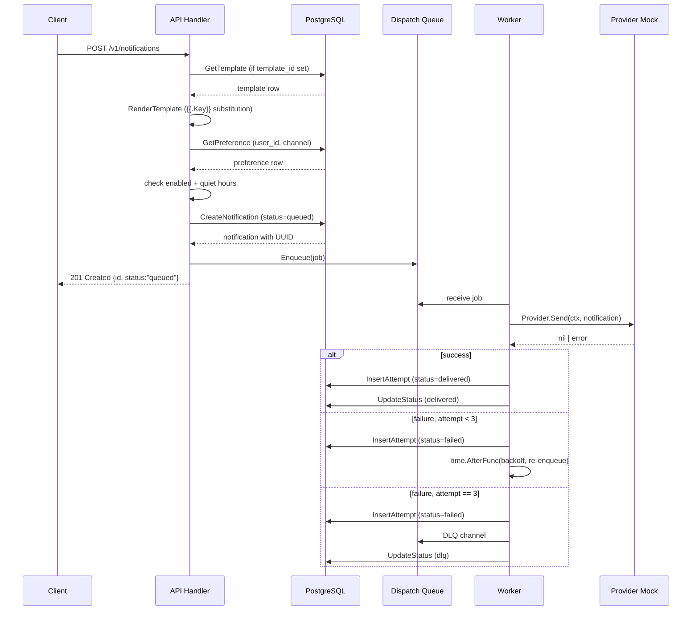

# Architecture — Notification System (Project 10)

## System Diagram

## Primary Request Sequence

## Components

### API Layer (`api/`)
Thin HTTP transport. Validates inputs, enforces channel enum, resolves templates, checks preferences, persists to DB, and enqueues the job. Does not block on delivery. Returns 201 with the persisted notification.

### Notification Domain (`notification/`)
Pure domain types with no external imports. Contains `RenderTemplate` (string substitution), `IsQuietHour` (wrap-around time window logic), and all status/channel/priority constants.

### Store (`store/`)
`*sql.DB` wrapper. All persistence operations for notifications, preferences, templates, and delivery attempts. Uses `pgcrypto` UUIDs on the DB side. Implements idempotency via `ON CONFLICT (idempotency_key) DO UPDATE`.

### Worker (`worker/`)
**Dispatcher**: owns a `chan Job` (queue) and `chan Job` (DLQ), both buffered. Starts 4 worker goroutines and 1 DLQ drain goroutine. Workers call `Provider.Send` and apply exponential-backoff retry (`200ms → 400ms → 800ms`) via `time.AfterFunc`. After 3 failures the job goes to the DLQ.

**Provider mocks**: `MockEmailProvider`, `MockSMSProvider`, `MockPushProvider`. Each has a configurable `FailureRate` (0.0–1.0) exposed via the admin API so failure injection works live.

### Metrics (`metrics/`)
Prometheus counters and histograms: enqueued, delivered, failed, retried, DLQ, queue depth, delivery latency, HTTP requests/duration.

## Data Model

| Table | Key Columns | Purpose |
|---|---|---|
| `notifications` | id (UUID), user_id, channel, status, idempotency_key | Canonical notification record |
| `templates` | id (TEXT PK), channel, subject, body | Named reusable templates |
| `preferences` | (user_id, channel) PK, enabled, quiet_start, quiet_end | Per-user channel opt-in and quiet hours |
| `delivery_attempts` | id (UUID), notification_id FK, attempt_number, status, error_msg, latency_ms | Audit trail of every send attempt |

## Capacity Estimates

| Dimension | Estimate |
|---|---|
| Notification throughput | ~500 req/s (single instance, PostgreSQL bound) |
| Worker throughput | ~200 deliveries/s (4 workers × mock latency ~20–50ms) |
| Queue saturation point | 1024 jobs (backpressure returns 503 beyond this) |
| DB storage growth | ~1 KB/notification + ~2 KB/attempt → 3 KB/notification average |
| At 10k notifications/day | ~30 MB/day, ~10 GB/year |

## External Dependencies
- PostgreSQL (shared infra container)
- Prometheus (shared infra container)
