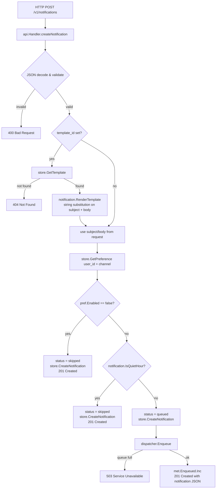
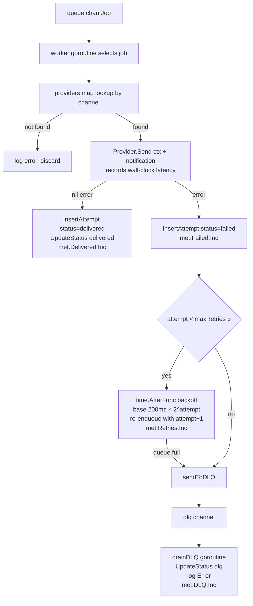
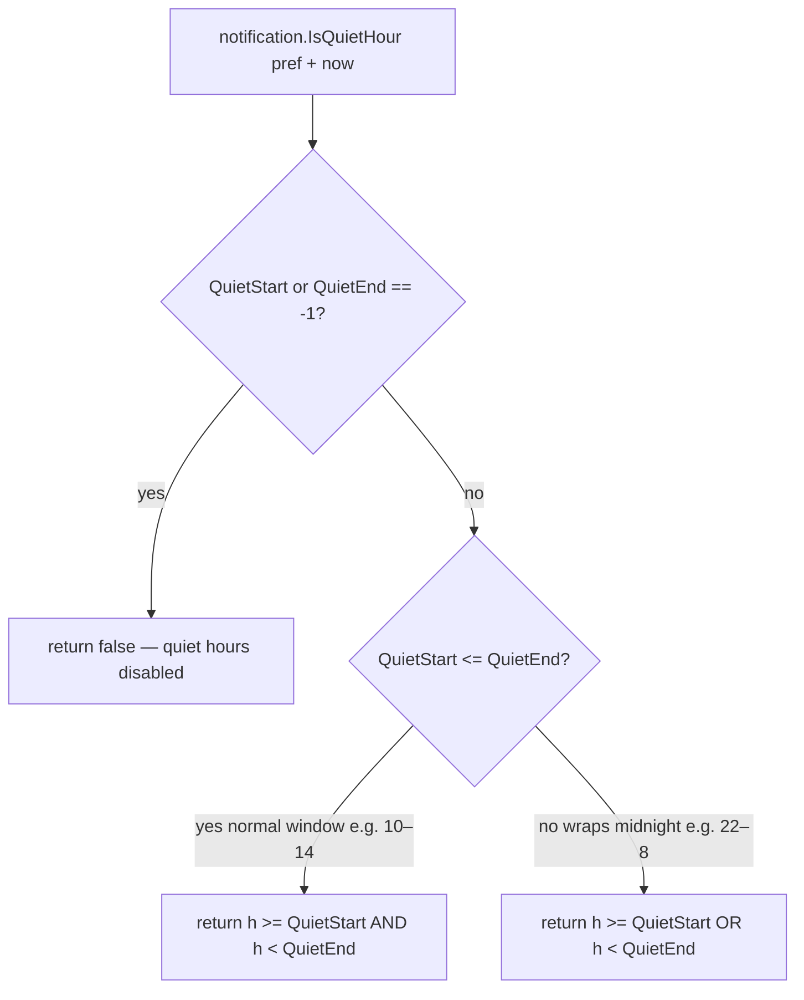
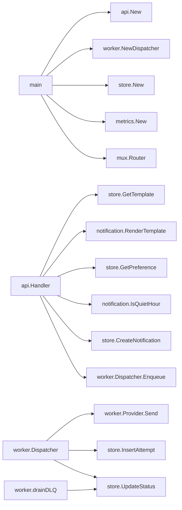

# Code Flow — Notification System (Project 10)

## Send Notification (`POST /v1/notifications`)



## Async Dispatch (worker goroutine)



## Template Rendering

```mermaid
flowchart TD
    A[Template.Body with placeholders\ne.g. 'Hi {{.Name}} code {{.Code}}'] --> B[notification.RenderTemplate]
    B --> C[strings.ReplaceAll for each key in params map]
    C --> D[rendered subject + body]
```

Substitution is O(k × len(body)) where k = number of params. For typical templates (< 1 KB body, < 10 params) this is negligible.

## Quiet Hours Check



## Call Graph Summary



## Key Design Decisions

**Why `time.AfterFunc` for retry backoff instead of a separate retry queue?**
`time.AfterFunc` fires a goroutine after the delay and re-enqueues the job. This keeps the retry logic inside the Dispatcher without a second data structure. The tradeoff: if the process restarts, in-flight retry timers are lost. For production, retries should be persisted (e.g. a `retry_after` column on notifications and a polling sweeper).

**Why buffered channels instead of Kafka?**
All other projects in this series use in-process concurrency primitives. A Kafka dependency would require a separate broker container, increasing resource usage on the shared Oracle Cloud instance. The channel model demonstrates the same fanout, backpressure, and DLQ semantics without the operational overhead. The production design section in `architecture.md` calls out Kafka as the natural evolution path.
