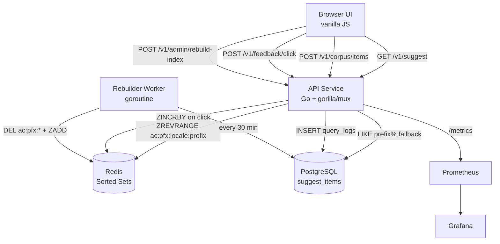
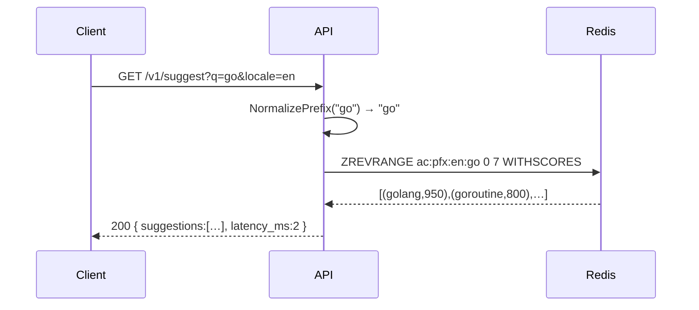
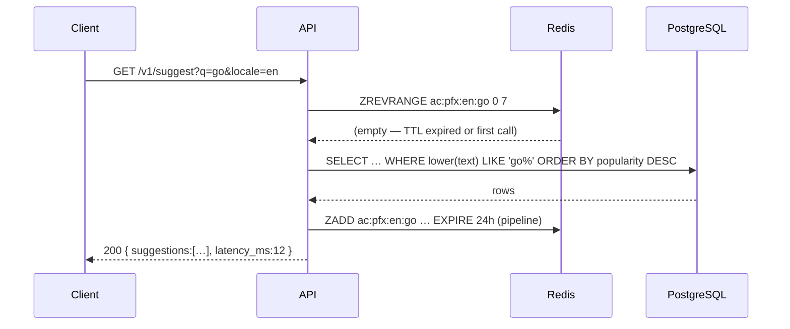

# Architecture — Typeahead Autocomplete System

## System Diagram

## Sequence — Suggest (Cache Hit)

## Sequence — Suggest (Cache Miss → PG Fallback)

## Components

| Component | Responsibility |
|-----------|---------------|
| **API Service** | HTTP transport: request validation, routing, response serialisation |
| **autocomplete package** | Domain types, prefix normalisation, score computation |
| **store package** | PostgreSQL corpus CRUD + Redis sorted-set index read/write |
| **worker package** | Periodic full index rebuild — deletes stale keys, re-indexes all items |
| **metrics package** | Prometheus counter/histogram registrations |
| **web/** | Vanilla JS tutorial UI with live trie visualisation |

## Data Flow

1. **Write path**: `POST /v1/corpus/items` inserts into `suggest_items`, then immediately indexes all prefixes of `text` (up to 20 chars) into Redis sorted sets via a pipelined `ZADD + ZREMRANGEBYRANK + EXPIRE`.
2. **Read path**: `GET /v1/suggest` looks up `ac:pfx:{locale}:{prefix}` in Redis. On hit, returns top-K by score. On miss, falls back to `LIKE prefix%` on PostgreSQL and back-fills Redis.
3. **Click feedback**: `POST /v1/feedback/click` records a `query_logs` row and calls `ZINCRBY` on all prefixes of the selected item, raising its score without a rebuild.
4. **Index rebuild**: The background `Rebuilder` goroutine runs every `REBUILD_INTERVAL`. It clears all `ac:pfx:*` keys (removing deleted items) then re-inserts every corpus item in 500-row batches.

## Capacity Estimates

| Metric | Value | Notes |
|--------|-------|-------|
| Corpus size | 100k items | each ~64 bytes text avg |
| Prefixes per item | ≤ 20 | max 20-char prefix |
| Redis keys | ≤ 2M | 100k × 20 prefixes |
| Redis memory | ~200 MB | 20 members/key × 2M keys |
| Suggest throughput | ~5k rps | single instance, Redis-served |
| p50 suggest latency | < 2 ms | Redis ZREVRANGE |
| p99 suggest latency | < 25 ms | PG fallback |
| Rebuild duration (100k items) | ~10 s | batch size 500 |
| Write throughput | ~200 rps | PG insert + Redis pipeline |
