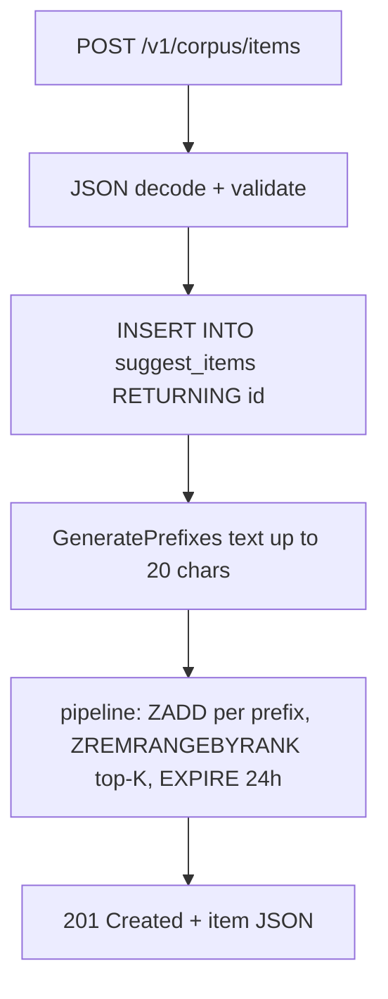
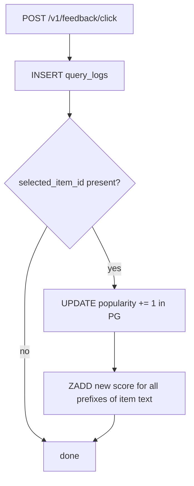
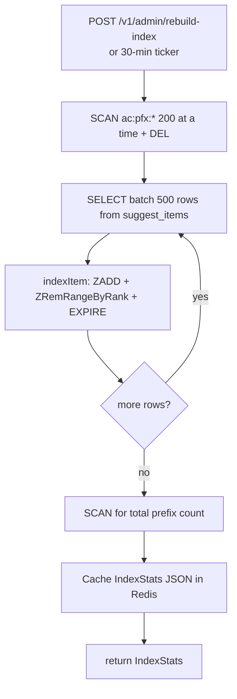
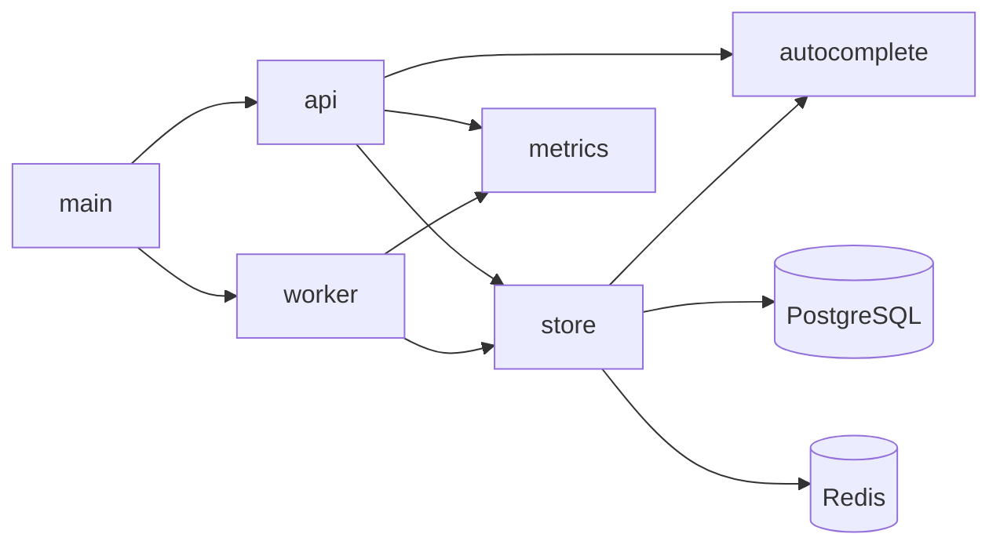

# Code Flow — Typeahead Autocomplete System

## Full Call Graph (main → storage)

```mermaid
flowchart TD
    main --> store.New
    main --> worker.New
    main --> api.New
    main --> http.Server.ListenAndServe
    main --> rebuilder.Run

    api.New --> mux.Router
    mux.Router -->|GET /v1/suggest| handler.suggest
    mux.Router -->|POST /v1/corpus/items| handler.addItem
    mux.Router -->|POST /v1/feedback/click| handler.recordClick
    mux.Router -->|POST /v1/admin/rebuild-index| handler.rebuildIndex

    handler.suggest --> autocomplete.NormalizePrefix
    handler.suggest --> store.Suggest
    store.Suggest -->|cache hit| rdb.ZRevRangeWithScores
    store.Suggest -->|cache miss| store.suggestFromPG
    store.suggestFromPG --> db.QueryContext
    store.suggestFromPG --> rdb.Pipeline.ZAdd

    handler.addItem --> store.AddItem
    store.AddItem --> db.QueryRowContext
    store.AddItem --> store.indexItem
    store.indexItem --> rdb.Pipeline.ZAdd
    store.indexItem --> rdb.Pipeline.ZRemRangeByRank

    handler.recordClick --> store.RecordQuery
    store.RecordQuery --> db.ExecContext
    handler.recordClick --> store.IncrementPopularity
    store.IncrementPopularity --> db.QueryRowContext
    store.IncrementPopularity --> rdb.Pipeline.ZAdd

    handler.rebuildIndex --> rebuilder.TriggerRebuild
    rebuilder.TriggerRebuild --> store.RebuildIndex
    store.RebuildIndex -->|DEL ac:pfx:*| rdb.Scan + rdb.Del
    store.RebuildIndex -->|batch 500| db.QueryContext
    store.RebuildIndex --> store.indexItem

    rebuilder.Run -->|ticker| store.RebuildIndex
```

## Suggest Operation

```mermaid
flowchart TD
    A[GET /v1/suggest?q=go] --> B[NormalizePrefix: lowercase, trim, cap 64]
    B --> C{prefix empty?}
    C -- yes --> D[return empty suggestions]
    C -- no --> E[ZREVRANGE ac:pfx:en:go 0 limit-1]
    E --> F{results > 0?}
    F -- yes --> G[parseRedisResults → []Suggestion]
    F -- no --> H[suggestFromPG: LIKE go%]
    H --> I[pipeline: ZADD + EXPIRE]
    I --> G
    G --> J[JSON response with latency_ms]
```

**Why**: `ZREVRANGE` is O(log N + K) — independent of corpus size. The PostgreSQL fallback only fires on a cold cache (first request to a prefix, or after TTL expiry). Back-filling Redis on miss means subsequent requests for the same prefix are served entirely from memory.

## Add Item Operation



**Why**: The `ZREMRANGEBYRANK 0 -topK-1` call keeps each sorted set bounded to at most 20 members regardless of how many items share a prefix, preventing unbounded Redis growth.

## Click Feedback Operation



**Why**: Incrementing popularity directly updates Redis scores without a rebuild, so the ranking change is visible to the next suggest request within milliseconds.

## Index Rebuild Operation



**Why**: Deleting all prefix keys before re-indexing is the only way to evict entries for items that were deleted from the corpus. The scan-and-delete loop avoids a single `FLUSHDB` which would wipe unrelated keys.

## Call Graph Summary


