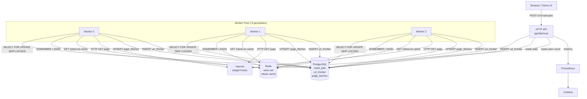
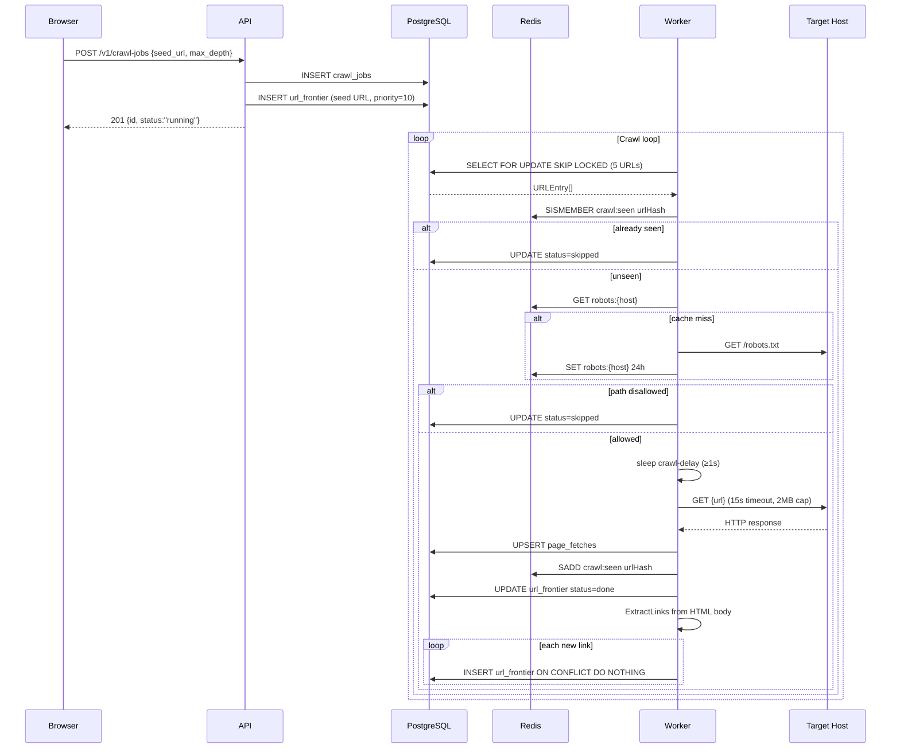

# Architecture — Web Crawler (Project 12)

## System Diagram

## Sequence Diagram — Happy Path Crawl

## Components

### HTTP API (`api/`)
Handles synchronous user and operator workflows. All handlers share a DB + Redis client injected at construction time. Static assets served from `web/`. No business logic — delegates all state mutations to the `store` package.

### Crawler Domain (`crawler/`)
Pure functions with no I/O: URL normalisation, hashing, link extraction, robots.txt parsing. The `HTTPFetcher` wraps a single `*http.Client` shared across all calls. All domain rules live here — isolated, unit-testable without Docker.

### Store (`store/`)
Two adapters:
- **`DB`** — PostgreSQL via `database/sql` + `lib/pq`. Uses `SELECT FOR UPDATE SKIP LOCKED` for lock-free worker fan-out on the frontier.
- **`Cache`** — Redis via `go-redis/v9`. Holds a Redis SET (`crawl:seen`) for O(1) deduplication and per-host JSON blobs for robots.txt caching.

### Worker (`worker/`)
Each `Worker` is a goroutine running a claim-fetch-enqueue loop. Workers exit cleanly when the context is cancelled (SIGTERM). The number of workers is configurable via `NUM_WORKERS` (default 3).

### Metrics (`metrics/`)
Prometheus counters and histograms registered at package init. Exposed at `/metrics` via `promhttp`.

## Data Flows

1. **Submission**: Browser → API → `crawl_jobs` + `url_frontier` (seed, priority 10)
2. **Crawl tick**: Worker → `url_frontier` (SKIP LOCKED) → Redis dedupe → robots check → HTTP fetch → `page_fetches` → extract links → re-enqueue to `url_frontier`
3. **Read path**: Browser polls `/v1/frontier/stats` (aggregated counts) and `/v1/pages` (recent fetches) every 3–6s

## Capacity Table

| Metric | Value |
|---|---|
| Workers (MVP) | 3 goroutines |
| Target fetch throughput | ~3 req/s (1s politeness delay per host) |
| Max body size per page | 2 MB |
| URL dedup structure | Redis SET (O(1) SISMEMBER) |
| robots.txt cache TTL | 24 h |
| Recrawl delay (done URLs) | 24 h |
| Frontier index | `(status, next_fetch_at, priority DESC)` partial index on `pending` |
| Page storage | PostgreSQL row ~200 B + content hash; no raw HTML stored in DB |
| Redis seen-set growth | ~64 B per URL hash × N URLs |
