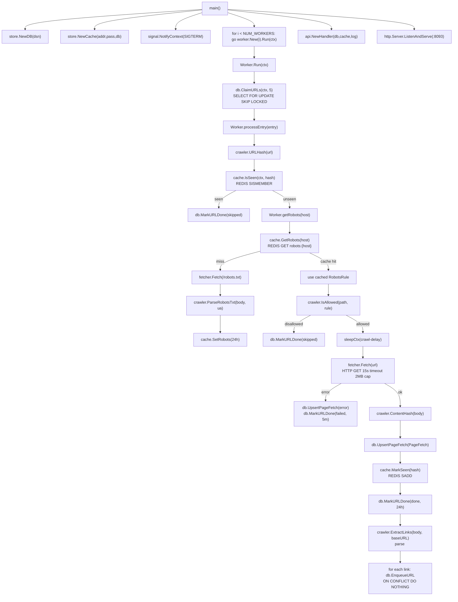
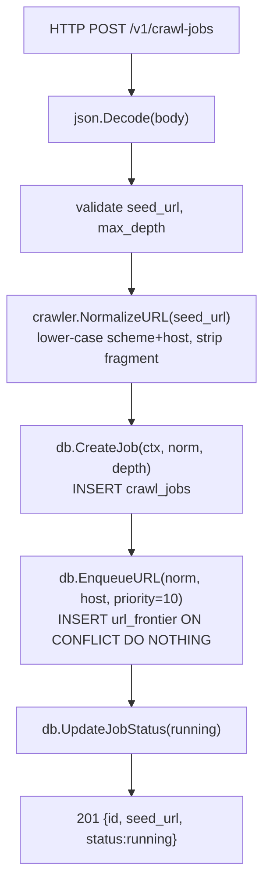
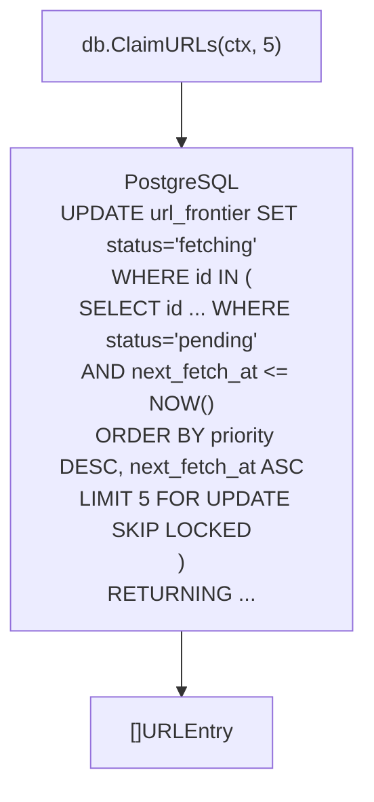
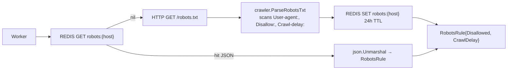
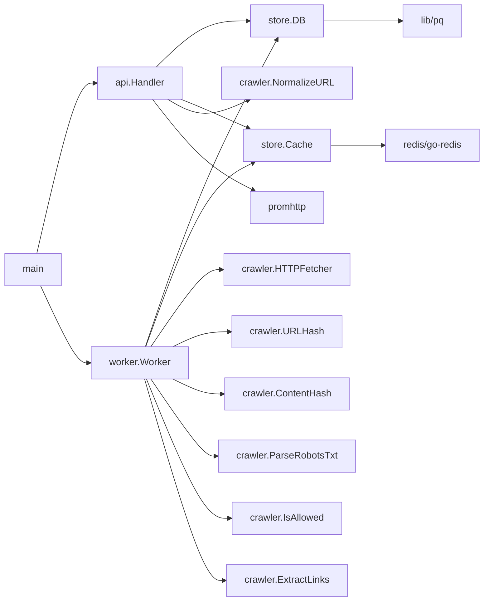

# Code Flow — Web Crawler (Project 12)

## Full Call Graph from main()

## Operation: Submit Crawl Job (POST /v1/crawl-jobs)

Why priority=10 for seeds: seeds are the entry points chosen by the operator and should be processed before organically discovered links (priority=1).

## Operation: Worker Claim (SELECT FOR UPDATE SKIP LOCKED)

`SKIP LOCKED` is the key: rows being processed by other workers are invisible, giving lock-free fan-out across the worker pool without a message broker.

## Operation: robots.txt Caching

## Call Graph Summary

