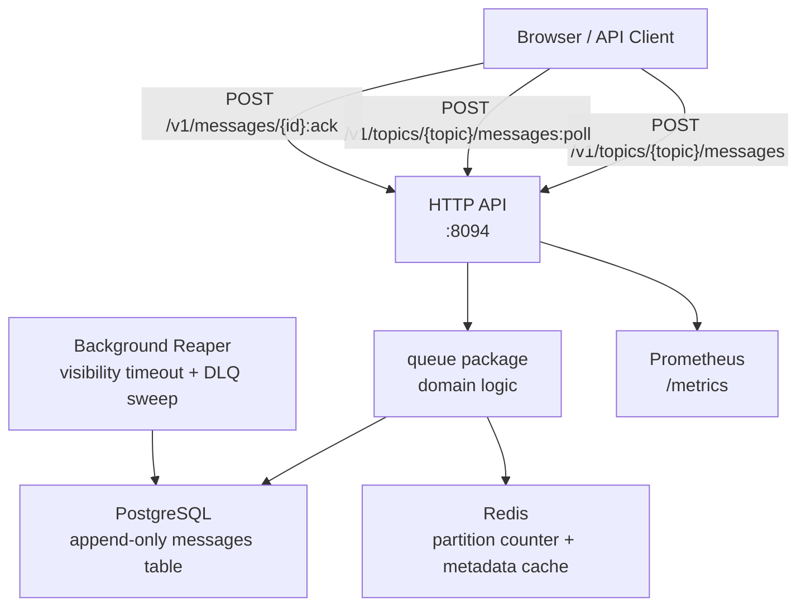
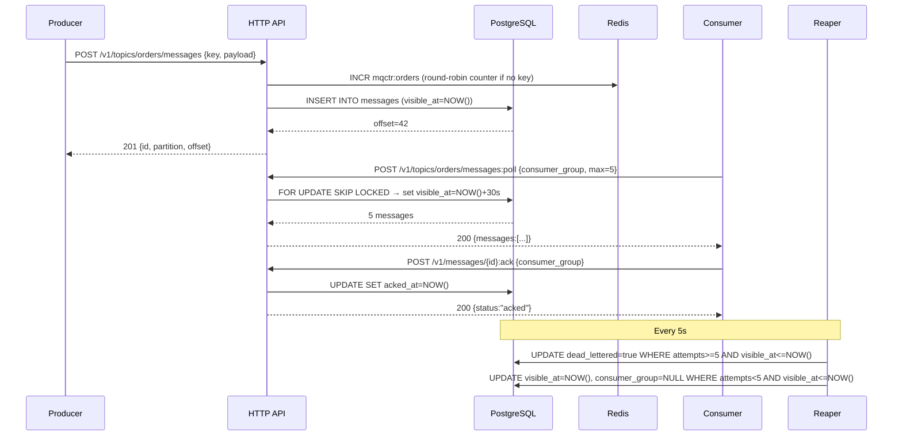

# Architecture — Message Queue (Project 13)

## System Diagram



## Sequence Diagram — Happy Path



## Components

### HTTP API (`api/handler.go`)
- Gorilla Mux router with Prometheus middleware.
- All handlers read from `*store.DB` and `*store.Cache`; no business logic lives here.
- `newID()` generates a time-sortable hex ID (nanosecond timestamp + low-bits entropy).

### Domain (`queue/queue.go`)
- Pure Go structs: `Topic`, `Message`, `ConsumerOffset`, `PollRequest`, `AckRequest`.
- `PartitionFor(key, partitions, counter)`: FNV-1a hash for keyed routing; modulo counter for round-robin.
- Zero I/O. Unit-testable in isolation.

### Store — PostgreSQL (`store/db.go`)
- `PublishMessage`: append-only INSERT; offset assigned by `BIGSERIAL`.
- `PollMessages`: CTE with `FOR UPDATE SKIP LOCKED` atomically claims messages and extends their visibility window. Concurrent consumers on the same group never see the same row.
- `AckMessage`: single UPDATE with a no-op guard against double-ack.
- `MoveExpiredToDeadLetter` / `RestoreExpiredMessages`: batch UPDATE run by the Reaper.

### Store — Redis (`store/cache.go`)
- Partition counter (`INCR mqctr:{topic}`): atomic per-topic round-robin counter for keyless publishes.
- Partition metadata cache (`SET/GET mqpart:{topic}`): avoids a DB round-trip on every publish.

### Worker (`worker/worker.go`)
- **Reaper** (every 5 s): promotes poison messages (≥5 attempts, expired lease) to `dead_lettered=true`, then restores remaining expired leases to `visible_at=NOW()`.
- **DepthUpdater** (every 10 s): refreshes Prometheus queue-depth and DLQ-depth gauges per topic.

### Metrics (`metrics/metrics.go`)
- `message_queue_messages_published_total{topic,partition}`
- `message_queue_messages_polled_total{topic,consumer_group}`
- `message_queue_messages_acked_total{topic,consumer_group}`
- `message_queue_messages_dead_lettered_total{topic}`
- `message_queue_depth{topic,partition}` (gauge)
- `message_queue_dlq_depth{topic}` (gauge)
- Publish / poll / ack latency histograms.
- HTTP request count and duration.

## Data Model

```
topics(name PK, partitions, retention_seconds, created_at)

messages(
  id TEXT PK,
  topic TEXT FK→topics,
  partition INT,
  offset BIGSERIAL,          -- append-only log position
  key TEXT,
  payload BYTEA,
  published_at TIMESTAMPTZ,
  visible_at TIMESTAMPTZ,    -- re-delivery gate
  delivery_attempts INT,
  acked_at TIMESTAMPTZ,      -- NULL = unacked
  dead_lettered BOOL,
  consumer_group TEXT        -- locked to group during visibility window
)
```

## Capacity Estimates (single-node MVP)

| Metric | Value | Notes |
|--------|-------|-------|
| Publish throughput | ~800 msg/s | 10-conn PG pool; single host |
| Poll throughput | ~600 polls/s | SKIP LOCKED adds ~0.5 ms/row |
| p50 publish latency | ~1 ms | local PG |
| p95 publish latency | ~4 ms | |
| p99 publish latency | ~12 ms | |
| Storage growth | ~200 B/msg | payload + indexes |
| Visibility timeout redelivery window | 5 s | reaper interval |
| Max retries before DLQ | 5 | `queue.MaxDeliveryAttempts` |

## Failure Modes

| Failure | Behavior |
|---------|----------|
| Consumer crash before ack | Message re-appears after visibility timeout |
| Poison message | After 5 failed deliveries → DLQ |
| Producer retry duplicate | Duplicate message ID rejected; different IDs = duplicate delivery (idempotent consumer required) |
| PostgreSQL restart | Service returns 500 until PG recovers; no data loss (WAL) |
| Redis unavailable | Publish falls back to DB partition lookup; counter resets on Redis restart (may briefly skew round-robin) |
