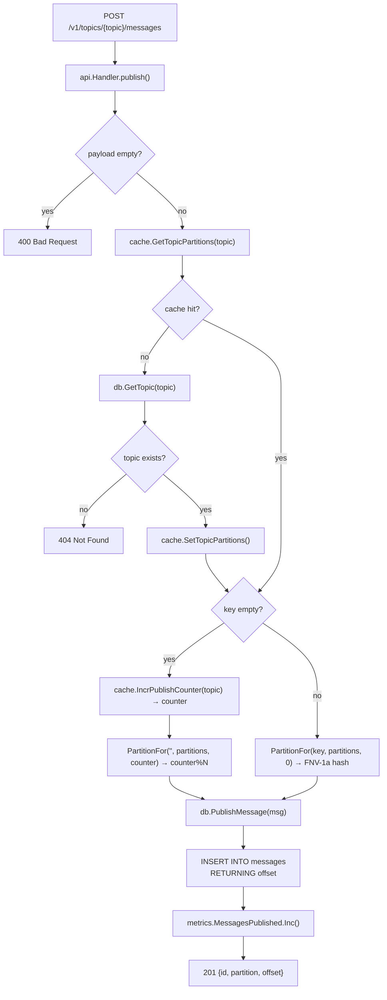
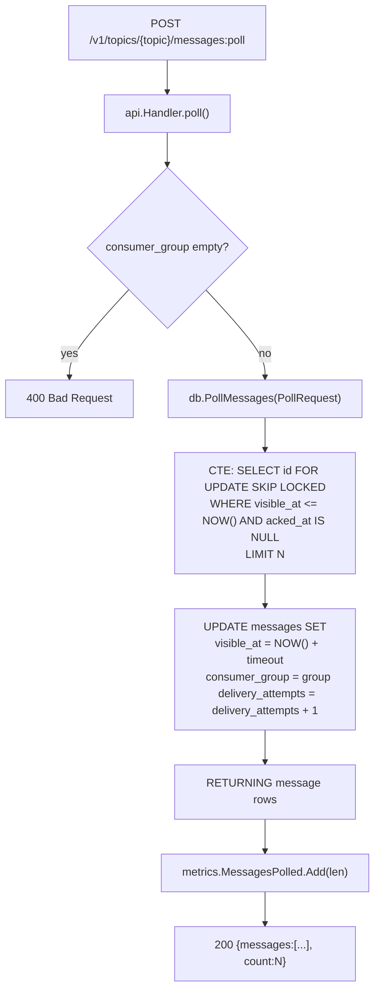
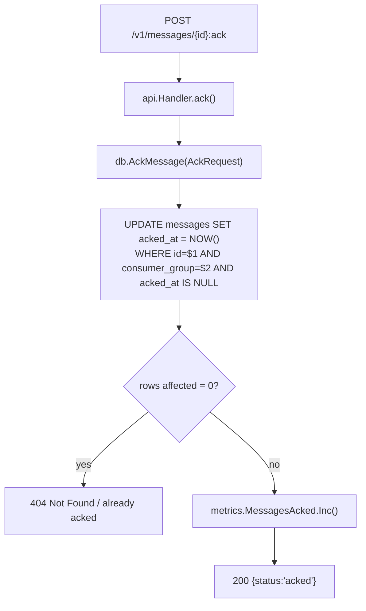
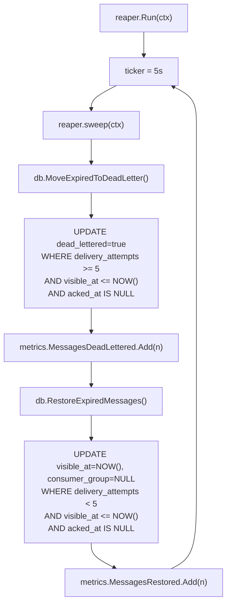
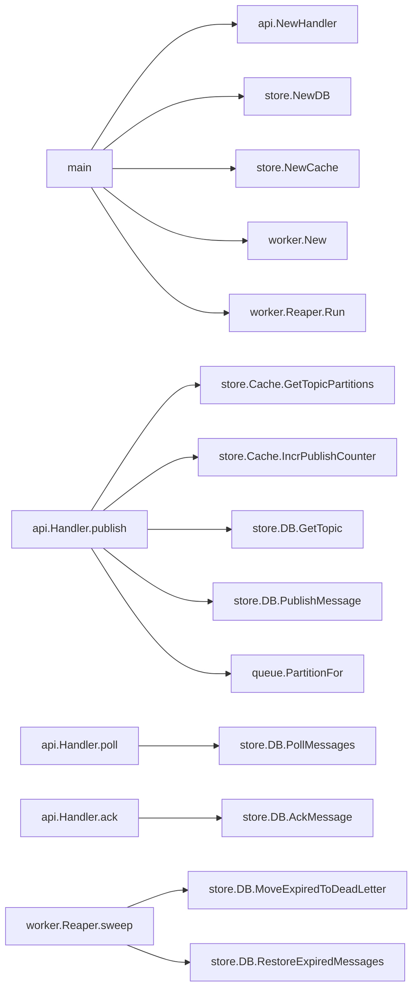

# Code Flow — Message Queue (Project 13)

## Publish Flow

### Why each step matters
- **Cache-first partition lookup**: avoids a DB round-trip on the hot publish path (PG read for a rarely-changing value).
- **`IncrPublishCounter`**: Redis INCR is atomic and O(1). Without it, keyless round-robin would require a sequence or random assignment with skew.
- **`BIGSERIAL offset`**: PostgreSQL sequences are non-blocking. The `offset` column acts as the monotonic log position per-partition.

## Poll Flow

### Why `FOR UPDATE SKIP LOCKED`
Without this, two concurrent consumers polling the same topic would see the same rows, process them both, and produce duplicate work. `SKIP LOCKED` tells PG to skip rows already locked by another transaction, giving each consumer a unique, non-overlapping set.

## Ack Flow

### Why `AND acked_at IS NULL`
Prevents double-ack from silently succeeding. Without this guard a retry from a crashed consumer could overwrite `acked_at` and corrupt audit logs.

## Reaper Flow

### Why DLQ promotion runs before restore
If the order were reversed, a message at exactly attempt 5 could be restored first (making it visible again) and then immediately DLQ'd on the next sweep, leading to a phantom extra delivery. Promoting first prevents this off-by-one.

## Call Graph Summary

