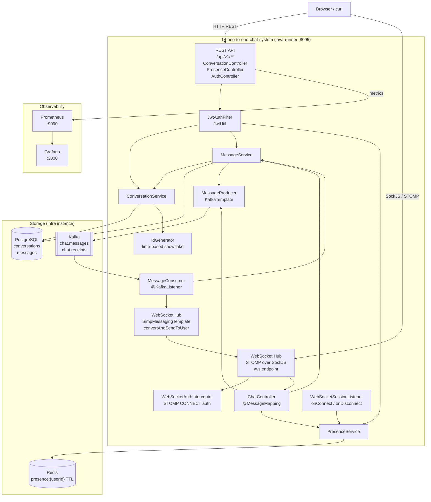
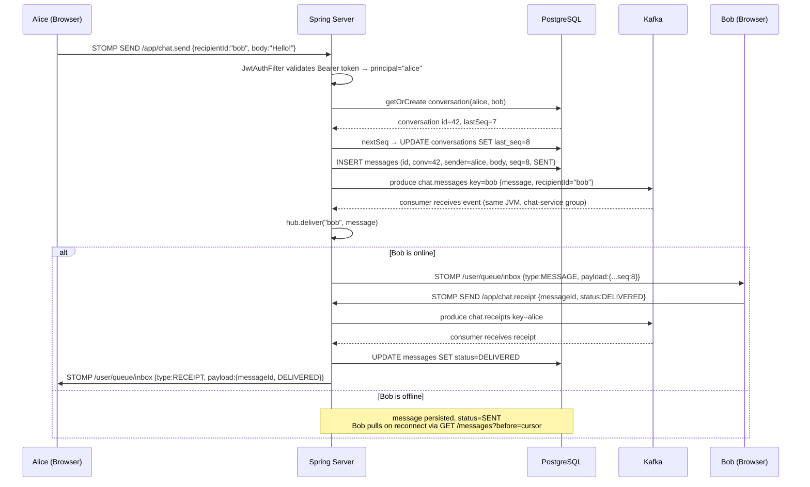

# Architecture — 14: One-to-One Chat System

## System diagram

## Happy-path sequence: Alice sends a message to Bob

## Components

### REST API (`/api/v1/`)

| Endpoint | Controller | Description |
|---|---|---|
| `POST /auth/token?userId=X` | `AuthController` | Issues demo JWT (no password check) |
| `GET /conversations` | `ConversationController` | Lists caller's conversations |
| `POST /conversations?recipientId=Y` | `ConversationController` | Gets or creates a conversation |
| `POST /conversations/{id}/messages` | `ConversationController` | Sends a message (REST path) |
| `GET /conversations/{id}/messages` | `ConversationController` | Cursor-paged message history |
| `GET /presence?users=a,b` | `PresenceController` | Bulk presence lookup |
| `GET /presence/{userId}` | `PresenceController` | Single user presence |

### WebSocket / STOMP

Clients connect to `/ws` (SockJS) and authenticate via the `Authorization: Bearer <token>` STOMP header on the CONNECT frame. After connecting, clients:
- **Subscribe** to `/user/queue/inbox` to receive inbound messages and receipts.
- **Send** to `/app/chat.send` to deliver a message.
- **Send** to `/app/chat.receipt` to acknowledge delivery or read.
- **Send** to `/app/chat.heartbeat` to refresh presence.

### Domain

- **`Conversation`** — canonical pair `(userA < userB)` with a monotonic `lastSeq` counter. Enforced unique constraint prevents duplicate conversations.
- **`Message`** — belongs to a conversation, has a `seq` (assigned under transaction), and progresses through `SENT → DELIVERED → READ` (transitions are append-only).
- **`IdGenerator`** — time-based 64-bit IDs (timestamp-shifted + sequence), monotonically increasing within a process.

### Kafka fanout

Every persisted message is published to `chat.messages` partitioned by `recipientId`. This decouples message persistence from WebSocket delivery:
- If the recipient is online → consumer delivers immediately via `SimpMessagingTemplate`.
- If offline → message stays in Postgres; the client fetches history on reconnect.

Read/delivery receipts flow through `chat.receipts`, partitioned by sender userId so the sender's receipt notification lands on the same partition as their other events.

### Presence (Redis TTL)

`PresenceStore` writes `presence:{userId} = epochMs` with a 30 s TTL on every heartbeat. The key expires automatically if the connection drops without a clean disconnect. `WebSocketSessionListener` also calls `markOffline()` on the `SessionDisconnectEvent` for immediate eviction.

### Security

`JwtAuthFilter` validates HTTP REST requests. `WebSocketAuthInterceptor` validates STOMP CONNECT frames — this sets the `Principal` on the session so `convertAndSendToUser` can route by userId. Both use the same `JwtUtil` (HS256, configurable secret + expiry).

## Capacity estimates

| Metric | Value | Notes |
|---|---|---|
| WebSocket connections | ~1 000 per JVM | t4g.large has 8 GB; each STOMP session ~50 KB |
| Message throughput | ~500 msg/s per node | Bounded by Postgres write latency (~2 ms p50) |
| Kafka lag | < 100 ms | Single-partition consumer; same JVM as producer |
| Presence TTL | 30 s | Stale presence window after unexpected disconnect |
| Message history | Unlimited | Postgres with index on (conversation_id, seq DESC) |
| Storage growth | ~1 KB/message | body + metadata; 1 M messages/day ≈ 1 GB/day |
| p50 REST send | ~5 ms | 1 DB write + 1 Kafka produce |
| p99 REST send | ~30 ms | Kafka produce latency tail |
| p50 WS delivery | ~10 ms end-to-end | REST send + Kafka round-trip + WS push |
