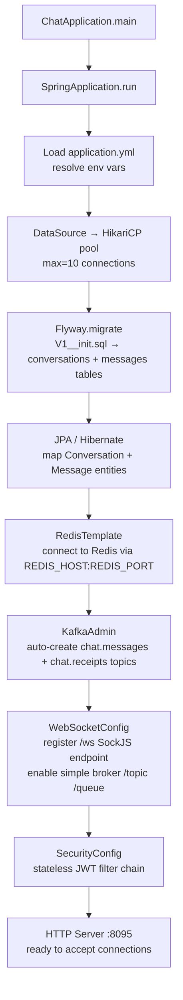
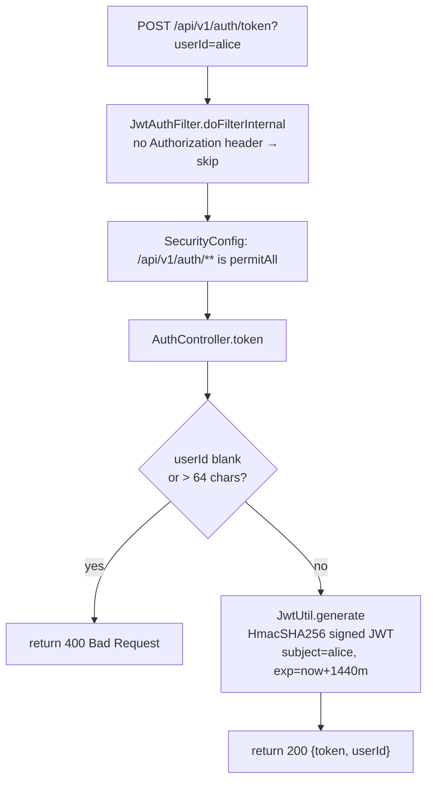
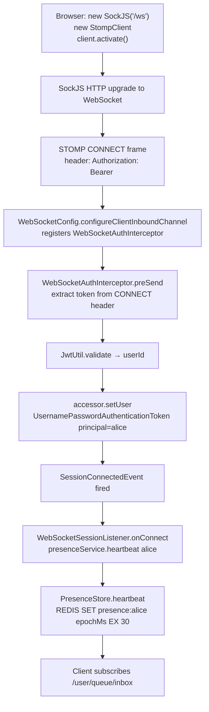
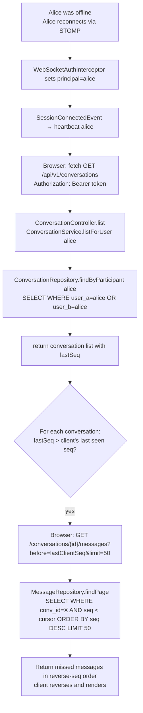
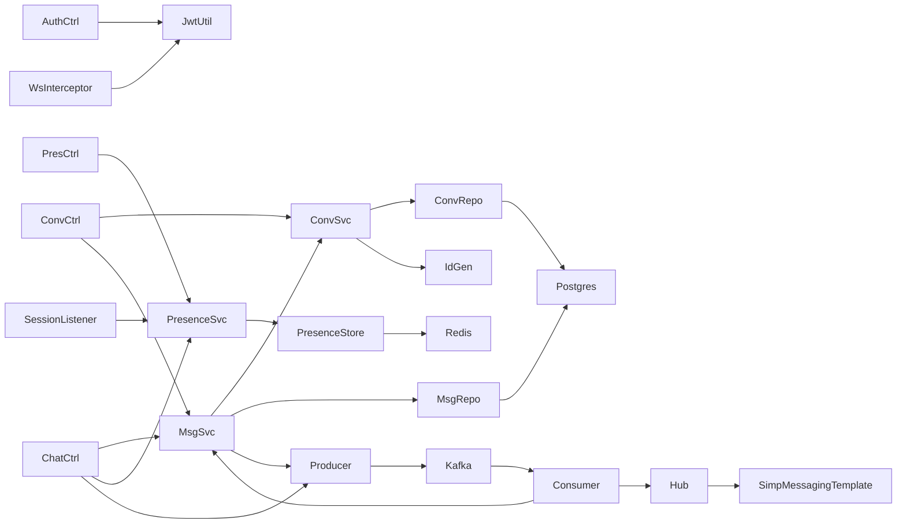

# Code Flow — 14: One-to-One Chat System

## Startup (`ChatApplication.main`)



## Operation 1: Authenticate (GET token)



Why: The JWT is the credential for all subsequent REST and WebSocket calls. Demo auth issues tokens for any userId — no password store needed.

## Operation 2: STOMP Connect



Why: Setting the Principal on the STOMP session is critical — `SimpMessagingTemplate.convertAndSendToUser("alice", ...)` routes to all sessions whose principal name is "alice". Without this, user-targeted delivery fails silently.

## Operation 3: Send message (WebSocket path)

```mermaid
flowchart TD
    A["Browser: STOMP SEND /app/chat.send\n{recipientId:bob, body:Hello}"] --> B[ChatController.handleSend\nprincipal=alice]
    B --> C[presenceService.heartbeat alice\nrefresh Redis TTL]
    C --> D[MessageService.send alice→bob Hello]
    D --> E[ConversationService.getOrCreate alice,bob]
    E --> F{"findByParticipants\nalice,bob in DB?"}
    F -->|exists| G[return existing Conversation]
    F -->|new| H[IdGenerator.nextId\ntimestamp<<12 | seq]
    H --> I[ConversationRepository.save\nINSERT conversations]
    I --> G
    G --> J[ConversationService.nextSeq\nUPDATE conversations SET last_seq=last_seq+1\nRETURN last_seq]
    J --> K[IdGenerator.nextId for message]
    K --> L[MessageRepository.save\nINSERT messages status=SENT]
    L --> M[MessageDto.from message]
    M --> N[MessageProducer.publishMessage\nkafka.send chat.messages key=bob\npayload={message, recipientId=bob}]
    N --> O[Return MessageDto to ChatController]
```

Why: `nextSeq` is a read-modify-write under JPA transaction with `@Transactional`. This ensures no two concurrent messages in the same conversation share the same `seq`. The Kafka publish is after the DB commit so the message is guaranteed durable before delivery is attempted.

## Operation 4: Kafka consumer → WebSocket delivery

```mermaid
flowchart TD
    A["Kafka consumer receives\nchat.messages partition=bob-hash"] --> B[MessageConsumer.onMessage\nKafkaMessageEvent]
    B --> C[WebSocketHub.deliver bob, messageDto]
    C --> D[SimpMessagingTemplate.convertAndSendToUser\nuserId=bob, /queue/inbox\nWsEnvelope{type:MESSAGE, payload}]
    D --> E{"Bob has active\nSTOMP session?"}
    E -->|yes| F[WS frame pushed to Bob's browser\nreturn true]
    E -->|no| G[SimpMessagingTemplate silently drops\nreturn false]
    F --> H[MessageConsumer: delivered=true\nMessageService.markDelivered messageId\nUPDATE messages SET status=DELIVERED]
    G --> I[delivered=false\nmessage stays SENT in DB\nBob pulls on reconnect]
```

Why: The consumer checks the return value of `deliver()` to decide whether to update the DB status. If the user is offline the message is already persisted — no retry needed. The client is responsible for fetching history on reconnect.

## Operation 5: Read receipt flow

```mermaid
flowchart TD
    A["Bob's browser: STOMP SEND /app/chat.receipt\n{messageId:99, userId:bob, status:READ}"] --> B[ChatController.handleReceipt\nprincipal=bob]
    B --> C[presenceService.heartbeat bob]
    C --> D[MessageProducer.publishReceipt\nkafka.send chat.receipts key=alice\nReceiptEvent{messageId:99, userId:bob, status:READ}]
    D --> E["Kafka consumer: MessageConsumer.onReceipt"]
    E --> F{"status == READ?"}
    F -->|yes| G[MessageService.markRead messageId\nUPDATE messages SET status=READ]
    F -->|no| H[skip DB update]
    G --> I[WebSocketHub.deliverReceipt\nconvertAndSendToUser alice /queue/inbox\nWsEnvelope{type:RECEIPT, payload}]
    I --> J[Alice's browser updates status indicator ✓✓]
```

Why: Receipts travel through Kafka for the same reason as messages — decouples the receipt sender's WebSocket session from the original sender's session. Both parties may be on different server nodes in a scaled-out deployment.

## Operation 6: Offline reconnect + message catch-up



Why: Cursor-based pagination (seq as cursor) avoids OFFSET scans and is stable — new messages arriving during pagination don't shift rows. The client compares server `lastSeq` against its own last-seen seq to know whether a catch-up fetch is needed.

## Call graph summary


