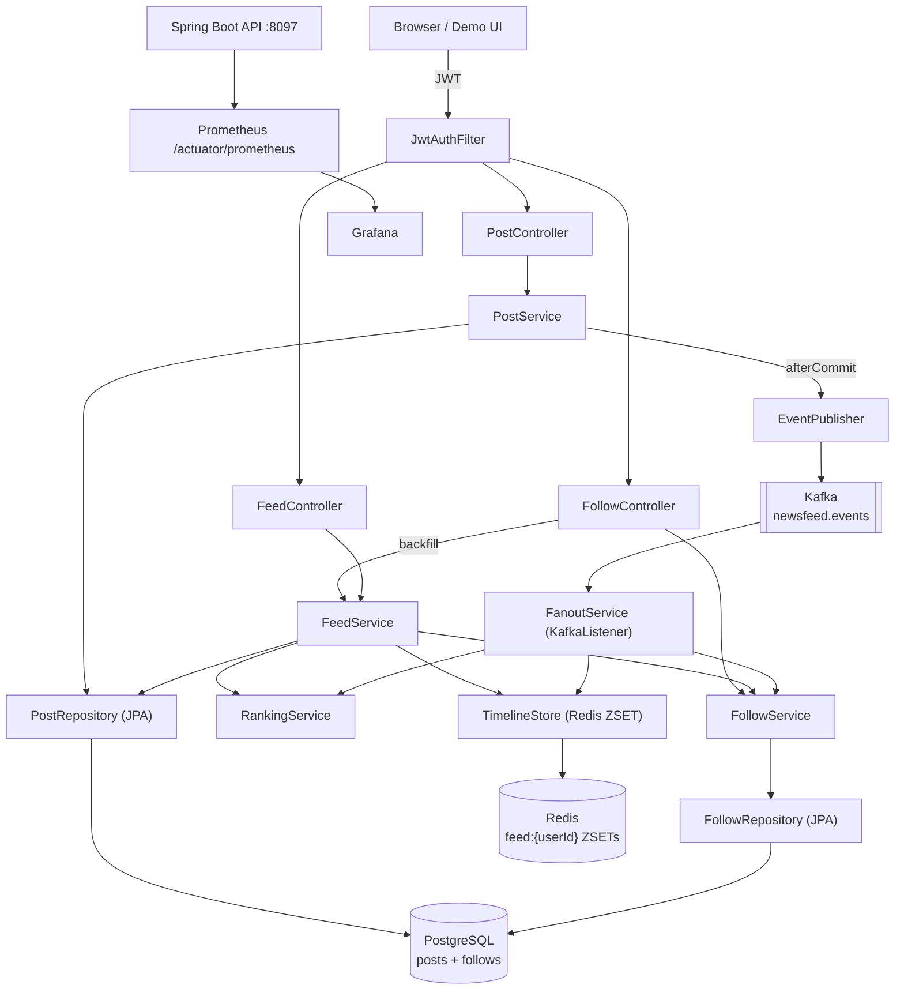
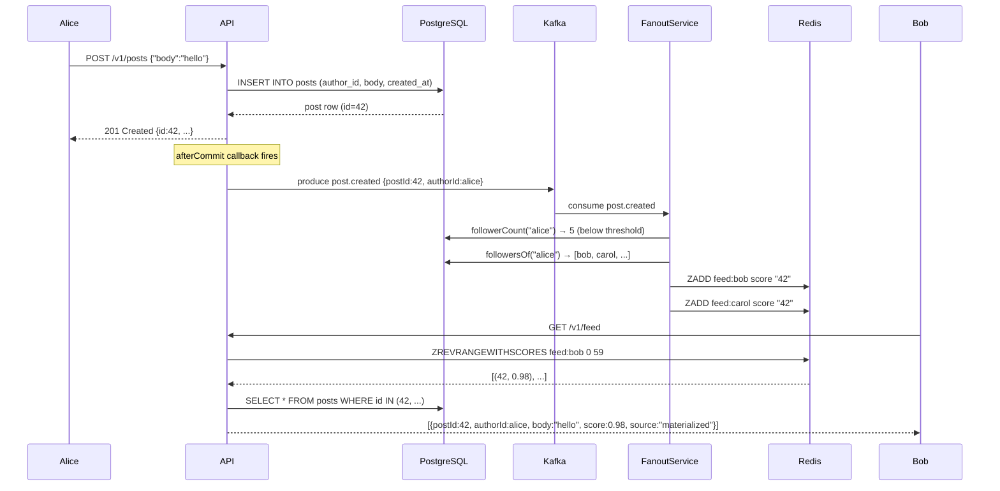

# Architecture — News Feed System (Project 16)

## Problem

Generate a personalized home feed for each user from the posts of the people
they follow, ranked rather than purely chronological, at a scale where a naive
"query everyone you follow on every read" does not survive.

## The core tension: fanout-on-write vs fanout-on-read

| | Fanout-on-write (push) | Fanout-on-read (pull) |
|---|---|---|
| When work happens | At post time | At read time |
| Read cost | O(1) — read your own timeline | O(followees) — query all authors |
| Write cost | O(followers) — write to every follower | O(1) — just store the post |
| Pain point | **Celebrity** with millions of followers ⇒ write storm | Active users reading often ⇒ read storm |

This project uses a **hybrid**. Normal authors fan out *on write*; authors above a
follower threshold (`newsfeed.fanout.celebrity-threshold`, default 1000) are
*not* fanned out — their posts are pulled at read time and merged in. This caps
worst-case write amplification while keeping reads cheap for the common case.

---

## System diagram



---

## Happy-path sequence: user posts, follower reads



---

## Components

### API layer
- **AuthController** — demo-mode JWT mint (`/api/auth/token`). No password store;
  tutorial scope only.
- **PostController** — create (`POST /v1/posts`) and soft-delete
  (`DELETE /v1/posts/{id}`). Validates body length ≤ 1000 chars.
- **FollowController** — `POST /v1/follows`; on success, triggers a timeline
  backfill so the new followee's history appears immediately.
- **FeedController** — `GET /v1/feed`, `POST /v1/feed/backfill`,
  `GET /v1/feed/stats`.

### Domain layer
- **PostService** — `@Transactional` write + `afterCommit` Kafka publish (durable
  before fanout). Soft-delete with author guard.
- **FollowService** — idempotent follow (duplicate follow is a no-op). Provides
  `followersOf`, `followeesOf`, `followerCount` for the fanout and read paths.
- **FeedService** — hybrid feed assembly: merge materialized ZSET + read-time
  celebrity pulls, filter soft-deleted, re-score, rank, page.
- **FanoutService** — `@KafkaListener` that fans a `post.created` event out to
  every follower's Redis ZSET, unless the author exceeds the celebrity threshold.
- **RankingService** — time-decay score = `0.5^(ageHours / halfLifeHours)`.
  Score halves every `half-life-hours` (default 12 h). Stored in the ZSET so the
  timeline is always in ranked order; re-scored at read time for freshness.

### Storage layer
- **PostgreSQL** — durable source of truth. Tables: `posts` (with `deleted` flag,
  composite index `(author_id, created_at DESC)`) and `follows` (unique constraint
  + indexes on both directions of the follow edge). Schema managed by Flyway.
- **Redis sorted sets** — one ZSET per user: `feed:{userId}`, member = postId,
  score = ranking score. Capped at `max-cached-items` (default 800).
- **Kafka topic `newsfeed.events`** — carries `PostCreatedEvent` records. Keyed
  by `authorId` to maintain per-author ordering on one partition.

### Observability
| Metric | Description |
|---|---|
| `newsfeed_posts_created_total` | Posts durably committed |
| `newsfeed_fanout_writes_total` | Timeline entries materialized on write |
| `newsfeed_celebrity_skips_total` | Posts skipped from write fanout (celebrity) |
| `newsfeed_read_path_pulls_total` | Posts pulled at read time (celebrity pull) |
| `newsfeed_feed_reads_total` | Home feed requests served |
| `newsfeed_feed_cache_hits_total` | Feed served from non-empty Redis timeline |
| `newsfeed_feed_cache_misses_total` | Feed where Redis timeline was empty |
| `newsfeed_feed_build_seconds` | Latency histogram: assembling a home feed page |
| `newsfeed_fanout_seconds` | Latency histogram: one fanout event |

---

## Data model

```sql
-- Durable source of truth
posts  (id BIGINT PK, author_id VARCHAR(128), body VARCHAR(1000),
        created_at TIMESTAMPTZ, deleted BOOLEAN DEFAULT FALSE)
follows (id BIGINT PK, follower_id VARCHAR(128), followee_id VARCHAR(128),
         created_at TIMESTAMPTZ, UNIQUE(follower_id, followee_id))

-- Materialized read model (Redis)
ZSET feed:{userId}   member=postId  score=rankingScore
```

---

## Capacity estimates

| Dimension | Estimate | Basis |
|---|---|---|
| Write throughput | ~500 posts/s | 50M DAU × 0.01 posts/day / 86 400 s |
| Fanout writes | ~50 000 ZADD/s | avg 100 followers × 500 posts/s |
| Feed reads | ~6 000 reads/s | 50M DAU × 10 reads/day / 86 400 s |
| PostgreSQL storage | ~30 GB/year | 500 posts/s × 500 B avg × 86 400 × 365 |
| Redis memory | ~3 GB | 500K active users × 800 items × 8 B per entry |
| Kafka retention | ~50 GB | 500 events/s × 1 KB × 86 400 s × 1 day |

---

## Failure modes and mitigations

| Failure | Mitigation in this build |
|---|---|
| Celebrity fanout storm | Authors above threshold skipped on write; pulled at read time |
| Stale feed after Redis loss | Backfill API reconstructs timeline from PostgreSQL |
| Deleted post remains in feed | Soft-delete flag; filtered lazily at read time |
| Ranking job failure | Score is recomputed at read time from `createdAt`; ZSET score corrected |
| Duplicate Kafka delivery | ZADD is idempotent; re-processing same event is safe no-op |
