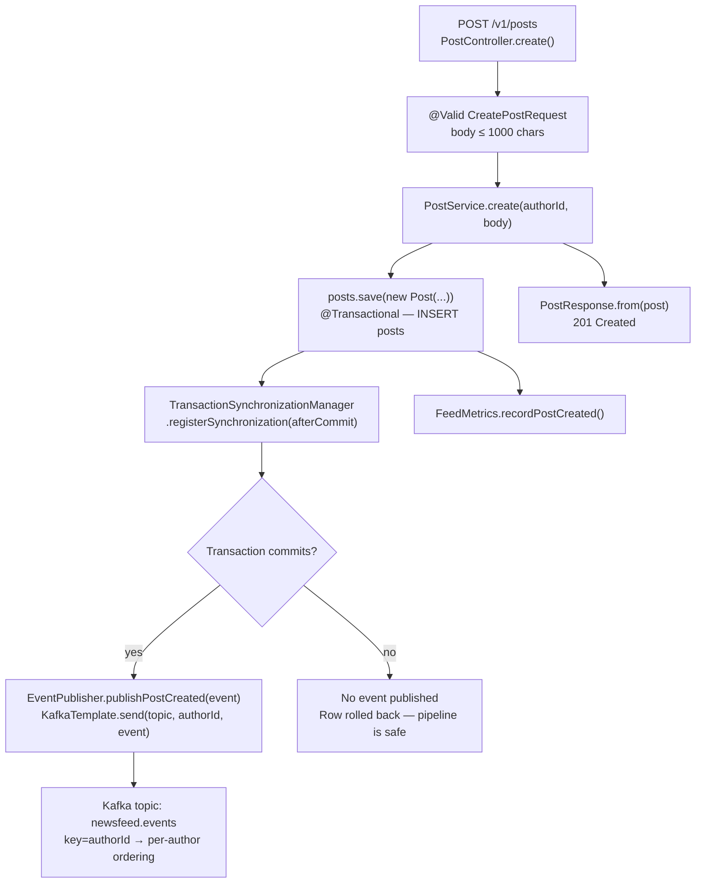
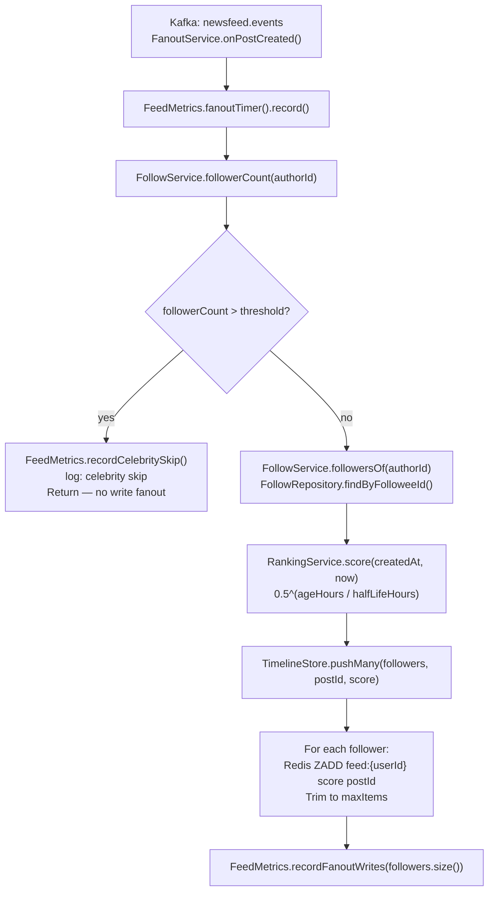
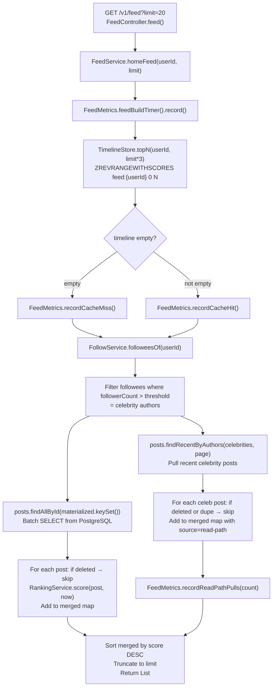
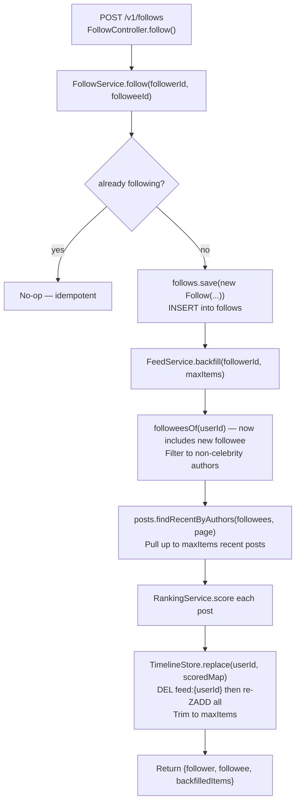
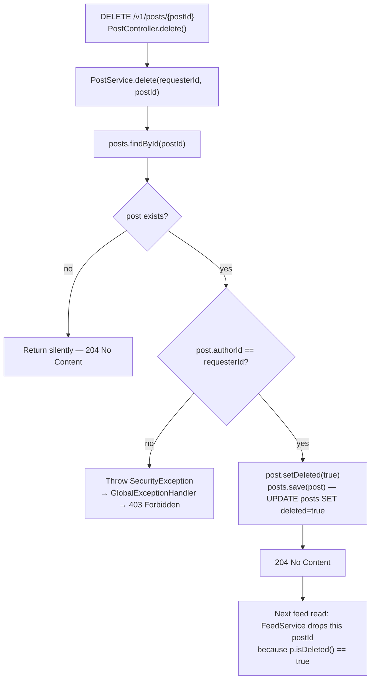
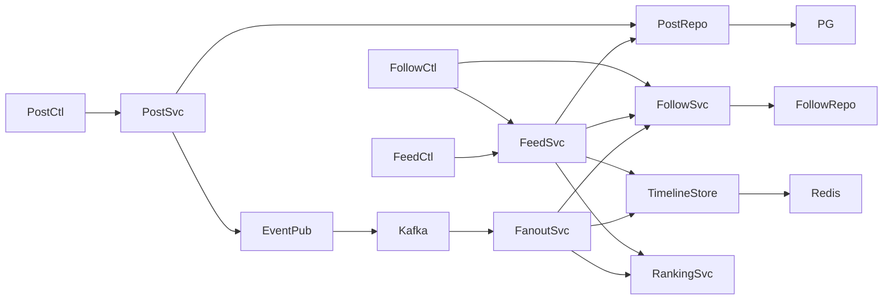

# Code Flow — News Feed System (Project 16)

Traces the three core paths through the codebase from the HTTP entry point to
the storage layer and back.

---

## 1. Write path: creating a post

**Why `afterCommit`?** Publishing before commit risks fanning out a post that
never makes it to the source of truth. The `afterCommit` hook ensures Kafka only
receives events for rows that are durable in PostgreSQL.

---

## 2. Fanout path: consuming a post event

**Why celebrity skip?** A user with 10M followers would trigger 10M ZADDs on
every post — a write storm. Authors above the threshold are excluded; their posts
are pulled at read time instead.

**Why is fanout idempotent?** Redis ZADD with the same member and score is a
no-op update. At-least-once Kafka delivery is therefore safe — a re-delivered
event re-issues the same ZADDs with no visible effect.

---

## 3. Read path: assembling a home feed

**Why over-fetch from Redis?** We request `limit × 3` IDs from the ZSET to
account for soft-deleted posts. After filtering, we still have a full page.

**Why re-score at read time?** The ZSET score was set at fanout time. For
long-lived posts the stored score is stale. Re-scoring with `now` gives an
accurate ranking, and celebrity posts (never materialized) get the same formula.

---

## 4. Follow + backfill path

**Why backfill on follow?** Without it, following someone only surfaces their
future posts. Backfill brings their recent history into the timeline immediately,
which matches the expected UX.

---

## 5. Soft-delete path

**Why soft delete?** The post ID may be materialized in dozens or thousands of
follower timelines (Redis ZSETs). Hunting down every ZSET entry would be
expensive and error-prone. Soft delete + lazy read-time filtering is correct,
cheap, and naturally handles the eventual-consistency lag.

---

## Call graph summary

