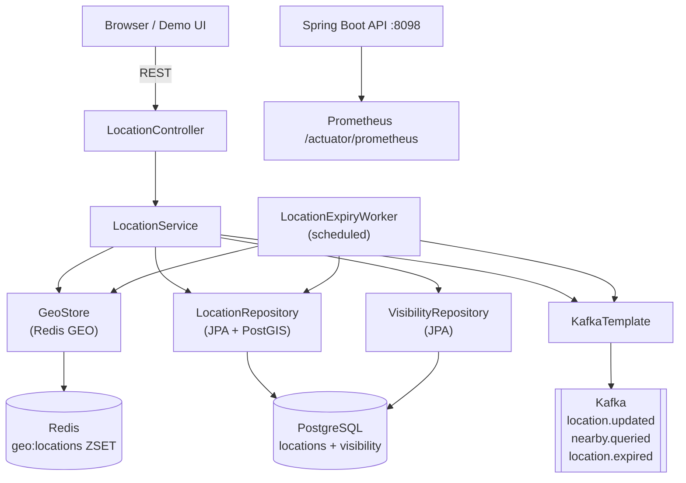
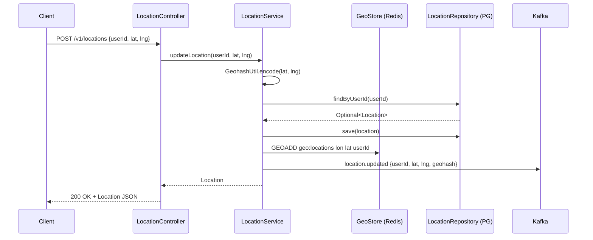
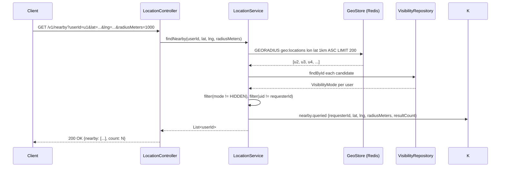

# Architecture — Proximity Service (Project 17)

## Problem

Find nearby entities (users, drivers, restaurants, devices) with low latency.
The challenge is that locations change frequently, queries must be cheap at any
scale, and users have privacy expectations that must be enforced consistently.

---

## The core tension: hot reads vs durable writes

| | Redis GEO (hot path) | PostGIS (cold/durable path) |
|---|---|---|
| Purpose | Sub-millisecond nearby lookup | History, analytics, correctness audits |
| Data lifetime | TTL-evicted (5 min default) | Permanent, append-only |
| Consistency | Eventually consistent | Strongly consistent |
| Query cost | O(N) with spatial index | O(log N) GIST index |
| Privacy enforcement | In-process filter on results | SQL WHERE clause |

This project uses **Redis GEO as the hot layer** and **PostGIS as the durable
layer**. Every write goes to both; reads hit Redis first. The TTL worker
reconciles expiry between the two stores.

---

## System diagram

---

## Request flow — location update

---

## Request flow — nearby query

---

## Components

### LocationController (`api/`)
REST entry point. Validates input, sets MDC request ID for structured logging,
delegates to `LocationService`.

Endpoints: `POST /v1/locations`, `GET /v1/nearby`, `DELETE /v1/locations/{id}`,
`PUT /v1/visibility/{id}`, `GET /v1/locations/{id}`.

### LocationService (`service/`)
Core business logic:
- Encodes lat/lng to geohash (precision 9, ~4.8m)
- Writes to both Redis GEO and PostgreSQL transactionally
- Applies visibility filter on nearby results
- Publishes Kafka events after every mutation

### GeoStore (`store/`)
Thin adapter over Spring Data Redis `GeoOperations`. Translates between
domain types and Redis `GEOADD` / `GEORADIUS` commands.

### LocationExpiryWorker (`service/`)
Scheduled task (period = TTL seconds). Scans for rows whose `updated_at` is
older than the TTL, removes them from both Redis and PostgreSQL, and publishes
`location.expired` Kafka events.

### GeohashUtil (`domain/`)
Pure-Java Base32 geohash encoder. No external library dependency. Precision 9
(~4.8m × 4.8m cells). Can be swapped for a library (e.g. `ch.hsr.geohash`)
without changing the service layer.

### Flyway migration (`V1__init.sql`)
Creates `locations` table with a PostGIS `GEOMETRY(Point, 4326)` column and a
GIST spatial index, a `visibility_settings` table, and a `nearby_queries`
analytics table.

---

## Data model

### `locations`
| Column | Type | Notes |
|---|---|---|
| `user_id` | VARCHAR(128) UNIQUE | natural key |
| `lat`, `lng` | DOUBLE PRECISION | WGS84 |
| `geohash` | VARCHAR(12) | precision 9 |
| `geom` | GEOMETRY(Point,4326) | PostGIS, GIST-indexed |
| `updated_at` | TIMESTAMPTZ | used by expiry worker |

### `visibility_settings`
| Column | Type | Notes |
|---|---|---|
| `user_id` | VARCHAR(128) PK | |
| `mode` | VARCHAR(32) | PUBLIC / FRIENDS / HIDDEN |

### Redis GEO key
`geo:locations` — sorted set with geohash scores. Members are `user_id` strings.

---

## Kafka events

| Topic | Key | Payload |
|---|---|---|
| `location.updated` | userId | `{userId, lat, lng, geohash}` |
| `nearby.queried` | requesterId | `{requesterId, lat, lng, radiusMeters, resultCount}` |
| `location.expired` | userId | `{userId, reason}` |

---

## Capacity estimates

| Metric | Value | Assumption |
|---|---|---|
| Active users updating location | 100K/s | peak mobile app |
| Location record size (Redis) | ~50 bytes | geohash + score |
| Location record size (PG) | ~200 bytes | with PostGIS geom |
| Redis memory @ 1M active users | ~50 MB | well within free tier |
| Kafka throughput | 100K msg/s | 3 partitions, 1x replica |
| Nearby query latency | p50 <10ms, p99 <50ms | Redis GEO GEORADIUS |

---

## Observability

- `proximity_location_updates_total` — counter, location writes
- `proximity_nearby_queries_total` — counter, nearby lookups
- `proximity_nearby_query_latency_seconds` — timer, p50/p95/p99
- Spring Boot Actuator at `/actuator/health`, `/actuator/prometheus`
- Structured logs with `request_id`, `userId`, `geohash` in MDC
