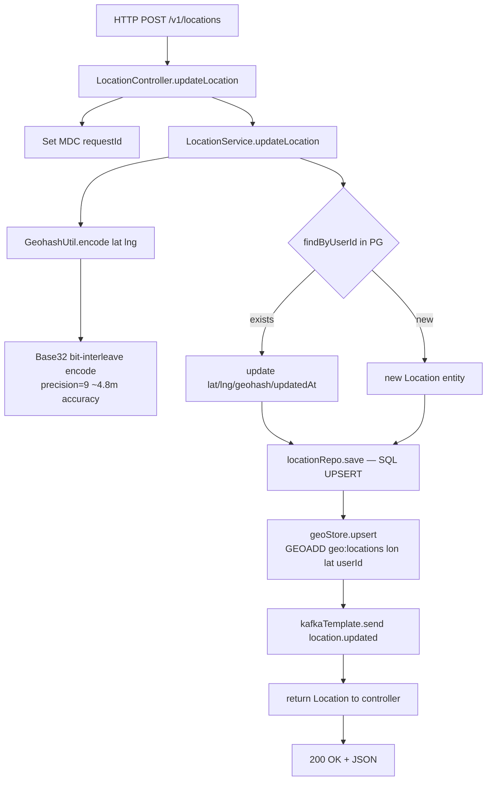
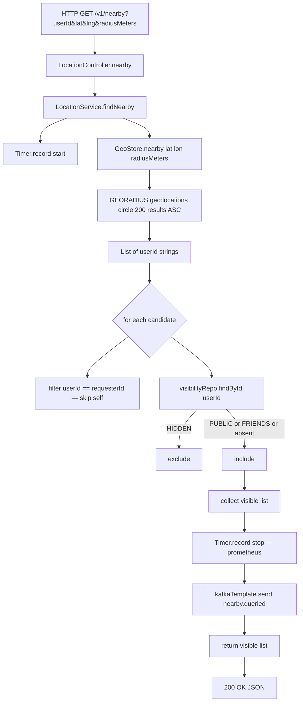
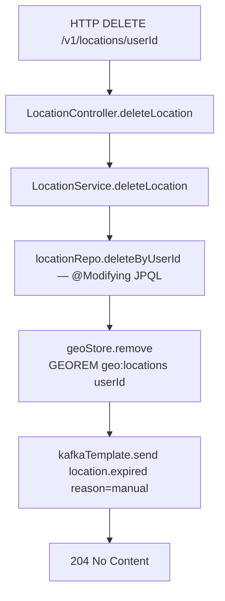
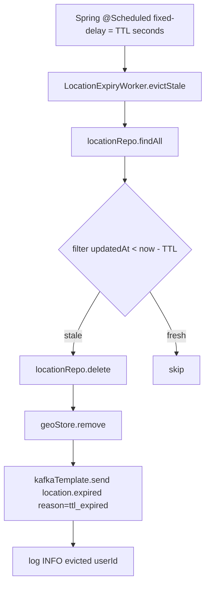
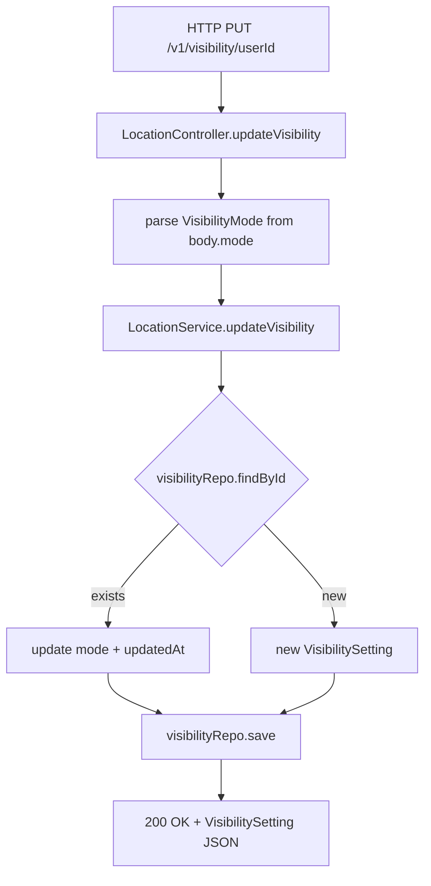
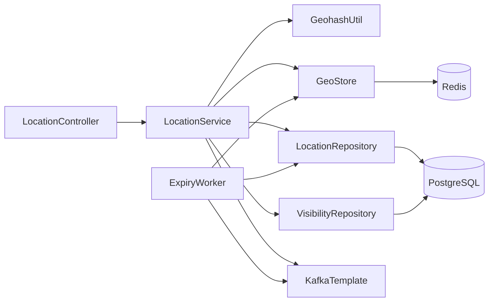

# Code Flow — Proximity Service (Project 17)

## Entry point

`ProximityServiceApplication.main()` boots Spring Boot, which:
1. Applies Flyway migrations (PostGIS extension + DDL)
2. Registers Kafka topics via `KafkaConfig` `@Bean` methods
3. Starts `LocationExpiryWorker` scheduler
4. Listens on port 8098

---

## Operation: Update Location (`POST /v1/locations`)

**Why both stores?**
Redis GEO is ephemeral — data is TTL-evicted. PostgreSQL is the system of
record. Writing both on every update keeps them consistent until the TTL worker
runs. The JPA save is inside a `@Transactional` boundary; Redis and Kafka writes
happen after the transaction commits (post-commit effect not explicitly isolated
here — acceptable for MVP, a `TransactionSynchronization.afterCommit` hook
would harden it for production).

---

## Operation: Nearby Query (`GET /v1/nearby`)

**Why filter in process, not in Redis?**
Redis GEO has no concept of visibility. The per-user mode is a low-cardinality
join (one row per user in PG), so filtering in the application after a Redis
radius query is cheaper than adding a secondary index or Lua script. For
production at scale, visibility could be cached in Redis hashes to avoid PG
round-trips per candidate.

---

## Operation: Delete Location (`DELETE /v1/locations/{userId}`)

---

## Operation: Expiry Worker (scheduled)

**Trade-off note:** `findAll()` is O(N) — fine for MVP but must be replaced
with a range query `WHERE updated_at < :cutoff` for production. A Redis sorted
set keyed by timestamp could drive expiry with zero PostgreSQL scans.

---

## Operation: Update Visibility (`PUT /v1/visibility/{userId}`)

---

## Call graph summary

