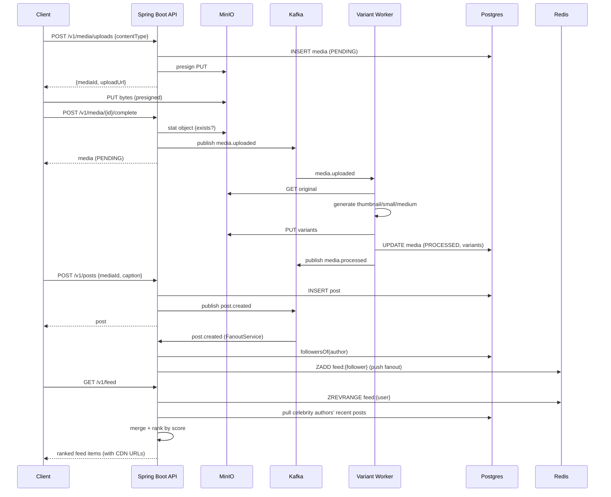

# Architecture — Instagram Photo/Video Sharing & Feed (Project 18)

A media-heavy social system: upload photos/videos, generate display variants
asynchronously, serve a ranked home feed, and track engagement. Metadata and the
social graph live in PostgreSQL; hot feeds and counters in Redis; media bytes in
an S3-compatible object store (MinIO) fronted by a CDN (Cloudflare) in
production. Kafka decouples upload acceptance from variant processing and feed
fanout.

## System diagram

```mermaid
graph TD
  subgraph Client
    UI[Demo UI / API client]
  end

  subgraph App[Spring Boot API :8099]
    MC[MediaController]
    PC[PostController]
    FC[FollowController]
    FDC[FeedController]
    MOC[MediaObjectController<br/>/media/**]
    MS[MediaService]
    PS[PostService]
    ES[EngagementService]
    FS[FeedService]
    FOS[FanoutService<br/>@KafkaListener]
    MPW[MediaProcessingWorker<br/>@KafkaListener]
    VG[VariantGenerator]
    URLS[MediaUrlService]
    CDN[CdnInvalidationService]
  end

  subgraph Storage
    PG[(PostgreSQL<br/>users, follows, media,<br/>posts, engagements)]
    RD[(Redis<br/>feed ZSETs, like counters)]
    OS[(MinIO<br/>originals/ + variants/)]
  end

  subgraph Bus[Kafka]
    T1{{media.uploaded}}
    T2{{media.processed}}
    T3{{post.created}}
    T4{{post.liked}}
  end

  EDGE[[Cloudflare CDN<br/>prod only]]

  UI -->|presign / complete| MC
  UI -->|PUT bytes direct| OS
  UI -->|create post| PC
  UI -->|follow| FC
  UI -->|GET feed| FDC
  UI -->|GET media url| EDGE --> MOC --> OS

  MC --> MS --> PG
  MS -->|publish| T1
  T1 --> MPW --> VG
  MPW -->|download original / write variants| OS
  MPW --> MS
  MPW -->|publish| T2
  MPW -->|purge keys| CDN --> URLS

  PC --> PS --> PG
  PS -->|publish| T3
  T3 --> FOS --> RD
  FOS --> PG

  PC -->|like| ES --> PG
  ES --> RD
  ES -->|publish| T4

  FDC --> FS
  FS --> RD
  FS --> PG
  FS --> URLS

  App -.metrics.-> PROM[Prometheus]
  PROM --> GRAF[Grafana]
```

## Primary happy path — upload → post → feed



## Components

| Component | Responsibility |
|---|---|
| `MediaController` | Two-phase upload: presign + complete; media reads. Identity via trusted `X-User-Id` header (gateway-set in prod). |
| `MediaService` | Media metadata lifecycle (PENDING → PROCESSED/FAILED); emits `media.uploaded`. |
| `MediaStore` | MinIO adapter: presigned PUT, stat, get/put object bytes. |
| `MediaProcessingWorker` | Kafka consumer of `media.uploaded`; generates image variants, marks PROCESSED, purges CDN, emits `media.processed`. |
| `VariantGenerator` | Pure image resizing (Thumbnailator) → thumbnail/small/medium JPEGs. |
| `PostService` | Creates posts referencing owned media; emits `post.created`. |
| `FanoutService` | Kafka consumer of `post.created`; hybrid fanout — push to follower ZSETs, skip celebrities. |
| `FeedService` | Hybrid read: Redis timeline + live celebrity pull, ranked + paginated; resolves CDN URLs. |
| `EngagementService` | Idempotent like/unlike; durable rows in Postgres + hot counter in Redis; emits `post.liked`. |
| `FollowService` | Social graph (follows) reads/writes. |
| `RankingService` | Time-decay score (half-life) used as the ZSET score. |
| `TimelineStore` | Per-user Redis ZSET home timelines (ZADD/ZREVRANGE, trim to bound). |
| `CounterStore` | Redis like counters (atomic INCR/DECR). |
| `MediaUrlService` | Object key → public URL; the single config swap point (local path ↔ Cloudflare host). |
| `CdnInvalidationService` | Edge cache purge seam (logs locally; Cloudflare purge_cache in prod). |
| `MediaObjectController` | Local CDN-shaped serving of object bytes with immutable Cache-Control. |

## External dependencies

- **PostgreSQL** (shared infra, db `instagram`) — durable metadata, social graph, engagement.
- **Redis** (shared infra) — home-timeline ZSETs and like counters.
- **Kafka** (shared infra) — `media.uploaded`, `media.processed`, `post.created`, `post.liked`.
- **MinIO** (bundled per-project) — S3-compatible object store for media bytes.
- **Cloudflare** (production only) — CDN in front of MinIO; swapped in via `MEDIA_PUBLIC_BASE_URL`.

## Design decisions

- **Hybrid fanout** (push for normal authors, pull for celebrities above
  `fanout-follower-threshold`) bounds write amplification while keeping reads cheap.
- **Two-phase presigned upload** keeps large media bytes off the application's
  request path — clients PUT straight to object storage.
- **Post metadata is durable before variants finish**: a post may reference a
  PENDING media; the feed shows the original until variants land. Eventually
  consistent display, strongly consistent metadata.
- **Variants are immutable** (unique keys) → long, immutable Cache-Control; the
  invalidation seam handles the reprocess/delete cases that change bytes.

## Capacity (MVP envelope)

| Dimension | Estimate / limit |
|---|---|
| Upload size | 25 MB (multipart/presigned limit) |
| Variants per image | 3 (thumbnail 150px, small 320px, medium 640px) |
| Timeline size per user | trimmed to 500 entries (ZSET) |
| Feed page size | 20 (default) |
| Fanout write cost | O(followers) ZADDs, skipped above 10k followers |
| Storage growth | original + ~3 variant JPEGs per image post |
| Read path | feed = 1 ZREVRANGE + N hydrations + celebrity pull |
