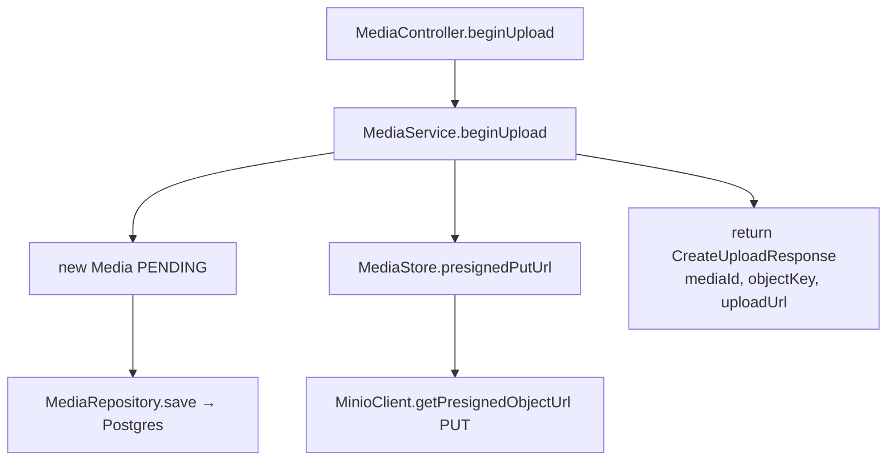
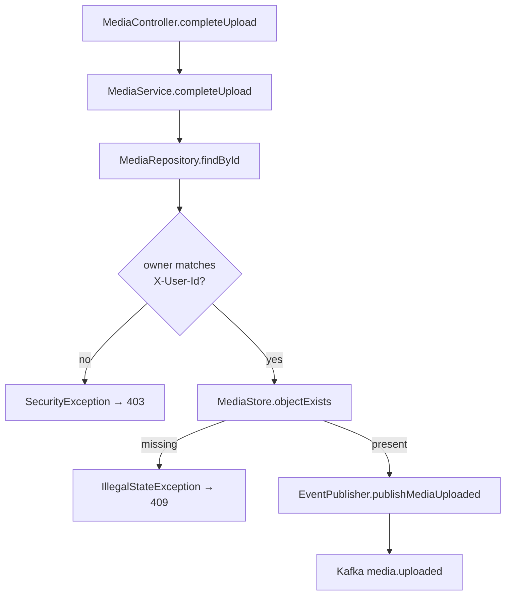
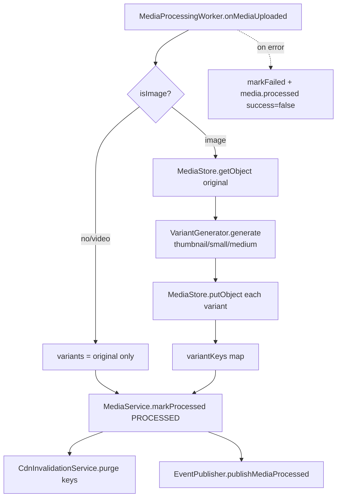
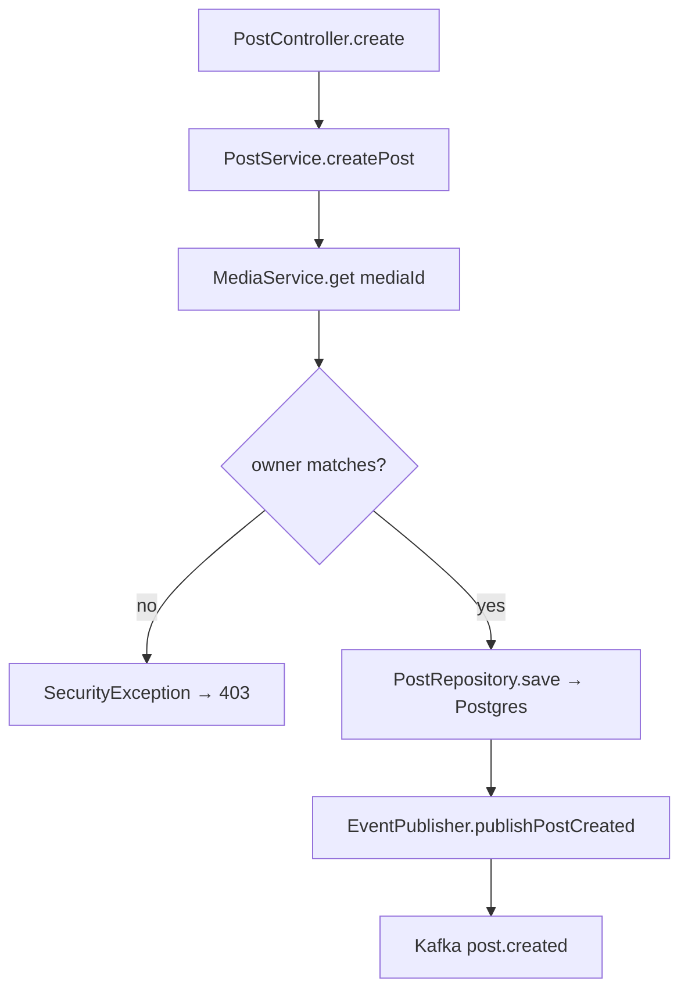
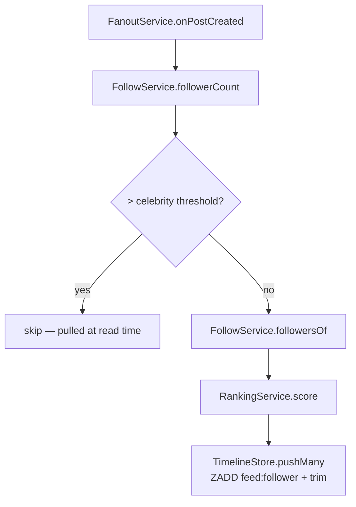
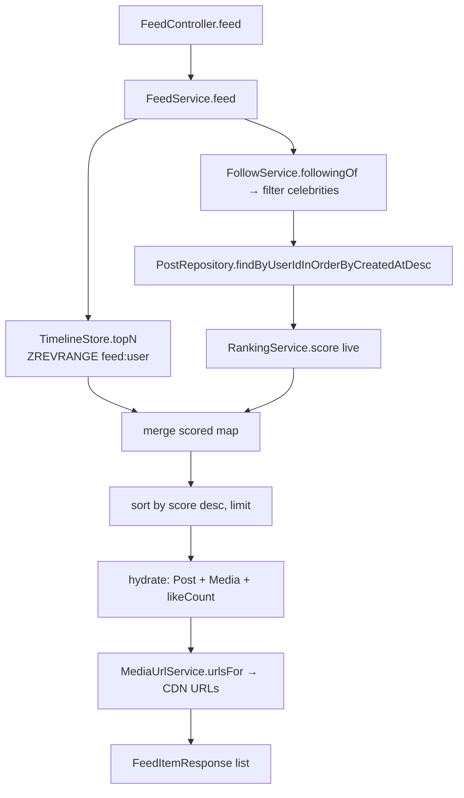
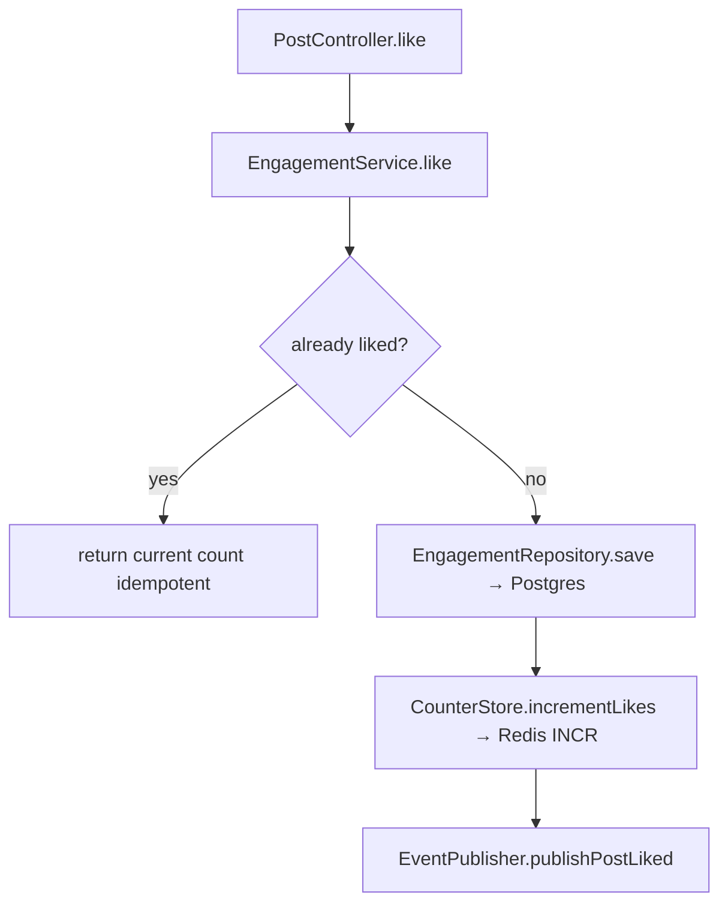
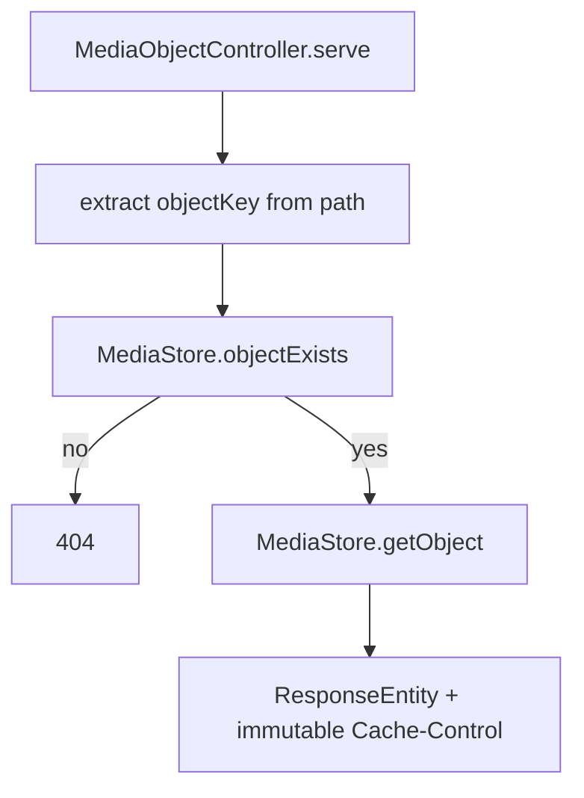
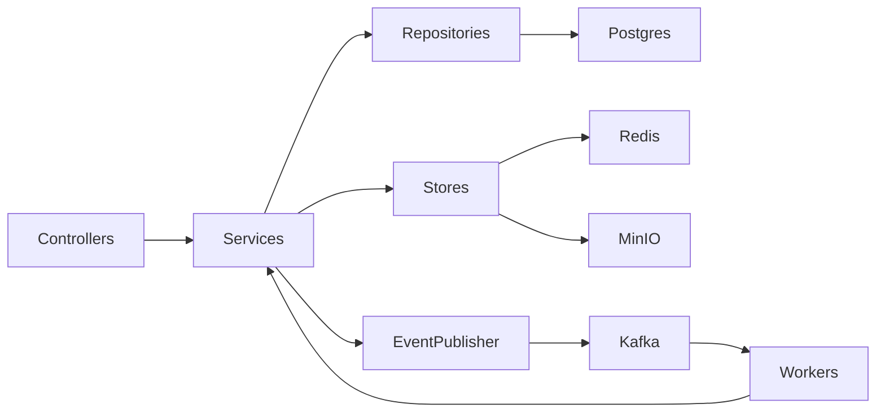

# Code Flow — Project 18

Traces each major operation from the HTTP/Kafka entry point through to storage.

## 1. Begin upload (`POST /v1/media/uploads`)

Why: the metadata row is created up front (PENDING) so the system has a durable
handle before any bytes exist. The presigned URL lets the client upload directly
to object storage, keeping media bytes off the app.

## 2. Complete upload (`POST /v1/media/{id}/complete`)

Why: completion verifies the client actually uploaded the bytes before announcing
the media to downstream consumers, and enforces ownership.

## 3. Variant generation (Kafka `media.uploaded`)

Why: processing is async and idempotent — re-delivery just rewrites the same
variant keys. Reprocessing purges the CDN so stale variants aren't served.

## 4. Create post (`POST /v1/posts`)

Why: a post can reference a still-PENDING media (write path not blocked on
processing). The event drives fanout asynchronously.

## 5. Fanout (Kafka `post.created`)

Why: hybrid fanout bounds write amplification. Pushing to each follower's ZSET
makes the common-case read O(1) range scan.

## 6. Read feed (`GET /v1/feed`)

Why: the precomputed timeline serves the bulk cheaply; celebrity posts are merged
in live so they're never missed despite being skipped during fanout.

## 7. Like (`POST /v1/posts/{id}/likes`)

Why: durable row in Postgres (source of truth) + atomic Redis counter (hot read).
Idempotency keeps the counter from drifting under retries/double-clicks.

## Serve media bytes (`GET /media/**`)

## Call graph summary

