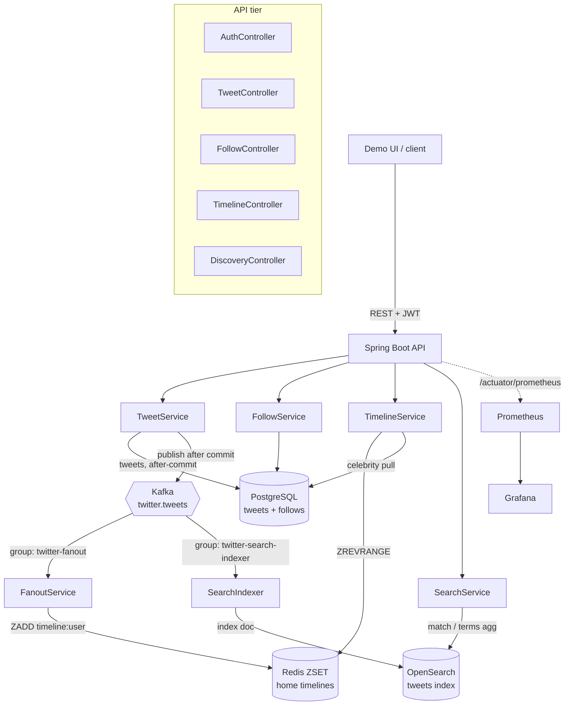
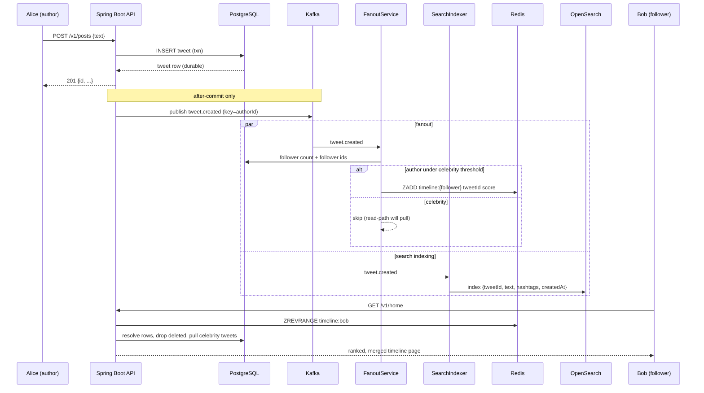

# Architecture — Twitter/X Timeline and Posts

A microblogging backend: short posts (tweets), a follow graph, ranked home
timelines built with **hybrid fanout**, and public discovery via **full-text
search** and **trending hashtags**. PostgreSQL is the durable source of truth;
Redis holds materialized timelines; OpenSearch holds the search/trends
projection; Kafka carries the `tweet.created` event to two independent async
workers.

## System diagram

## Primary happy path — post a tweet, read a timeline

## Components and responsibilities

| Component | Responsibility |
|---|---|
| `AuthController` | Demo JWT minting (`POST /api/auth/token`). No password store — tutorial only. |
| `TweetController` | Create / soft-delete tweets (`/v1/posts`). |
| `FollowController` | Add a follow edge; backfills the follower's timeline. |
| `TimelineController` | Home timeline read, backfill, stats (`/v1/home*`). |
| `DiscoveryController` | Public search and trends (`/v1/search`, `/v1/trends`). |
| `TweetService` | Write path: persist tweet in a txn, publish `tweet.created` **after commit**. |
| `FollowService` | The social graph: follower/followee lookups + counts. |
| `FanoutService` | Kafka consumer (`twitter-fanout`): materialize tweets into follower ZSETs; skip celebrities. |
| `SearchIndexer` | Kafka consumer (`twitter-search-indexer`): index tweets into OpenSearch. |
| `TimelineService` | Read path: merge materialized ZSET + celebrity pull, re-rank, drop deletes. |
| `SearchService` | Read facade over OpenSearch for search + trends. |
| `RankingService` | Time-decay score: `0.5 ^ (ageHours / halfLife)`. |
| `TimelineStore` | Redis ZSET adapter (push/topN/trim/replace). |
| `SearchStore` | OpenSearch adapter: index, match query, hashtag terms aggregation. |
| `EventPublisher` | Kafka producer, keyed by `authorId` for per-author ordering. |
| `TwitterMetrics` | Micrometer counters/timers (`twitter_*`). |

## Why hybrid fanout

- **Fanout-on-write** (push) makes reads cheap — a home timeline is one Redis
  `ZREVRANGE`. But it costs O(followers) writes per tweet.
- For a **celebrity** (followers > `celebrity-threshold`, default 1000), that
  write amplification is the dominant failure mode. So those authors are
  **skipped on write** and their tweets are **pulled on read** instead.
- The read path merges both sources, so the cost is bounded on both sides: the
  write path never explodes, and the read path only pays the pull for the
  (few) celebrities a user actually follows.

## Why a separate search consumer

Search/trends indexing runs as an **independent consumer group** on the same
`tweet.created` topic. A slow or failing OpenSearch never blocks timeline
delivery (and vice-versa). This isolates the "search lag" failure mode:
discovery degrades while the home timeline stays fast.

## Consistency model

| Data | Store | Consistency |
|---|---|---|
| Tweets, follow graph | PostgreSQL | Strong (source of truth) |
| Home timelines | Redis ZSET | Eventually consistent (rebuilt by backfill) |
| Search index / trends | OpenSearch | Eventually consistent (async indexer) |

Tweet durability leads; all projections follow. Soft deletes are honored
lazily at read time, so a stale Redis entry for a deleted tweet is filtered out
on the next read.

## Capacity sketch (single-node demo)

| Dimension | Estimate |
|---|---|
| Tweet write | 1 PG insert + 1 Kafka publish |
| Fanout cost (non-celebrity) | O(followers) Redis ZADD |
| Fanout cost (celebrity) | O(1) — skipped, pulled on read |
| Home read | 1 Redis ZREVRANGE + 1 PG `findAllById` + (per-celebrity pull) |
| Timeline memory | O(users × `max-cached-items`), default 800/user |
| Search query | 1 OpenSearch `match` |
| Trends query | 1 OpenSearch `terms` agg over 24h window |

## External dependencies

- **PostgreSQL** (shared `infra` network) — tweets + follows, Flyway-migrated.
- **Redis** (shared `infra`) — home-timeline sorted sets.
- **Kafka** (shared `infra`) — `twitter.tweets` topic, 6 partitions, keyed by author.
- **OpenSearch** (bundled single-node, this project's `docker-compose.yml`) — `tweets` index.
- **Prometheus / Grafana** (shared `infra`) — scrape `/actuator/prometheus`.
