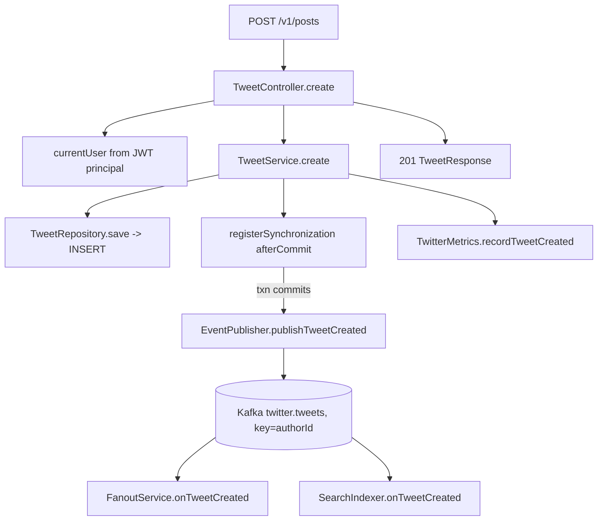
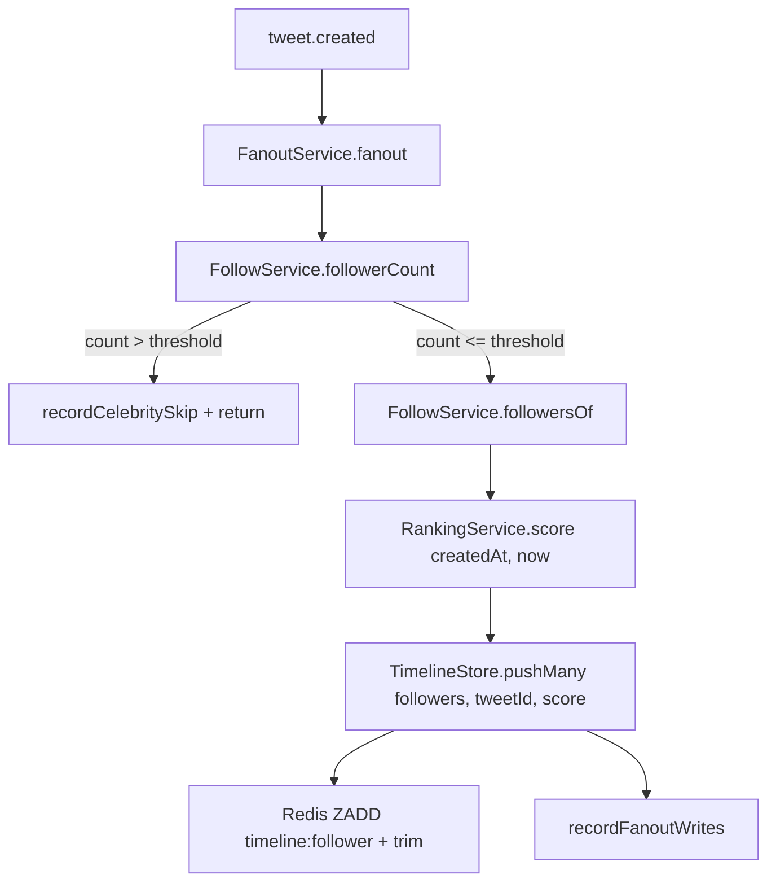
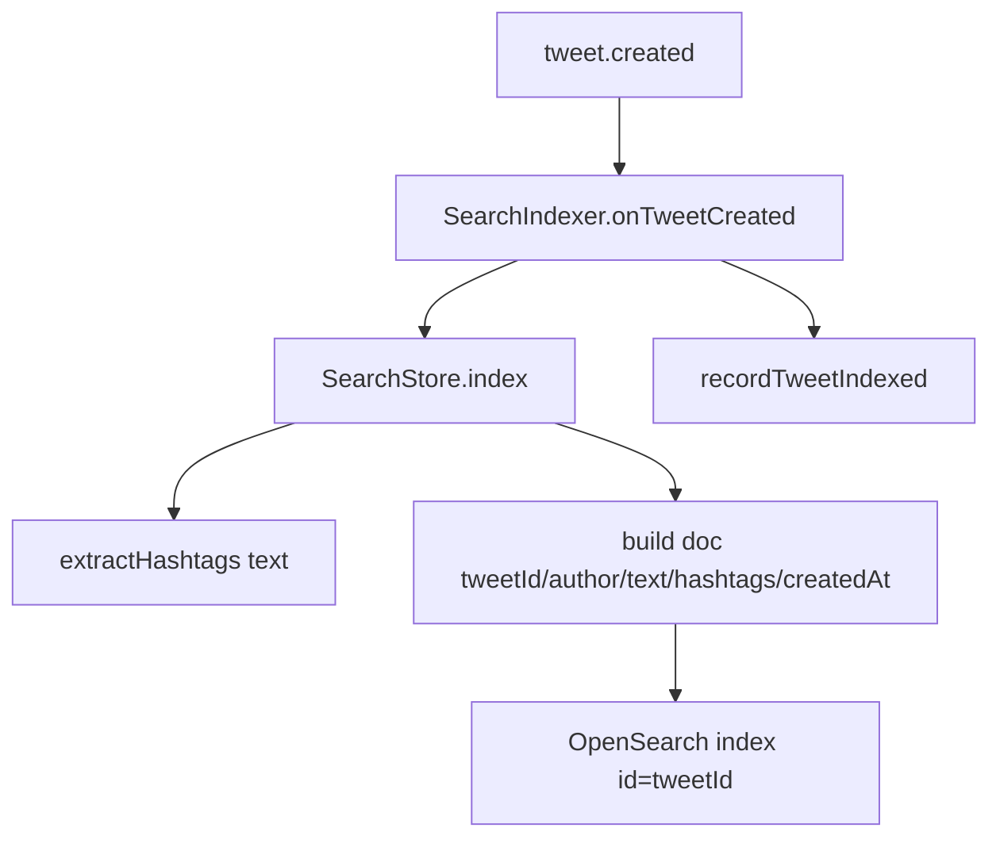
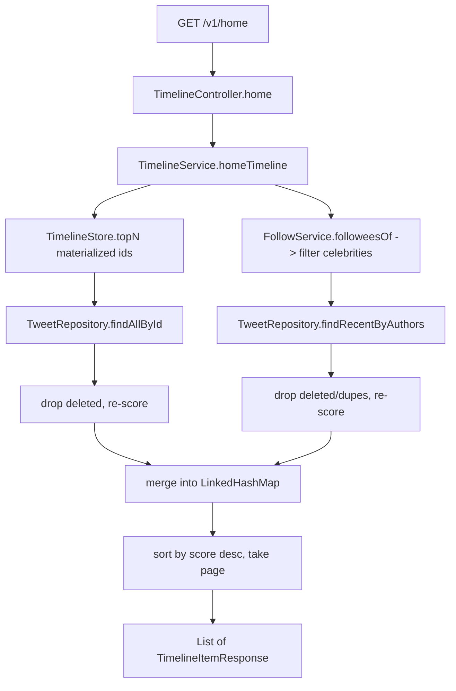
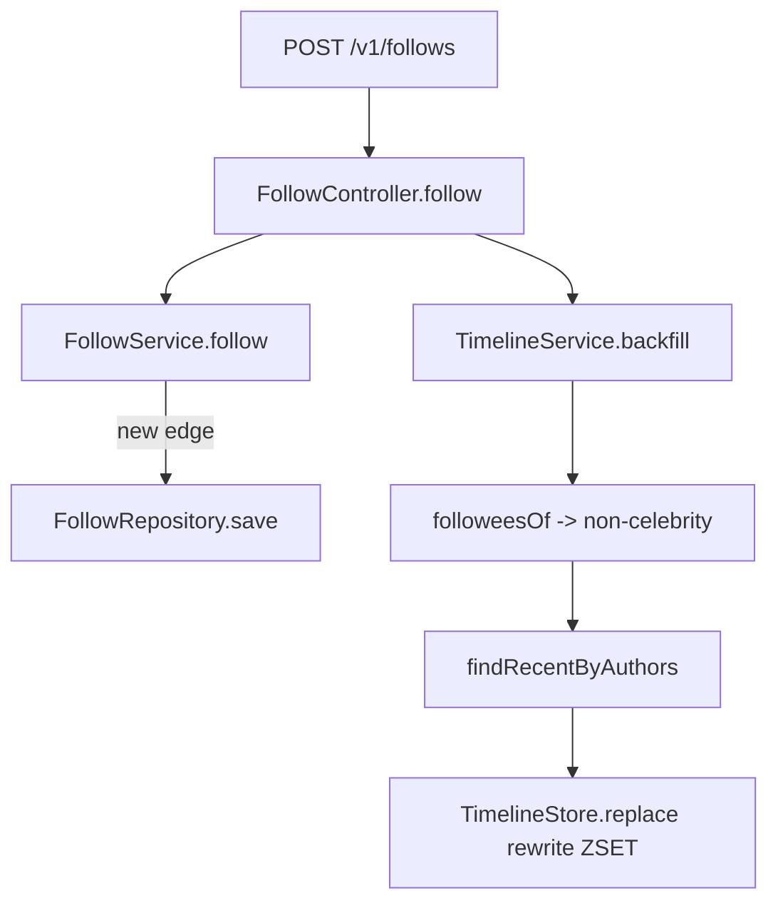
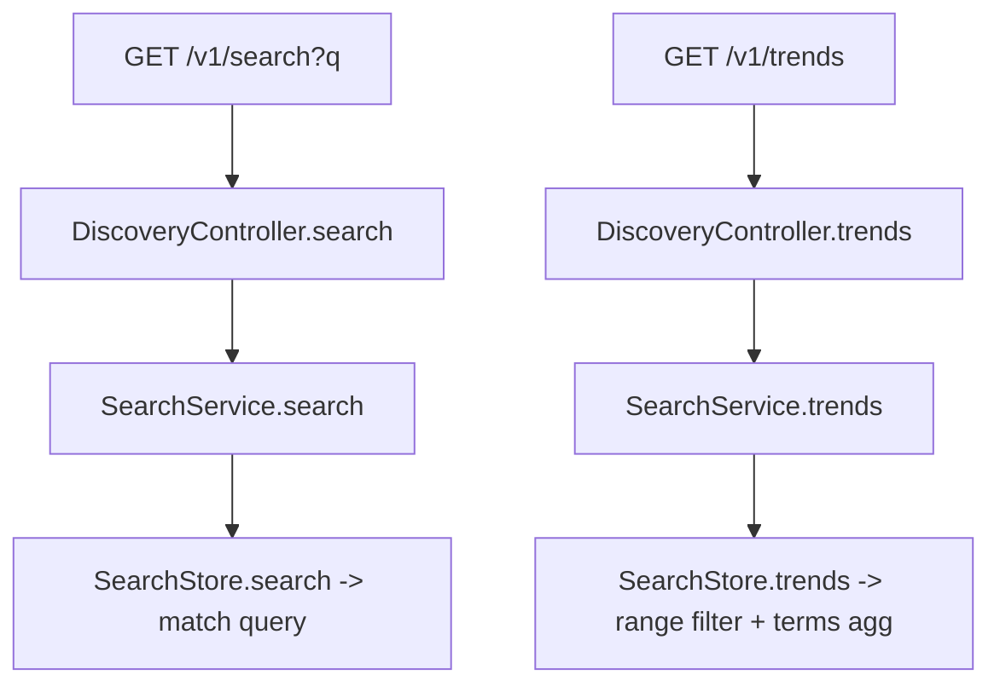
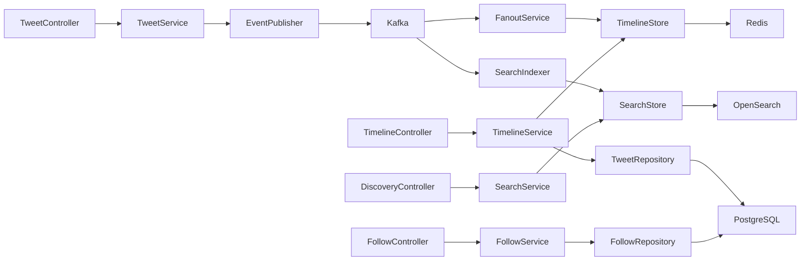

# Code Flow — Twitter/X Timeline and Posts

Traces every significant call from the HTTP edge through services, stores, the
Kafka workers, and back. Three major operations: **post a tweet**, **read the
home timeline**, and **search / trends**.

## 1. Post a tweet (write path + async fanout/index)

**Why each call:**
- `currentUser()` reads the authenticated principal set by `JwtAuthFilter` — the
  author id is never trusted from the request body.
- `TweetService.create` runs in a `@Transactional` method so the INSERT is
  atomic. The Kafka publish is deferred to `afterCommit` so we **never fan out
  or index a tweet that wasn't durably stored** — if the txn rolls back, no
  event fires.
- Keying the Kafka record by `authorId` keeps one author's events on a single
  partition, preserving per-author order across both consumers.

## 2. Async fanout (consumer group `twitter-fanout`)

**Why:** the celebrity branch is the write-amplification guard. For ordinary
authors we compute one time-decay score and ZADD the tweet id into every
follower's sorted set, trimming each to `max-cached-items`. Re-processing the
same event re-issues identical ZADDs (idempotent), so at-least-once delivery is
safe.

## 3. Async search indexing (consumer group `twitter-search-indexer`)

**Why:** a second, independent consumer group means indexing failures don't stall
fanout. Doc id = `tweetId` makes indexing idempotent. Hashtags are extracted
once at index time into a keyword field so the trends aggregation counts whole
tags.

## 4. Read the home timeline (hybrid merge)

**Why:** source 1 (materialized ZSET) is the cheap common case; source 2 pulls
celebrity tweets the user follows that were skipped on write. Both are resolved
to live `Tweet` rows so soft-deleted tweets are dropped and every item is
re-scored against *now* before the final ranked page is returned. Over-fetching
(`pageLimit * 3`) ensures a full page survives dropping deletes.

## 5. Follow + backfill

**Why:** without backfill, a brand-new follow would only surface the followee's
*future* tweets. Backfill reconstructs the materialized timeline from Postgres so
recent history appears immediately. It's also the repair path after Redis loss.

## 6. Search / trends (public read)

## Call-graph summary

