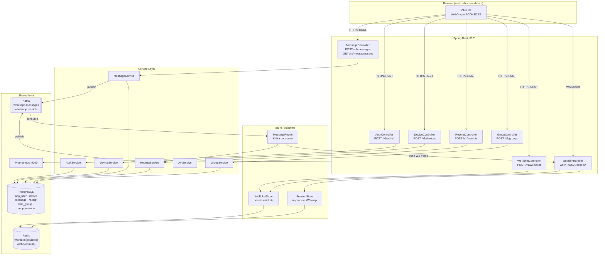
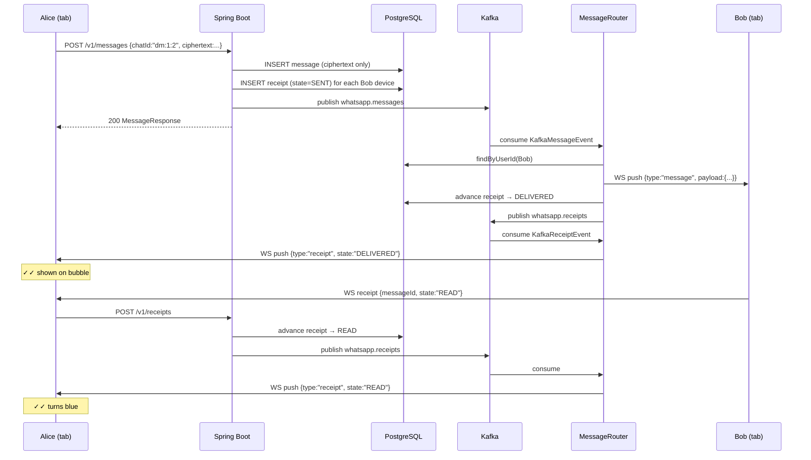
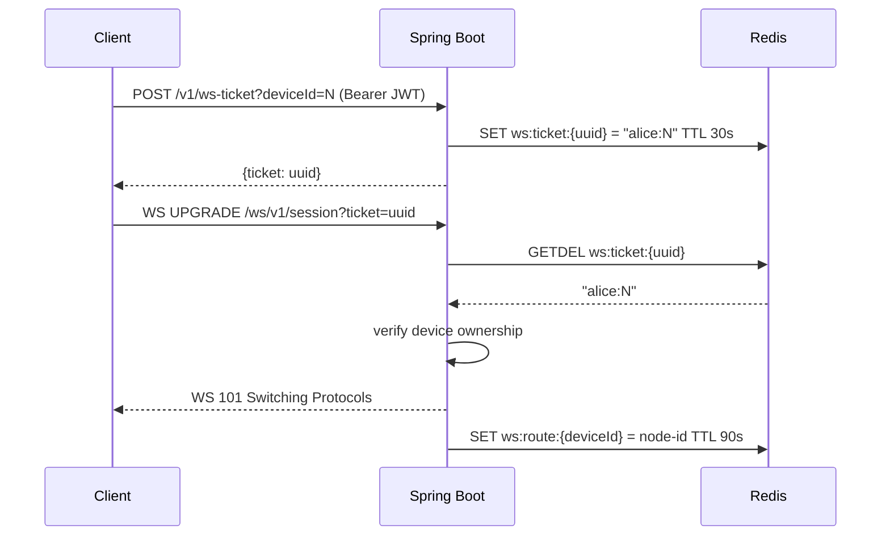

# Architecture — WhatsApp Real-Time Messaging (Project 20)

## System diagram



## Sequence diagram — send a DM



## Sequence diagram — WebSocket connection (one-time ticket)



## Components

| Component | Package | Responsibility |
|---|---|---|
| `WhatsappApplication` | root | Spring Boot entry point, scheduling enabled |
| `AuthController` / `AuthService` | api / service | Register/login; issues JWT; password hash in-memory for demo |
| `JwtService` | service | HS256 JWT sign/verify via JJWT 0.12 |
| `DeviceController` / `DeviceService` | api / service | Device registration; stores ECDH public key |
| `WsTicketController` / `WsTicketStore` | api / store | Issues 30 s single-use Redis ticket so JWT never appears in WS URL |
| `SessionHandler` | api | Spring WebSocket `TextWebSocketHandler`; ticket redemption; heartbeat; receipt frame dispatch |
| `SessionStore` | store | In-process `deviceId→WebSocketSession` map + Redis route TTL |
| `MessageController` / `MessageService` | api / service | Send message; participant authorization on sync; Kafka publish |
| `MessageRouter` | store | Kafka consumer; WebSocket fan-out; marks DELIVERED |
| `ReceiptController` / `ReceiptService` | api / service | Receipt state machine SENT→DELIVERED→READ; Kafka publish |
| `GroupController` / `GroupService` | api / service | Group CRUD; owner-only member add |
| Repositories | repository | Spring Data JPA for all domain entities |
| Flyway migrations | resources/db | V1 core schema, V2 group schema |

## Data model

```
app_user(id, username, created_at)
device(id, user_id→app_user, public_key, label, created_at, last_seen)
message(id, chat_id, sender_id→app_user, ciphertext BYTEA, created_at)
receipt(message_id→message, device_id→device, state, updated_at)   PK(message_id,device_id)
chat_group(id, name, owner_id→app_user, created_at)
group_member(id, group_id→chat_group, user_id→app_user, joined_at)
```

**E2EE boundary**: `ciphertext` is opaque BYTEA. The server never decrypts it. The browser generates an ECDH P-256 key pair (WebCrypto), registers the public key with the server, derives a per-chat AES-GCM-256 shared key, and encrypts all plaintext locally before sending.

## Chat ID format

| Format | Example | Used for |
|---|---|---|
| `dm:{uid1}:{uid2}` | `dm:1:2` | Direct message (uids sorted ascending) |
| `group:{groupId}` | `group:5` | Group chat |

## Capacity estimates (single node, demo scale)

| Metric | Value | Notes |
|---|---|---|
| Target p50 send latency | < 20 ms | API → Postgres write |
| Target p95 WS push latency | < 100 ms | Kafka round-trip |
| Target p99 sync latency | < 200 ms | Postgres range scan |
| Message throughput | ~5 k msg/s | Single Kafka partition per chatId |
| Storage growth | ~1 KB/msg avg | ciphertext + metadata |
| Redis WS route TTL | 90 s | Refreshed on heartbeat (30 s interval) |
| WS ticket TTL | 30 s | Single-use, then GETDEL |
| Offline backlog page size | 200 msgs | Configurable via `whatsapp.delivery.sync-page-size` |

## Availability and durability

- Messages are durable once committed to Postgres (before Kafka publish).
- Kafka publish failure throws `RuntimeException` → the send HTTP call fails (client can retry).
- Offline backlog is Postgres-backed: offline devices pick up missed messages via `/v1/messages/sync` on reconnect.
- Redis is ephemeral (session routes); loss causes reconnects but no message loss.

## Failure modes designed for

| Failure | Behaviour |
|---|---|
| Mobile reconnect / tab reload | `SessionHandler` closes old session; client reconnects; WS ticket re-issued; backlog drained via sync |
| Duplicate delivery | `receiptRepository.findById` is idempotent; Kafka consumer is at-least-once but receipt state machine is forward-only so duplicate DELIVERED events are no-ops |
| Device key rotation | Register a new Device with new public key; old chatKeys in peer browsers are not invalidated (demo limitation) |
| Offline backlog | State = SENT in Postgres; `GET /v1/messages/sync` drains on reconnect |
