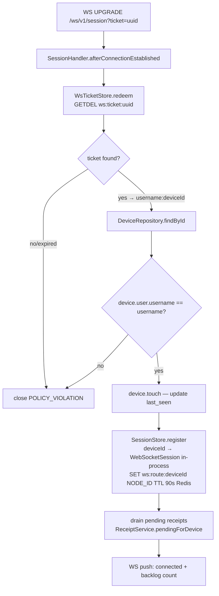
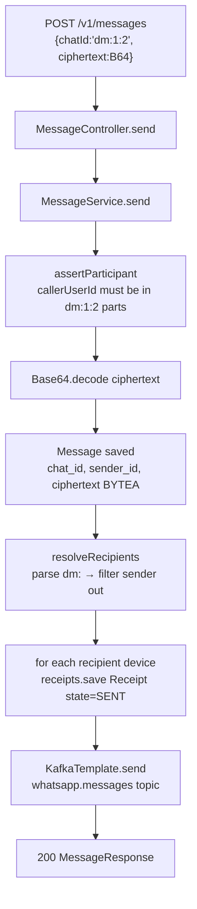
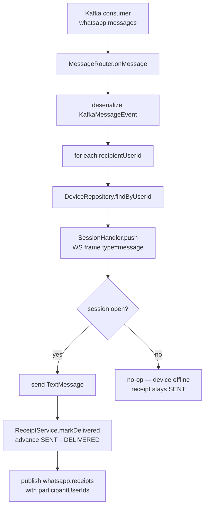
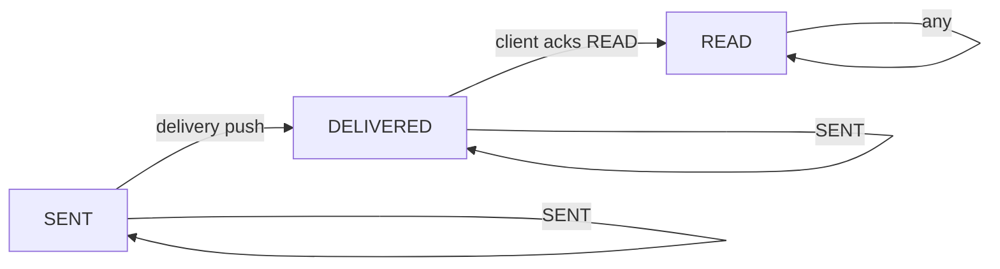
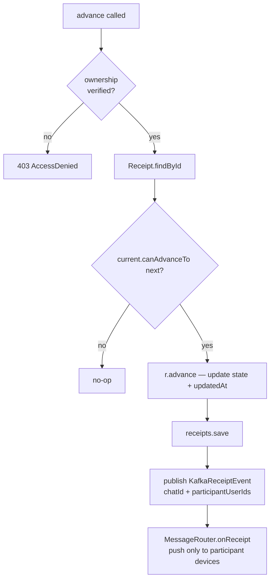
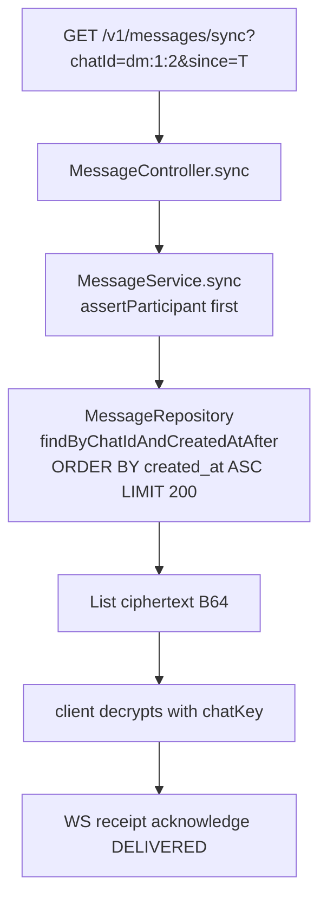
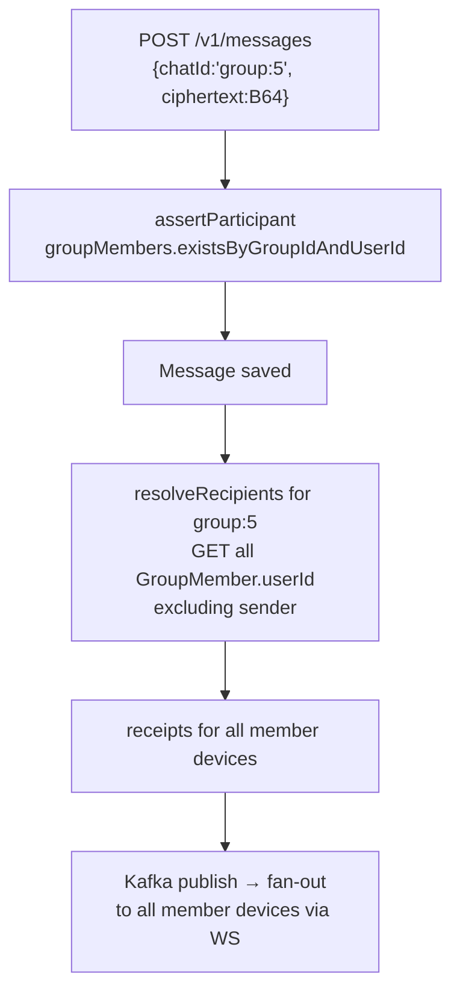
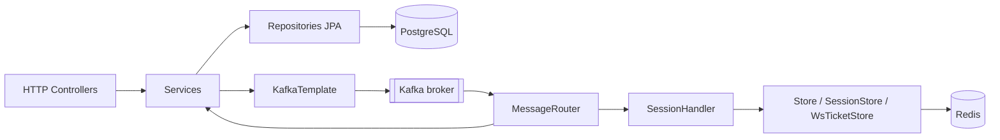

# Code Flow — WhatsApp Real-Time Messaging (Project 20)

## 1. Register + Login

```mermaid
flowchart TD
    A[POST /v1/auth/register] --> B[AuthController.register]
    B --> C{username exists?}
    C -- yes --> D[400 Bad Request]
    C -- no --> E[AppUser saved to Postgres]
    E --> F[password hash stored in-memory map]
    F --> G[JwtService.generate\nHS256 JWT, uid claim]
    G --> H[AuthResponse{token, userId, username}]

    I[POST /v1/auth/login] --> J[AuthController.login]
    J --> K[UserRepository.findByUsername]
    K --> L{found?}
    L -- no --> M[401 Bad Credentials]
    L -- yes --> N[BCrypt.matches\npassword vs hash]
    N -- fail --> M
    N -- ok --> G
```

**Why**: JWT is stateless — the server signs once and never stores sessions. `uid` claim lets downstream code avoid an extra DB lookup for userId.

---

## 2. Device registration + WS ticket

```mermaid
flowchart TD
    A[POST /v1/devices] --> B[SecurityConfig JWT filter\nextract username from Bearer]
    B --> C[DeviceController.register]
    C --> D[DeviceService.register]
    D --> E[Device saved\npublic_key stored as spki B64]
    E --> F[DeviceResponse{id, userId, publicKey}]

    G[POST /v1/ws-ticket?deviceId=N] --> H[WsTicketController.issue]
    H --> I[WsTicketStore.issue]
    I --> J[UUID ticket → Redis\nKEY ws:ticket:uuid VALUE username:deviceId TTL 30s]
    J --> K[{ticket: uuid}]
```

**Why**: The ticket ensures the JWT never appears in the WebSocket URL (which would be logged by reverse proxies and appear in browser history). The 30-second TTL bounds the window of ticket theft.

---

## 3. WebSocket connect



**Why**: `GETDEL` makes the ticket single-use atomically. `ws:route:deviceId` in Redis is the foundation for future multi-node routing — other nodes can see which node owns a device connection.

---

## 4. Send a DM message



**Why**: Message is committed to Postgres before Kafka publish — durability is guaranteed even if Kafka is temporarily unavailable. Receipts are pre-created in SENT state so offline devices have a record to drain on reconnect.

---

## 5. Kafka fan-out (MessageRouter)



**Why**: Fan-out happens asynchronously in the Kafka consumer so the sender's HTTP call returns immediately. Offline devices keep `state=SENT` and drain via `/v1/messages/sync` on reconnect.

---

## 6. Receipt state machine





**Why**: Forward-only invariant prevents a READ receipt from being downgraded to DELIVERED by a duplicate Kafka delivery. Scoped push (finding 2) prevents one user seeing another chat's receipt updates.

---

## 7. Offline sync



**Why**: `since` allows incremental sync — client passes the `createdAt` of the last known message. The 200-item page cap prevents a single reconnect from saturating the DB.

---

## 8. Group message send



---

## Call graph summary


