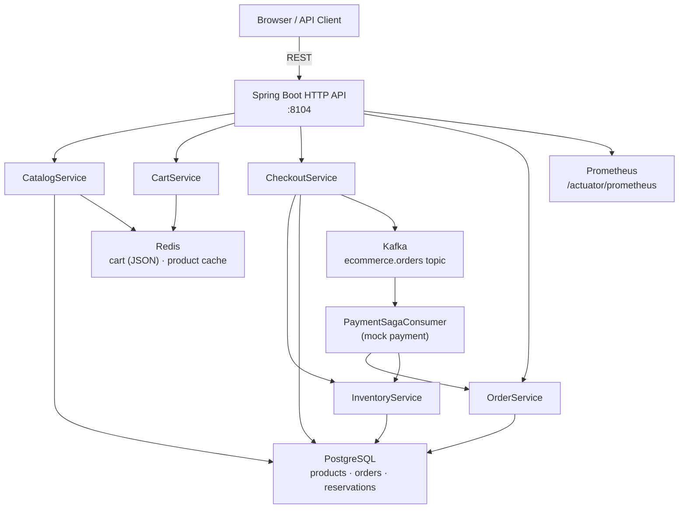
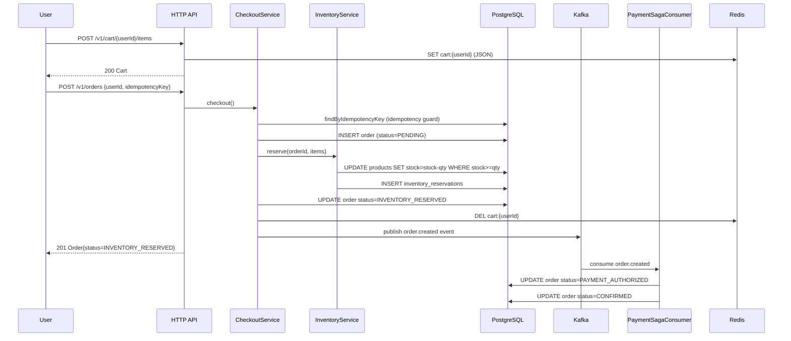

# Architecture — E-Commerce Platform (Project 23)

## System Diagram



## Sequence Diagram — Happy Path Checkout



## Sequence Diagram — Inventory Failure (Saga Compensation)

```mermaid
sequenceDiagram
    participant U as User
    participant CS as CheckoutService
    participant IS as InventoryService
    participant PG as PostgreSQL

    U->>CS: checkout(userId, key)
    CS->>PG: INSERT order (PENDING)
    CS->>IS: reserve() — stock < qty
    IS->>PG: UPDATE stock (returns 0 rows → exception)
    IS-->>CS: InsufficientStockException (TX rollback)
    CS->>PG: UPDATE order status=INVENTORY_FAILED
    CS-->>U: 409 Conflict
    Note over PG: No reservation rows created; no stock deducted
```

## Components

### HTTP API (`api/`)
Four controllers — `ProductController`, `CartController`, `OrderController`, `AdminController` — each wired to a single service. No business logic in controllers.

### CatalogService
CRUD for products plus a lightweight text search (DB LIKE fallback; production would delegate to OpenSearch). Product details are cached in Redis (`@Cacheable`) with a 10-minute TTL via `RedisCacheManager`.

### CartService + CartStore
Cart lives entirely in Redis as a JSON blob with a 7-day TTL. `CartStore` serializes/deserializes via Jackson. Graceful fallback: if Redis is unavailable, `get()` returns `Optional.empty()` and the cart starts fresh.

### CheckoutService (Saga orchestrator)
1. Idempotency guard on `idempotency_key` unique constraint.
2. INSERT order (PENDING).
3. `InventoryService.reserve()` — single @Transactional: all items or none.
4. UPDATE order → INVENTORY_RESERVED.
5. Clear cart.
6. Publish `OrderEvent` to Kafka.

### InventoryService
`reserve()` issues an atomic `UPDATE products SET stock = stock - qty WHERE stock >= qty` per item in one transaction. Zero rows affected = out of stock = exception = full rollback. No partial reservations. `release()` is the compensation step (increments stock back for cancelled/failed orders).

### PaymentSagaConsumer
Kafka listener on `ecommerce.orders` group `payment-saga`. Auto-approves all INVENTORY_RESERVED orders for demo. In production, this calls a payment gateway and handles authorization/capture asynchronously.

### OrderService
Pure state-machine helper: `transition(orderId, newStatus)`. Used by the saga consumer and admin endpoints.

## Data Model

```
products(id PK, sku UNIQUE, name, description, price, stock, category, image_url, created_at, updated_at)

orders(id PK, user_id, status, total, idempotency_key UNIQUE, created_at, updated_at)

order_items(id PK, order_id FK→orders, product_id, sku, name, quantity, unit_price)

inventory_reservations(id PK, order_id, product_id, sku, quantity, reserved_at, released_at)
```

Redis keys:
- `cart:{userId}` — JSON Cart (7-day TTL)
- Spring Cache `product:{id}` — serialized Product (10-min TTL)

Kafka topics:
- `ecommerce.orders` (3 partitions, 1 replica) — `OrderEvent` keyed by orderId

## Capacity Estimates (single-node MVP)

| Metric | Value | Notes |
|--------|-------|-------|
| Catalog reads (GET /v1/products) | ~800 req/s | Cached via Redis |
| Cart writes | ~400 req/s | Redis SET, sub-ms |
| Checkout throughput | ~200 req/s | Bounded by PG atomic stock UPDATE |
| p50 checkout latency | ~5 ms | PG write + Kafka produce |
| p95 checkout latency | ~20 ms | |
| p99 checkout latency | ~60 ms | Kafka + saga roundtrip |
| Order saga end-to-end | < 1 s | Kafka consumer lag < 500 ms |
| Storage (orders) | ~1 KB/order | Items + reservation rows |
| Cart TTL | 7 days | Redis expiry |

## Failure Modes

| Failure | Behaviour |
|---------|-----------|
| Concurrent checkout on same SKU | Atomic stock UPDATE — only one succeeds; others get 409 |
| Redis down | Cart operations degrade gracefully; product cache misses fall back to DB |
| Kafka down | Order created, inventory reserved, Kafka publish fails silently (logged); saga doesn't run — order stays INVENTORY_RESERVED. Operator can retry or a dead-letter handler can clean up |
| Duplicate checkout request | Idempotency key constraint returns existing order immediately |
| Payment failure (saga) | `release()` compensates stock; order → PAYMENT_FAILED |
| PostgreSQL restart | All writes fail with 500; data durable on restart via WAL |
