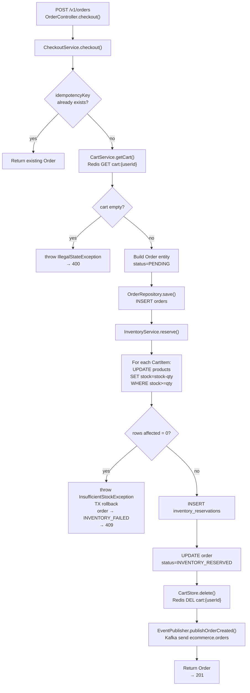
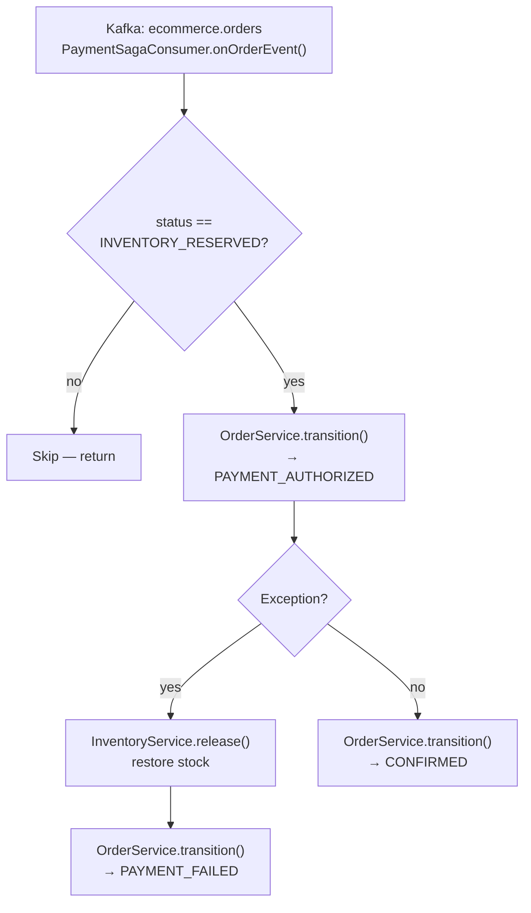
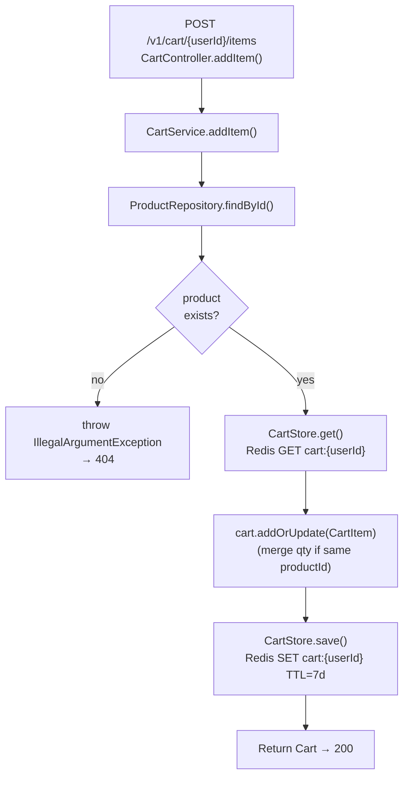
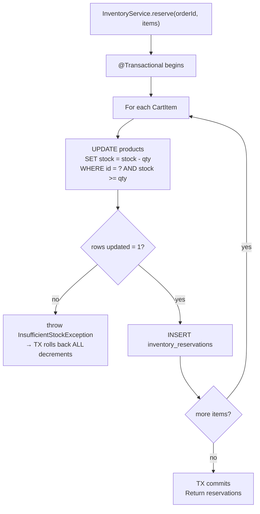
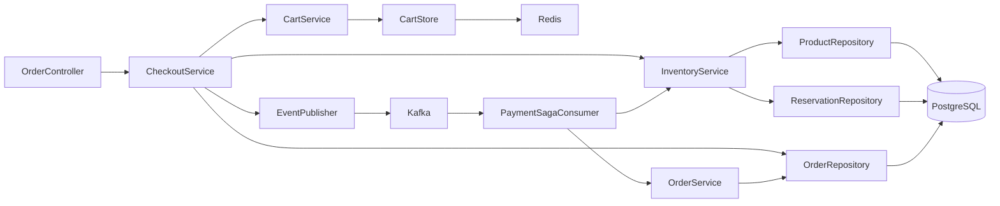

# Code Flow — E-Commerce Platform (Project 23)

## Checkout Flow

```mermaid
flowchart TD
    A["POST /v1/orders\nOrderController.checkout()"] --> B["CheckoutService.checkout()"]
    B --> C{"idempotencyKey\nalready exists?"}
    C -- yes --> D["Return existing Order"]
    C -- no --> E["CartService.getCart()\nRedis GET cart:{userId}"]
    E --> F{"cart empty?"}
    F -- yes --> G["throw IllegalStateException\n→ 400"]
    F -- no --> H["Build Order entity\nstatus=PENDING"]
    H --> I["OrderRepository.save()\nINSERT orders"]
    I --> J["InventoryService.reserve()"]
    J --> K["For each CartItem:\nUPDATE products\nSET stock=stock-qty\nWHERE stock>=qty"]
    K --> L{rows affected = 0?}
    L -- yes --> M["throw InsufficientStockException\nTX rollback\norder → INVENTORY_FAILED\n→ 409"]
    L -- no --> N["INSERT inventory_reservations"]
    N --> O["UPDATE order\nstatus=INVENTORY_RESERVED"]
    O --> P["CartStore.delete()\nRedis DEL cart:{userId}"]
    P --> Q["EventPublisher.publishOrderCreated()\nKafka send ecommerce.orders"]
    Q --> R["Return Order\n→ 201"]
```

## Payment Saga Flow

```mermaid
flowchart TD
    A["Kafka: ecommerce.orders\nPaymentSagaConsumer.onOrderEvent()"] --> B{"status ==\nINVENTORY_RESERVED?"}
    B -- no --> C["Skip — return"]
    B -- yes --> D["OrderService.transition()\n→ PAYMENT_AUTHORIZED"]
    D --> E{"Exception?"}
    E -- yes --> F["InventoryService.release()\nrestore stock"]
    F --> G["OrderService.transition()\n→ PAYMENT_FAILED"]
    E -- no --> H["OrderService.transition()\n→ CONFIRMED"]
```

## Cart Add Flow

```mermaid
flowchart TD
    A["POST /v1/cart/{userId}/items\nCartController.addItem()"] --> B["CartService.addItem()"]
    B --> C["ProductRepository.findById()"]
    C --> D{"product\nexists?"}
    D -- no --> E["throw IllegalArgumentException\n→ 404"]
    D -- yes --> F["CartStore.get()\nRedis GET cart:{userId}"]
    F --> G["cart.addOrUpdate(CartItem)\n(merge qty if same productId)"]
    G --> H["CartStore.save()\nRedis SET cart:{userId} TTL=7d"]
    H --> I["Return Cart → 200"]
```

## Inventory Reserve (Oversell Prevention)

```mermaid
flowchart TD
    A["InventoryService.reserve(orderId, items)"] --> B["@Transactional begins"]
    B --> C["For each CartItem"]
    C --> D["UPDATE products\nSET stock = stock - qty\nWHERE id = ? AND stock >= qty"]
    D --> E{rows updated = 1?}
    E -- no --> F["throw InsufficientStockException\n→ TX rolls back ALL decrements"]
    E -- yes --> G["INSERT inventory_reservations"]
    G --> H{"more items?"}
    H -- yes --> C
    H -- no --> I["TX commits\nReturn reservations"]
```

## Call Graph Summary

```mermaid
graph LR
    OC[OrderController] --> CS[CheckoutService]
    CS --> CartSvc[CartService]
    CS --> IS[InventoryService]
    CS --> OR[OrderRepository]
    CS --> EP[EventPublisher]
    CartSvc --> CartStore
    CartStore --> Redis
    IS --> PR[ProductRepository]
    IS --> RR[ReservationRepository]
    PR --> PG[(PostgreSQL)]
    RR --> PG
    OR --> PG
    EP --> Kafka
    Kafka --> PSC[PaymentSagaConsumer]
    PSC --> OrderSvc[OrderService]
    PSC --> IS
    OrderSvc --> OR
```
