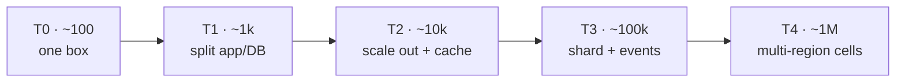
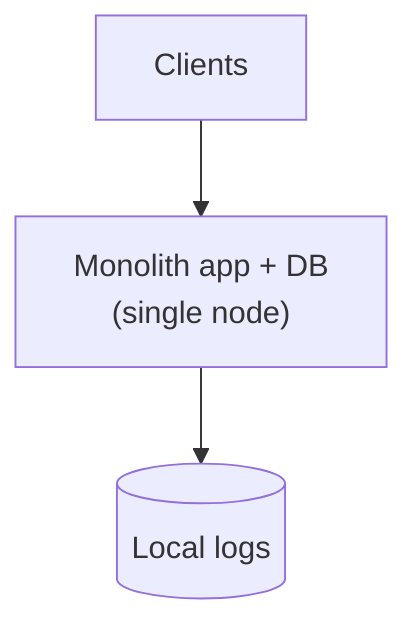
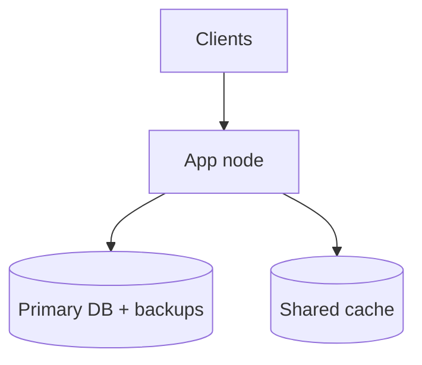
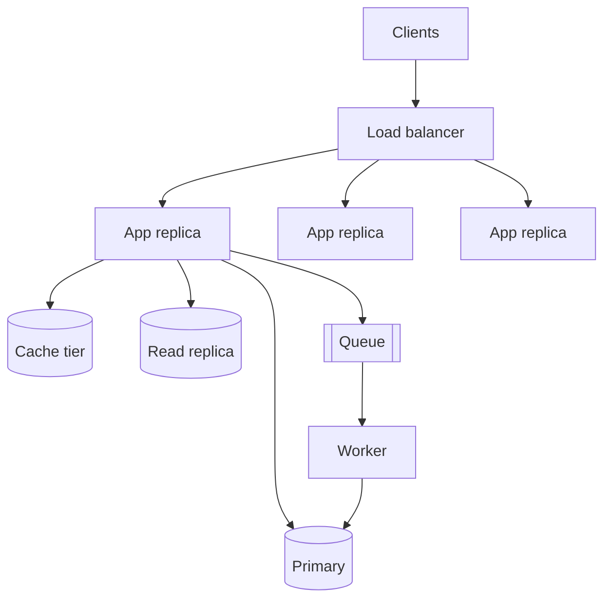
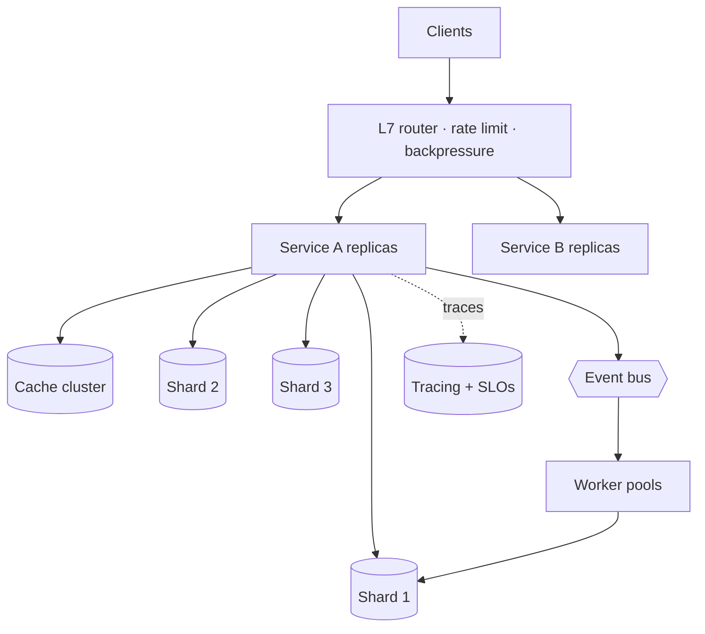
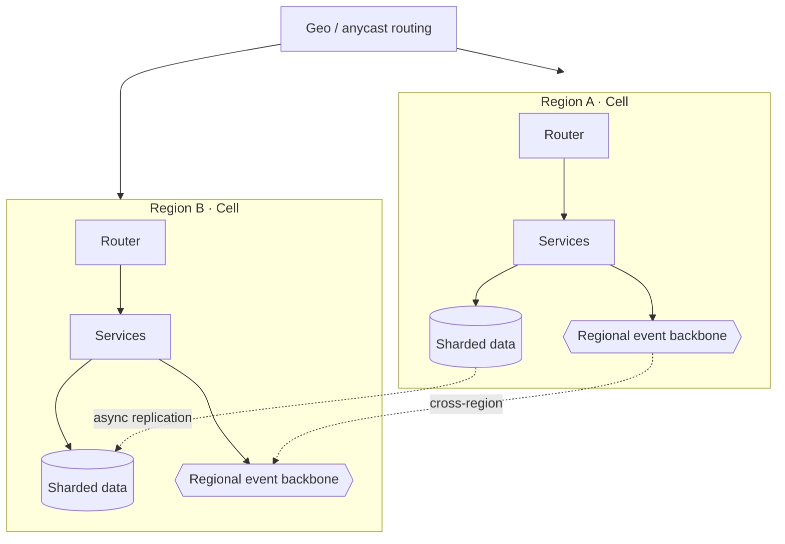

# 00 — The Scaling Spine

The backbone every archetype specializes. Five tiers, each **defined by what broke at the previous
one**. The user counts are orders of magnitude, not thresholds — the *sequence of bottlenecks* is
the durable part.

---

## The tiers at a glance

Each arrow is a forced move, not an upgrade for its own sake. You make it when a specific
resource hits a wall — and not before, because every move adds operational cost and removes a
guarantee (a join, a transaction, strong consistency) you used to get for free.

---

## The dimension × tier matrix

| Dimension | T0 ~100 | T1 ~1k | T2 ~10k | T3 ~100k | T4 ~1M |
|---|---|---|---|---|---|
| **Compute / topology** | single monolith node | app split from DB | N stateless replicas + autoscale | service decomposition | multi-region cells (bulkheads) |
| **Data store** | one DB | managed DB + backups | + read replicas | partition/shard primary | geo/tenant-partitioned, async cross-region replication |
| **Caching** | in-process | shared cache | look-aside cache tier | dedicated cache cluster | edge + regional + local |
| **Async / eventing** | inline | one background worker | queue for slow work | event bus | regional event backbone |
| **Networking / LB** | direct | one LB + health checks | LB + autoscale group | L7 routing, rate limit, backpressure | geo/anycast routing, edge |
| **State & sessions** | in-proc | sticky / none | externalized sessions | token-based, no affinity | same, replicated per region |
| **Consistency** | strong, single node | strong | read-your-writes via replicas | per-shard strong, cross-shard eventual | per-cell strong, global eventual |
| **Observability** | logs | logs + uptime check | metrics + structured logs | tracing + SLOs + alerts | SLOs per cell, error budgets |
| **Release** | manual | scripted | rolling | blue/green or canary | progressive per cell + DR drills |
| **Failure domain** | the box | the box | the AZ | the AZ (multi-AZ) | the cell / region |

Read it **down a column** to see a coherent architecture at one scale, or **across a row** to see
how one concern evolves. The archetype docs reuse exactly these rows.

---

## Tier by tier — the bottleneck and the move

### T0 · ~100 users — *one box*

- **Shape:** one process, one database, possibly on the same machine. In-process cache. Deploy by
  hand or one script.
- **Bottleneck:** none yet — *your bottleneck is shipping and learning*.
- **The move:** instrument from day one (request counts, latency, errors) so the *next* wall is
  visible before you hit it. Resist all distributed-systems temptation here.
- **What drives capacity:** nothing — you are nowhere near a resource limit.

### T1 · ~1k users — *split app from DB*

- **Bottleneck:** app and DB compete for CPU/RAM/IO on one box; a deploy or a heavy query stalls
  everything; losing the box loses the data.
- **The move:** managed database with **automated backups + PITR**; pull the cache out of process
  into a shared store; make the app **stateless** so you can restart it freely.
- **What drives capacity:** single-node DB IO and the largest single query.
- **Trap to avoid:** microservices. One well-factored app is correct here.

### T2 · ~10k users — *scale out + cache*

- **Bottleneck:** one app node saturates; reads swamp the primary; slow work (email, thumbnails,
  exports) blocks request threads.
- **The move:** **horizontal stateless app tier** behind an LB with health checks + autoscaling;
  **read replicas** for read-heavy queries; a **[look-aside cache](99-patterns/caching.md)** for
  hot keys; a **[queue + worker](99-patterns/queues-and-eventing.md)** for the slow path; object
  storage for blobs.
- **What drives capacity:** read QPS vs replica count; cache hit rate.
- **New requirements that appear here:** sessions must leave app memory; writes that get retried
  must be **idempotent**; cache invalidation becomes a real problem (stampedes, TTL jitter).

### T3 · ~100k users — *shard + events*

- **Bottleneck:** the **single primary DB is the wall** — vertical scaling is exhausted; one
  cache node can't hold the working set; a synchronous call chain fails as a unit.
- **The move:** **[shard/partition](99-patterns/sharding-partitioning.md)** the primary data
  (hash/range/geo); **multi-AZ** for each shard; a **[dedicated cache cluster](99-patterns/caching.md)**;
  an **[event bus](99-patterns/queues-and-eventing.md)** to decouple services (outbox + idempotent
  consumers); **[rate limiting, circuit breakers, backpressure](99-patterns/failure-and-resilience.md)**;
  **[distributed tracing + SLOs](99-patterns/observability-slos.md)**.
- **What drives capacity:** write throughput per shard; cross-shard query fan-out.
- **The cost you pay:** cross-shard transactions and joins are gone; you now design around
  per-shard strong consistency and cross-shard *eventual* consistency.

### T4 · ~1M users — *multi-region cells*

- **Bottleneck:** **one region is one blast radius** — a regional outage takes down everyone; users
  on the far side of the planet eat latency; a bad deploy hits 100% of traffic at once.
- **The move:** **[multi-region cells](99-patterns/multi-region-cells.md)** — independent, self-
  contained stacks; **geo/tenant-partitioned data** with **async cross-region replication**; **edge
  caching**; **progressive rollout per cell**; **DR + chaos drills** so failover is rehearsed, not
  hoped for; **cost governance** (cost per unit of real load).
- **What drives capacity:** per-cell capacity × cell count; cross-region replication lag.
- **The cost you pay:** global strong consistency is gone — you get per-cell strong, global
  eventual. Designing *what* must be global (identity, payments) vs *what* can be cell-local
  (most everything) is the central T4 decision.

---

## The three questions every tier must answer

Apply these to any box in any diagram in this playbook:

1. **Where is the bottleneck?** Name the single resource that runs out first (DB writes, cache
   memory, app CPU, connection count, replication lag).
2. **What is the failure domain?** When this dies, who else dies with it? Shrinking that answer is
   most of what T3→T4 buys you.
3. **What metric drives capacity here?** Not the user count — the *load multiplier* specific to
   the workload (CCU for games, fan-out for feeds, contention for marketplaces).

If a design can't answer all three at a given tier, it isn't ready for that tier.

---

## Where to go next

- The primary track applies this spine to a workload that breaks it in the most interesting way:
  **[01-games/architecture.md](01-games/architecture.md)**.
- The other archetypes — [SaaS](02-saas/architecture.md) · [Social/feed](03-social-feed/architecture.md)
  · [Real-time chat](04-realtime-chat/architecture.md) · [Marketplace](05-marketplace/architecture.md).
