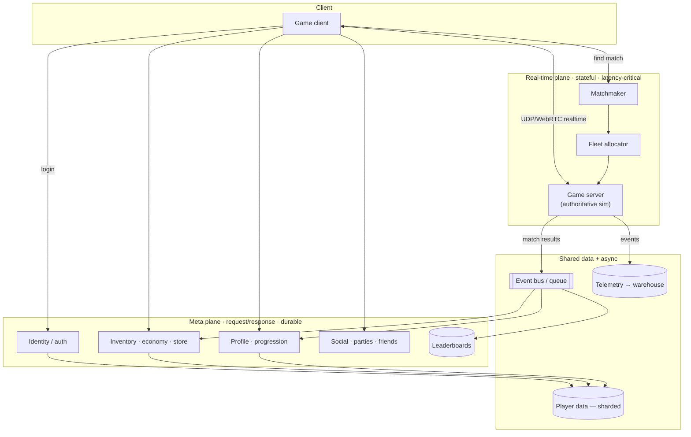
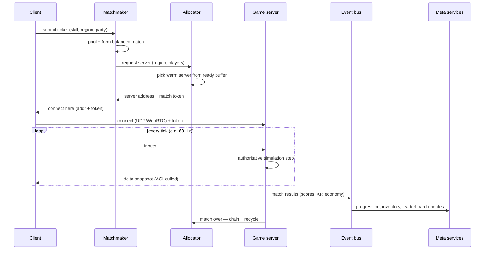

# 01 · Games — Architecture

The primary track. A multiplayer game is the archetype that **breaks the standard web spine in the
most interesting way**, because part of it is *stateful, latency-critical, and cannot be made
stateless*: the live match.

> Companion docs: [real-time-netcode](real-time-netcode.md) · [matchmaking](matchmaking.md) ·
> [fleet-orchestration](fleet-orchestration.md) · [leaderboards-and-meta](leaderboards-and-meta.md) ·
> [scaling-tiers](scaling-tiers.md).

---

## The one insight that reframes everything: CCU, not MAU

For a CRUD app, registered users predict load. **For a game they don't.** A game with 1,000,000
registered players might have **30,000–80,000 peak concurrent players (CCU)** — and CCU, plus
**matches per second**, is what sizes the fleet:

```
game-server processes ≈ (peak CCU ÷ players-per-server) + warm buffer
```

A 6v6 shooter at 60k CCU needs ≈ 60000 / 12 = **5,000 live server processes** plus a ready buffer.
Registrations are a marketing number; **CCU is the capacity number**. Every table in
[scaling-tiers.md](scaling-tiers.md) is in CCU.

---

## The two-plane model

A game backend is two systems with different physics, joined at the player's identity.



### Real-time plane — *stateful, scales on CCU*
- **Transport:** UDP / WebRTC datagram for action games; WebSocket/TCP for turn-based. See
  [real-time-netcode](real-time-netcode.md).
- **Game server:** the **authoritative simulation**. One match = one owning server process. This is
  the deliberate exception to "stateless compute" — and crucially, because **one server owns one
  match**, there is *no distributed consensus on hot state*. The hard problem is moved from
  "agree on state" to "place matches on servers" → [fleet-orchestration](fleet-orchestration.md).
- **Matchmaker:** turns a crowd of waiting players into balanced matches →
  [matchmaking](matchmaking.md).
- **Allocator:** finds a warm server for each formed match → [fleet-orchestration](fleet-orchestration.md).

### Meta plane — *request/response, scales on request rate*
This is **essentially the [SaaS archetype](../02-saas/architecture.md)**: identity, profile,
progression, inventory, economy/store, social graph, leaderboards. It follows the standard
[scaling spine](../00-scaling-spine.md) — stateless services, cache, read replicas, sharded data —
and is documented mostly by reference to SaaS, with games-specific notes on
[leaderboards-and-meta](leaderboards-and-meta.md).

### Why the split matters
The two planes **fail independently and scale independently**. The store can be down while matches
keep running; matchmaking can be saturated while profiles load fine. Keeping them separate is the
first and most important architectural decision in a game backend.

---

## The match lifecycle (the primary happy path)



Trace each call's *why*:
- **Ticket, not direct connect** — players can't pick servers; the system places them by skill +
  latency to keep matches fair and full.
- **Allocator between matchmaker and server** — decouples "who plays together" from "where it
  runs," so each scales on its own and warm servers absorb the spike.
- **Match token** — the server trusts the matchmaker, not the client; the token authorizes this
  player into this match (anti-cheat boundary).
- **Results via the event bus, not a synchronous write** — a finished match must not block on the
  economy service being healthy; results are durable events, consumed
  [idempotently](../99-patterns/queues-and-eventing.md).

---

## Cross-cutting subsystems (developed in the companion docs)

| Subsystem | Where | One-line role |
|---|---|---|
| Netcode & transport | [real-time-netcode](real-time-netcode.md) | authoritative sim, prediction, lag comp |
| Matchmaking | [matchmaking](matchmaking.md) | balanced, low-latency, full matches |
| Fleet orchestration | [fleet-orchestration](fleet-orchestration.md) | place matches on stateful servers, autoscale by CCU |
| Leaderboards & meta state | [leaderboards-and-meta](leaderboards-and-meta.md) | ranked boards, crash-safe match state |
| Anti-cheat & authority | this doc + netcode | server-authoritative, validate inputs, rate-limit actions |
| Live ops & telemetry | this doc | flags, seasons, remote config; event ingest → warehouse |

### Anti-cheat & authority (principle, not a service)
The server simulates; the client only sends **inputs** and renders. Never trust client-reported
positions, hits, or currency. Validate input rates, sanity-check physics, and feed per-action
telemetry to anomaly detection. This is why the game server is authoritative — it's a security
boundary as much as a performance one.

### Live ops & telemetry
- **Live ops:** feature flags, seasons/events, remote config, and A/B let you change balance and
  content **without shipping a new client** — essential because client updates are slow (app
  stores, downloads) and players are mid-season.
- **Telemetry:** game servers emit high-volume events (every kill, purchase, match) → a
  [streaming pipeline](../99-patterns/queues-and-eventing.md) → a warehouse for retention funnels,
  economy balance, and matchmaking quality analysis. This pipeline scales on **events/sec**, which
  tracks CCU × tick rate — the single largest data firehose in the system.

---

## Capacity shape (1M registered ≈ 60k CCU, 6v6)

| Resource | Driver | Rough size at 60k CCU |
|---|---|---|
| Live game servers | CCU ÷ players-per-server + buffer | ~5,000 processes + ~10% warm |
| Matchmaking throughput | CCU ÷ avg match length | ~hundreds of matches/sec formed |
| Meta request rate | active sessions × calls/min | standard SaaS tier (T3) load |
| Telemetry ingest | CCU × tick × event density | the largest stream; size on events/sec |
| Leaderboard writes | matches/sec × players | batched; see [leaderboards](leaderboards-and-meta.md) |

Full per-tier breakdown: **[scaling-tiers.md](scaling-tiers.md)**.

---

## The three questions, answered for games

- **Bottleneck:** at small scale, a single game-server host; at large scale, **fleet allocation +
  warm-buffer cost** and **telemetry ingest**. The meta plane bottlenecks exactly like SaaS.
- **Failure domain:** one match (one server) — by design, the smallest possible. A crashed server
  loses *one* match, recoverable from its last snapshot ([leaderboards-and-meta](leaderboards-and-meta.md)).
- **Capacity metric:** **CCU and matches/sec** — never registrations.
