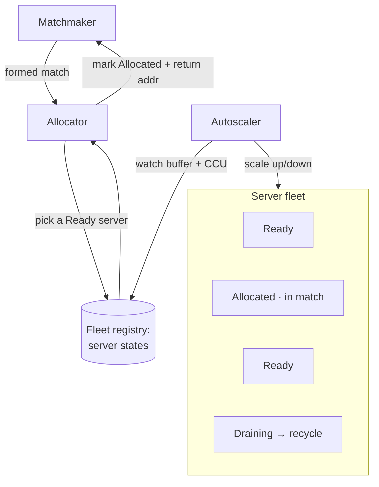
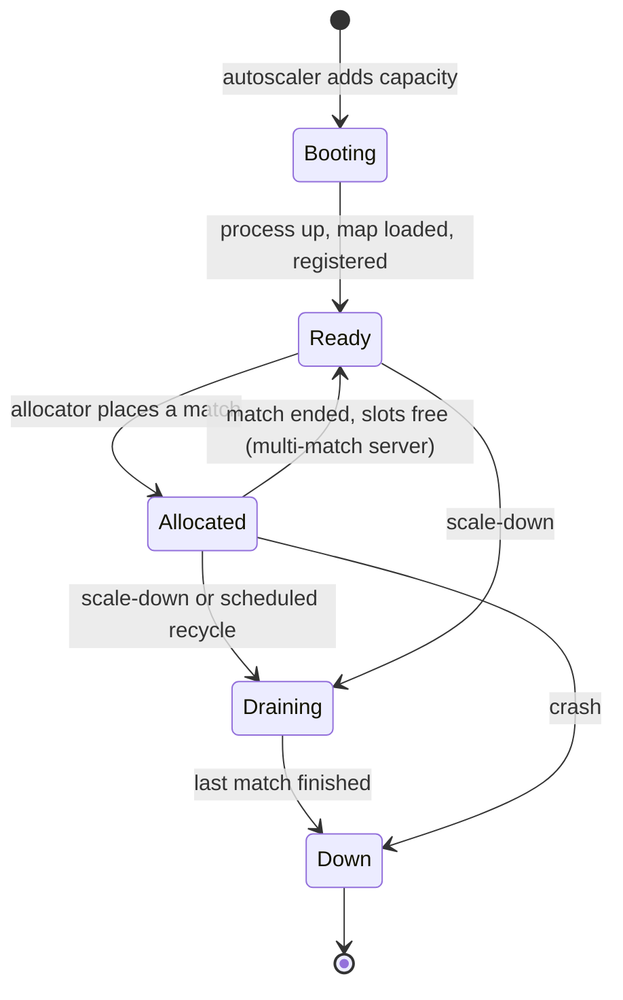
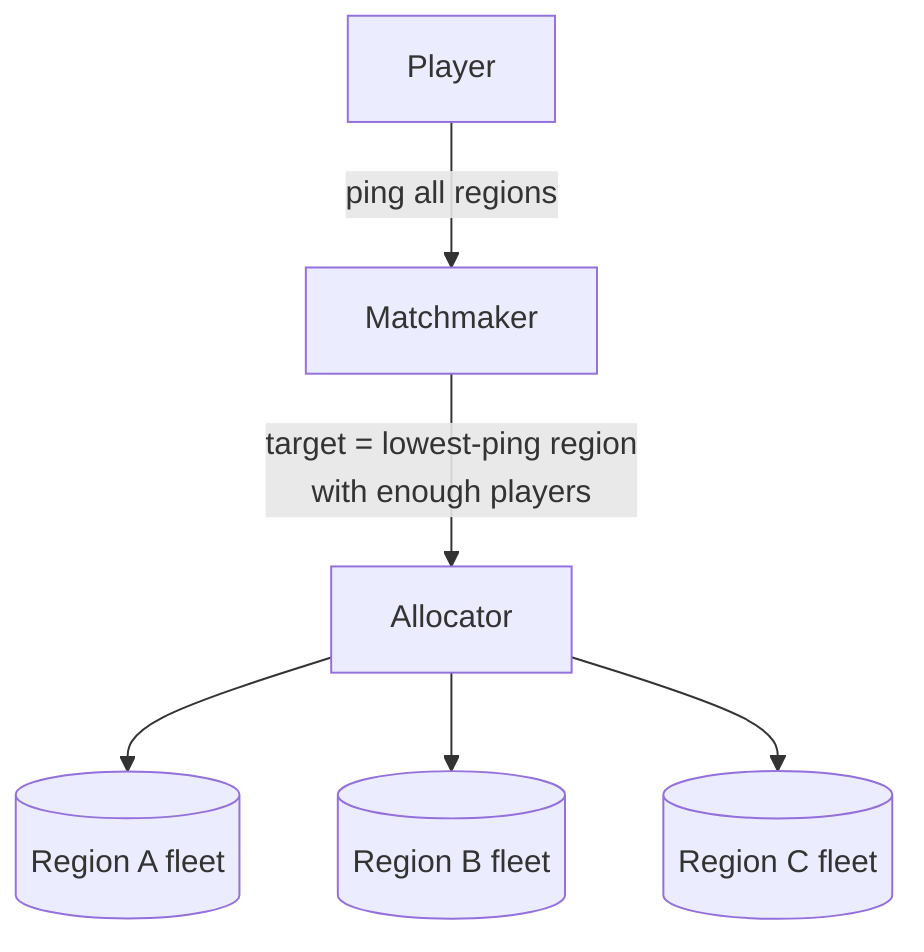

# 01 · Games — Fleet Orchestration

The hard scaling problem unique to games: running a fleet of **stateful, latency-critical server
processes** and placing live matches onto them, scaling the fleet by **CCU** in real time. This is
where games stop resembling the [scaling spine](../00-scaling-spine.md) and need their own machinery.

> This generalizes what Agones (on Kubernetes) and Amazon GameLift do. Those are named only as
> *examples of the pattern*; the pattern below is vendor-neutral: a **stateful session orchestrator
> + allocator + autoscaler**.

---

## Why it's hard

A stateless web app scales trivially: add nodes, the LB spreads requests, any node serves any
request. Game servers violate every assumption:

- **Stateful:** a match's entire world lives in one process's RAM. You cannot move a live match to
  another node mid-game.
- **Long-lived:** a session runs for minutes to an hour, not milliseconds. You can't drain a node
  by waiting out in-flight requests.
- **Capacity-quantized:** a server hosts a *fixed, small* number of matches/players. It's not "a
  bit more load," it's "one more whole match or not."
- **Cold start is slow:** booting a server process + loading a map takes seconds — far too slow to
  do *after* a match is formed. Hence the **warm buffer**.

So the problem becomes **bin-packing live matches onto a pool of pre-warmed servers, and keeping
the pool the right size as CCU swings**.

---

## The three components



### 1. Fleet registry — the source of truth
Every server process reports its **state** and **capacity**:

```
Ready      → warm, empty, available for allocation
Allocated  → hosting one or more live matches
Draining   → finish current match, accept no new ones
Down       → crashed / terminating
```

The registry is what the allocator and autoscaler read. It must be fast (allocation is on the
match-start path) and accurate (a stale "Ready" sends players to a dead server).

### 2. Allocator — bin-packing on the hot path
Given a formed match (region, player count), pick a **Ready** server in the right region and mark
it **Allocated**, returning its address + a match token to the matchmaker.

- **Pack, don't spread:** prefer filling partially-used servers (that host multiple small matches)
  before lighting up fresh ones — fewer running servers = lower cost. (Opposite of stateless LB,
  which spreads.)
- **Region-correct:** only allocate from the player's target region's pool.
- **Fast + idempotent:** allocation must be quick and a retried allocation must not double-book.

### 3. Autoscaler — keep the warm buffer right
The fleet is scaled on the **ready buffer**, not CPU:

```
target_ready ≈ expected matches-starting-per-(boot_time) + safety margin
```

- **Scale up early:** because boot is slow, you must add servers *before* the buffer runs dry —
  driven by CCU trend and matchmaking demand, not lagging CPU metrics.
- **Scale down carefully:** never kill an **Allocated** server. Move idle servers to **Draining**,
  let their matches finish, then recycle. Down-scaling is always graceful.

---

## Server lifecycle



**Recycle, don't reuse forever:** after a match (or a few), tear the process down and boot a fresh
one rather than resetting in place — avoids slow memory leaks and state bleed between matches, at
the cost of more boots. The warm buffer hides the boot latency from players.

---

## Regional placement



- Each region runs its **own fleet + allocator** (a [cell](../99-patterns/multi-region-cells.md)).
  Players are placed in the lowest-ping region that can field a quality match.
- **Connection path:** clients connect direct to the allocated server's address, or via an **edge
  relay** (hides server IP, mitigates DDoS, smooths some routes) at extra hop cost. Relay vs direct
  is a cost/latency/security tradeoff decided per region.

---

## Crash recovery

One match = one server = **the smallest possible failure domain**. When a server crashes only that
match is affected, and even that is softened: the server periodically snapshots in-memory match
state to a fast store, so recovery loses seconds, not the whole match
([leaderboards-and-meta](leaderboards-and-meta.md)). The allocator marks it **Down**, the
autoscaler replaces it.

---

## Failure modes

- **Buffer exhaustion (launch spike):** matches form faster than servers boot → matchmaking stalls
  at "allocating." Fix: aggressive lookahead scaling + a larger margin during expected spikes.
- **Over-provisioned buffer:** too many idle Ready servers → burning money. Fix: tighter buffer
  tied to real demand trend; scale down via Draining.
- **Region imbalance:** one region hot, another idle → per-region autoscaling, never a global pool.
- **Zombie servers:** registry says Ready, process is dead → heartbeats + TTL eviction in the
  registry; allocator health-checks before confirming.

---

## Tier notes (CCU — see [scaling-tiers](scaling-tiers.md))

- **T0–T1:** a handful of long-lived hosts; "next available" allocation; manual scaling.
- **T2:** real allocator + Ready buffer + autoscaler; 2 regional fleets; recycle on match end.
- **T3:** multi-AZ fleets per region; registry as a scaled service; autoscale on CCU trend; SLOs on
  allocation latency + buffer health.
- **T4:** fleets are per-region [cells](../99-patterns/multi-region-cells.md); buffer + tick + AOI
  budgets governed as **cost-per-CCU** across the global fleet; DR drills for whole-region loss.
