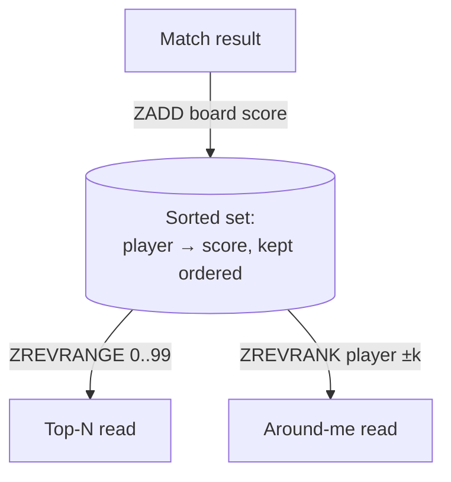
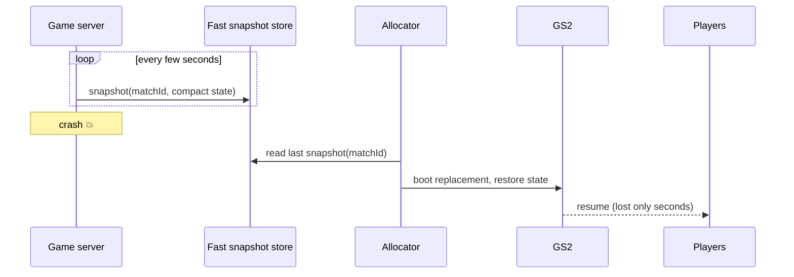
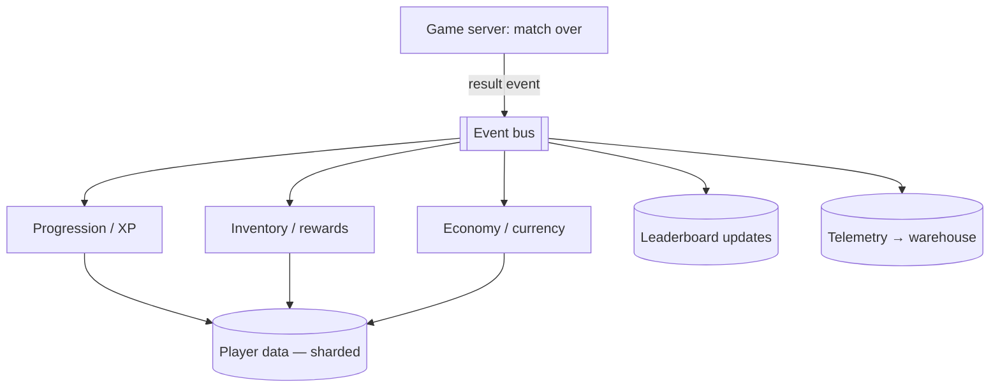

# 01 · Games — Leaderboards & Crash-Safe Match State

Two durable-data problems the [real-time plane](architecture.md) hands to the meta plane: **ranking
millions of players cheaply**, and **not losing a live match when a server dies**. The rest of the
meta plane (identity, profile, inventory, economy, social) is the [SaaS archetype](../02-saas/architecture.md)
and is documented there.

---

## Leaderboards

A leaderboard is two reads over a constantly-updated ranking:
- **Top-N** — the global/seasonal top 100.
- **Around-me** — your rank ± a few neighbors.

Both need **rank by score** at scale, which a plain indexed table gives you slowly (counting rows).
The right primitive is a **sorted structure**.

### The primitive: a sorted set / skip-list

A sorted set keeps members ordered by score with **O(log n)** insert and rank lookup and **O(log n
+ k)** range reads — exactly Top-N and around-me. This is the standard leaderboard engine.

### Sharding the board

A single board for 1M players, updated every match, becomes a write hotspot and a memory hog. Shard
it:

- **By season:** each season is a fresh, bounded board. Old seasons become read-only archives. This
  alone caps live-board size and is the most important split.
- **By region / tier / mode:** separate boards per region or skill tier reduce contention and are
  what players usually care about anyway (regional ranks).
- **Global = roll-up:** a true global board is computed by **merging the top of each regional
  board** ([multi-region cells](../99-patterns/multi-region-cells.md)) rather than maintaining one
  globally-synchronous board. Exact global rank for player #743,221 isn't worth the coordination
  cost.

### Exact head, approximate tail

- The **top** of the board (where players look and competition is real) is kept **exact**.
- Exact rank deep in the **tail** (#500,000) is expensive and nobody checks it precisely →
  **approximate** it (bucketed/percentile rank). Spend precision where it's seen.

### Write batching & abuse

- **Batch writes:** funnel match results through the [event bus](../99-patterns/queues-and-eventing.md)
  and apply leaderboard updates in batches rather than one synchronous write per kill. Smooths the
  write spike from many simultaneous match-ends.
- **Idempotent updates:** a result event may be delivered twice; keyed updates prevent double-counting
  ([queues](../99-patterns/queues-and-eventing.md)).
- **Anti-abuse:** validate scores server-side (results come from the authoritative server, not the
  client — [netcode](real-time-netcode.md)); flag impossible jumps via telemetry.

---

## Crash-safe match state

Live match state lives in **one server's RAM** ([fleet-orchestration](fleet-orchestration.md)) —
fast, but volatile. A crash would lose the match. The mitigation is periodic snapshots:

- **Snapshot cadence is a tradeoff:** more frequent = less lost on crash, more overhead per tick.
  Seconds, not milliseconds — losing a few seconds of a match is acceptable; losing the match is not.
- **Compact state only:** snapshot the *authoritative* state needed to resume (positions, scores,
  timers), not derived/rendered data.
- **Results are events, not synchronous writes:** when a match *ends*, the server publishes results
  to the [event bus](../99-patterns/queues-and-eventing.md); progression, inventory, and
  leaderboards consume them [idempotently](../99-patterns/queues-and-eventing.md). The match never
  blocks on the economy service being up — the two planes
  [fail independently](architecture.md).

---

## How match results fan out to the meta plane

One result event, many independent [idempotent consumers](../99-patterns/queues-and-eventing.md) —
add a new reward system later by subscribing a new consumer, without touching the game server.

---

## Tier notes (CCU — see [scaling-tiers](scaling-tiers.md))

- **T0–T1:** one sorted set for the whole board; synchronous result writes; no snapshots (accept
  match loss on crash).
- **T2:** results via queue; periodic snapshots for crash recovery; season boards begin.
- **T3:** boards sharded by season + region; batched idempotent updates; exact head / approx tail.
- **T4:** regional boards with **global as a roll-up**; snapshot store is per-region; results bus is
  the per-region [event backbone](../99-patterns/multi-region-cells.md).
