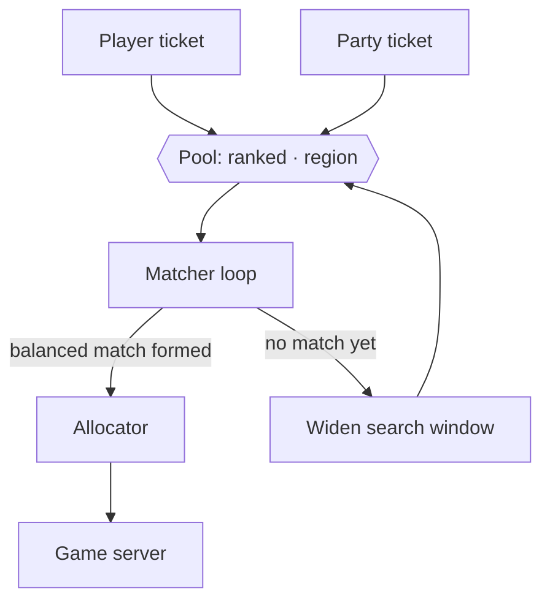
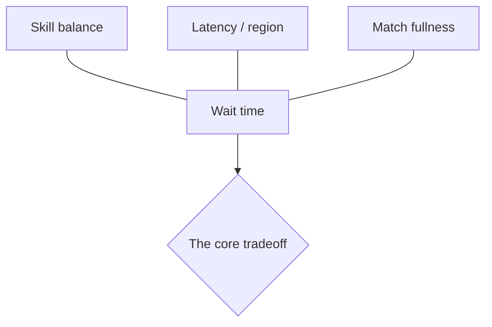
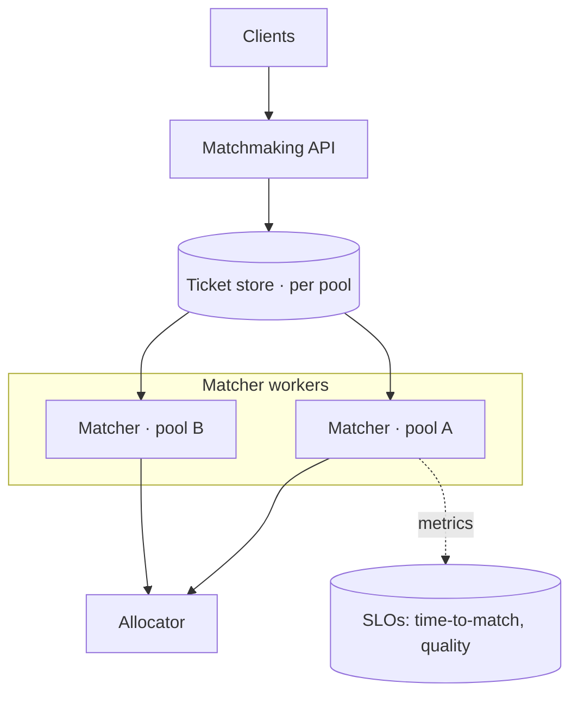

# 01 · Games — Matchmaking

Turning a crowd of waiting players into matches that are **balanced** (fair skill), **low-latency**
(close region), and **full** (no empty slots) — fast enough that nobody quits the queue. The
matchmaker sits in the [real-time plane](architecture.md) between the player and the
[allocator](fleet-orchestration.md).

---

## The ticket model

A player (or party) doesn't "join a server" — they **submit a ticket** describing what they want
and what they are:

```
ticket {
  party:     [playerIds...]        // 1..N players who must be placed together
  skill:     rating + uncertainty  // e.g. Glicko/TrueSkill-style
  region:    latency to each region (pings)
  mode:      ranked / casual / 6v6 / BR
  enqueuedAt: timestamp            // drives search widening + fairness
}
```

Tickets land in **pools** (one per mode, often per coarse region). A matcher scans a pool and forms
matches.



---

## The three constraints (and the tension between them)



- **Skill balance** — match players of similar rating so games are competitive. Tighter bands =
  better games but fewer eligible opponents = longer waits.
- **Latency** — prefer opponents/servers in the player's lowest-ping region. Cross-region matches
  play badly.
- **Fullness** — a 6v6 needs 12 compatible players at once; partial matches are bad experiences.
- **Wait time** — the master variable. **Every other constraint trades against queue time.**

### Expanding search windows
The standard resolution: start strict, **relax over time**. A ticket that's waited 5 s accepts a
wider skill band and a worse ping than one that just arrived. The widening is a function of
`now − enqueuedAt`, giving a smooth fairness-vs-wait curve instead of a hard cutoff.

---

## Skill rating

- Use a rating *with uncertainty* (TrueSkill / Glicko style), not a bare Elo number. New and
  returning players have high uncertainty → the system widens their bands and converges their
  rating faster.
- **Match quality** = predicted closeness of the two teams. The matcher maximizes quality subject
  to the current (widening) constraints, then hands the formed match to the allocator.

---

## Parties and backfill

- **Parties** must be placed **together** and balanced *as a group* — a 4-stack of high-skill
  players is matched against comparable opposition, not four solo players. Parties constrain the
  pool and are a common source of long queues for large stacks.
- **Backfill** — when a player leaves a long match (BR, large modes) or one fails to connect, the
  matcher **injects a replacement** into the running match. Backfill tickets are prioritized
  because an under-full live match is worse than a slightly mismatched fill.

---

## Matchmaking as a service (T3+)

At small scale the matcher is a loop inside one process. As CCU grows it becomes its **own scaled
service** with a durable **ticket store**:



- **Partition the pools** (by mode × coarse region) so each matcher owns a bounded set of tickets —
  this is just [sharding](../99-patterns/sharding-partitioning.md) applied to the queue.
- **Ticket store** must survive a matcher crash so queued players aren't dropped.
- **SLOs:** p50/p99 **time-to-match** and **match quality** are the two numbers that define
  matchmaking health — alert on both ([observability](../99-patterns/observability-slos.md)).

---

## Failure modes

- **Thin pool / off-peak:** not enough players to form a quality match → widen faster, merge
  regions, or relax mode segregation. The alternative (infinite wait) is worse.
- **Hot pool / launch spike:** ticket store and matchers overload → partition more, shed with
  [backpressure](../99-patterns/failure-and-resilience.md), show honest queue position.
- **Allocator can't place a formed match:** no warm servers → match holds briefly or re-queues;
  this couples matchmaking health to [fleet](fleet-orchestration.md) warm-buffer sizing.
- **Sniping / smurfing:** rating gamed by abandons or alt accounts → uncertainty modeling + abuse
  telemetry ([anti-cheat](architecture.md)).

---

## Tier notes (CCU — see [scaling-tiers](scaling-tiers.md))

- **T0–T1:** "next available" / single-pool loop; skill+region as soft sort keys.
- **T2:** real skill bands + region pools; widening windows; party support.
- **T3:** matchmaking is its own service with a ticket store, partitioned pools, SLOs.
- **T4:** pools partitioned per region/cell; cross-region only as a last-resort widening step.
