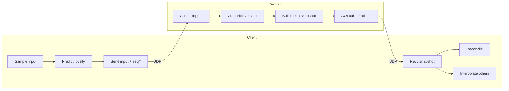
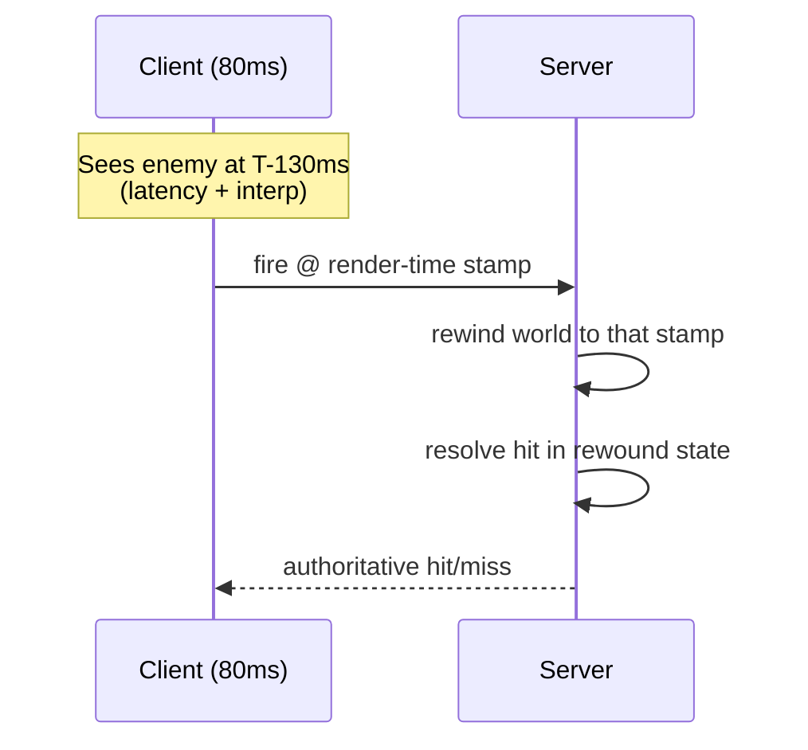

# 01 · Games — Real-Time Netcode

How the [real-time plane](architecture.md) moves state between client and the authoritative server
fast enough to feel instant over a network that is none of those things. This is the part of a
game backend with no equivalent in a CRUD app.

---

## The core loop: server-authoritative simulation

The server runs the **only true copy** of the world. Clients send *inputs*, not outcomes; the
server simulates and sends back authoritative *snapshots*. Everything below exists to hide the
round-trip latency this creates.

---

## Tick rate

The server advances the simulation at a fixed **tick rate** (e.g. 20 / 30 / 60 Hz). Each tick it
ingests buffered inputs, steps physics/logic, and emits state.

- **Higher tick** = more responsive + more accurate hit detection, but more CPU per match and more
  bandwidth → **fewer matches per server** → bigger, costlier fleet.
- **Tick rate is a direct cost lever:** doubling tick roughly doubles per-match server cost. Pick
  the lowest tick the genre tolerates (RTS/card: low; competitive FPS: high).
- **Send rate** (snapshots/sec to clients) can be lower than tick rate to save bandwidth; clients
  interpolate between snapshots.

---

## The four techniques that hide latency

### 1. Client-side prediction
The client doesn't wait for the server to confirm its own moves — it **applies its input
immediately** and keeps a buffer of unconfirmed inputs (each tagged with a sequence number). Your
own character feels zero-latency.

### 2. Server reconciliation
When the authoritative snapshot arrives, the client **rewinds to the server's state and re-applies
its still-unconfirmed inputs** (those after the acked sequence number). If the prediction was
right, nothing visible happens; if wrong, the character is gently corrected. This is what keeps
prediction honest without rubber-banding on every packet.

### 3. Entity interpolation
*Other* players are rendered slightly **in the past** (e.g. 100 ms behind). The client holds a
buffer of recent snapshots and interpolates between two of them, so other entities move smoothly
even though snapshots arrive at discrete, jittery intervals. The cost is that everyone else is a
little behind reality — which #4 compensates for.

### 4. Lag compensation (server-side rewind)
When a client fires, the server **rewinds the world to the state that client actually saw** (its
render time = now − its latency − interpolation delay) and resolves the hit there. This makes "I
clearly hit them" true even at 80 ms ping. The tradeoff is the famous "shot around the corner"
artifact — the price of fairness to the shooter.

---

## Bandwidth: delta snapshots + area-of-interest

A 60-player battle royale can't send every entity to every client every tick. Two cuts:

- **Delta compression:** send only what *changed* since the last snapshot the client acknowledged,
  not the full world state. Baseline + deltas.
- **Area-of-interest (AOI) culling:** send each client only the entities it can perceive
  (proximity / visibility / grid cells). A player on the far side of the map costs nothing in your
  stream. AOI is what makes large player counts per match feasible at all.

Together these turn an O(players²) broadcast into something close to O(players × neighbors).

---

## Transport choice

| Genre / need | Transport | Why |
|---|---|---|
| Competitive action (FPS, fighting, racing) | **UDP** (or QUIC/custom reliability) | drop late packets; never head-of-line block on a stale update |
| Browser real-time | **WebRTC data channels** (unreliable/unordered mode) | UDP-like semantics that work in a browser |
| Turn-based, card, strategy, lobbies/chat | **WebSocket / TCP** | reliability + ordering matter more than the last 50 ms |

Key principle: for action games **you do not want TCP's reliability** — a retransmitted 50-ms-old
position is worse than useless; you'd rather take the next fresh snapshot. Reliability is applied
*selectively* (e.g. for critical events like "round started"), not to the whole stream.

---

## Where netcode meets the rest of the system

- **Authority = anti-cheat boundary** ([architecture.md](architecture.md)): because the server
  simulates, the client can't fabricate positions or hits. Validate input *rates* and physical
  plausibility server-side.
- **One match = one server** ([fleet-orchestration](fleet-orchestration.md)): the whole simulation
  for a match lives in one process's memory, so there's no cross-node state sync within a match —
  the reason game state doesn't need distributed consensus.
- **Crash safety** ([leaderboards-and-meta](leaderboards-and-meta.md)): in-memory match state is
  snapshotted periodically so a server crash loses seconds, not the match.

---

## Tier notes (capacity in CCU — see [scaling-tiers](scaling-tiers.md))

- **T0–T1:** fixed tick, naive full snapshots, prediction only. Fine for small matches.
- **T2:** add reconciliation + interpolation; introduce delta compression as match sizes grow.
- **T3:** AOI culling becomes mandatory; tune send-rate vs tick-rate to control per-match cost
  across thousands of servers.
- **T4:** regional servers so ping is low everywhere; tick/AOI budgets are governed as a
  **cost-per-CCU** lever across the global fleet.
