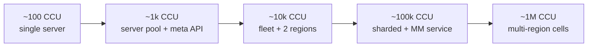

# 01 · Games — Scaling Tiers (in CCU)

The [games architecture](architecture.md) walked across the five [spine](../00-scaling-spine.md)
tiers — but for games the axis is **peak concurrent users (CCU)** and **matches/sec**, not
registrations. Reminder of the sizing identity:

```
live game-server processes ≈ (peak CCU ÷ players-per-server) + warm buffer
```

Worked example used throughout: a **6v6 game (12 players/server)**, where **1M registered ≈ 60k
peak CCU**.

---

## The CCU ladder



> Note the top rung: **1M *CCU*** (not 1M registered) is a genuinely huge game —
> tens of millions of registered players. Most "1M user" games live around the
> **~100k CCU** rung. The ladder is included for completeness.

---

## Per-tier breakdown

### ~100 CCU — *single authoritative server*
- **Real-time:** one (or few) game-server processes, in-memory matches, "next available"
  [allocation](fleet-orchestration.md). No warm buffer to speak of.
- **Meta:** one DB holds accounts + a single sorted-set [leaderboard](leaderboards-and-meta.md);
  results written synchronously.
- **Bottleneck:** a single host's CPU/RAM.
- **Servers needed:** ~100 / 12 ≈ **9 match-slots** → 1–2 hosts.

### ~1k CCU — *dedicated server pool + meta API*
- **Real-time:** a small **pool** of game-server hosts; simple skill+region
  [matchmaking](matchmaking.md) loop; recycle servers on match end.
- **Meta:** [meta plane](architecture.md) split into its own API on a managed DB with backups;
  sorted-set leaderboard.
- **Bottleneck:** manual fleet management; single meta DB.
- **Servers needed:** ~1000 / 12 ≈ **~85 servers** + small buffer.

### ~10k CCU — *fleet + allocator + 2 regions*
- **Real-time:** real [fleet orchestration](fleet-orchestration.md) — allocator, **Ready buffer**,
  autoscaler; **2 regional fleets**; recycle on match end. Netcode adds delta compression +
  interpolation ([netcode](real-time-netcode.md)).
- **Meta:** autoscaled **stateless** meta tier behind an LB; read replicas; match results go
  **async via a [queue](../99-patterns/queues-and-eventing.md)**; periodic snapshots for crash
  recovery.
- **Bottleneck:** warm-buffer sizing during spikes; meta read load.
- **Servers needed:** ~10000 / 12 ≈ **~830** + ~10% buffer, split across 2 regions.

### ~100k CCU — *sharded data + matchmaking as a service* (the typical "big game")
- **Real-time:** **multi-AZ fleets per region** ([cells](../99-patterns/multi-region-cells.md));
  [matchmaking is its own scaled service](matchmaking.md) with a durable ticket store and
  partitioned pools; AOI culling mandatory ([netcode](real-time-netcode.md)).
- **Meta:** player/meta data **[sharded](../99-patterns/sharding-partitioning.md)**;
  [leaderboards sharded by season + region](leaderboards-and-meta.md) with exact-head/approx-tail;
  an **[event bus](../99-patterns/queues-and-eventing.md)** drives economy/progression; telemetry
  pipeline at scale.
- **Observability:** [SLOs](../99-patterns/observability-slos.md) on **time-to-match**, **p99 tick
  time**, **allocation latency**, **buffer health**.
- **Bottleneck:** allocation + warm-buffer cost; telemetry ingest; per-shard write throughput.
- **Servers needed:** ~100000 / 12 ≈ **~8,300** + buffer, across regions/AZs.

### ~1M CCU — *multi-region cells*
- **Real-time:** fleets are **per-region [cells](../99-patterns/multi-region-cells.md)**, each
  self-contained; tick/AOI/buffer budgets governed as a **cost-per-CCU** lever globally; **DR +
  chaos drills** for whole-region loss.
- **Meta:** **geo-partitioned** data; **global leaderboard = roll-up of regional boards**; per-region
  event backbones with async cross-region replication for the few truly global facts (identity,
  payments).
- **Bottleneck:** cross-region replication lag; global cost governance; regional capacity headroom.
- **Servers needed:** ~1,000,000 / 12 ≈ **~83,000** + buffer — a planet-scale fleet.

---

## Capacity summary

| CCU | Game servers (6v6 +buffer) | Matchmaking | Meta data | Leaderboard | Regions |
|---|---|---|---|---|---|
| ~100 | 1–2 hosts | next-available loop | one DB | single sorted set | 1 |
| ~1k | ~85 + buffer | skill+region loop | managed DB | single sorted set | 1 |
| ~10k | ~830 + 10% | widening windows, parties | replicas + queue | season boards | 2 |
| ~100k | ~8,300 + buffer | own service + ticket store | sharded | season×region, head-exact | multi-AZ × few |
| ~1M | ~83,000 + buffer | per-region pools | geo-partitioned | regional + global roll-up | many cells |

---

## What changes vs the generic spine

| Aspect | Generic spine | Games |
|---|---|---|
| Capacity metric | requests/sec from user count | **CCU + matches/sec** |
| Stateless compute | always | meta plane yes; **game servers are stateful by design** |
| Scaling trigger | CPU / QPS | **warm-buffer depth + CCU trend** (lookahead, not lagging) |
| Failure domain | AZ → cell | **one match (one server)** — the smallest possible |
| Hard problem | sharding the write path | **bin-packing live matches onto warm stateful servers** |

The meta plane scales exactly like [SaaS](../02-saas/architecture.md); the real-time plane is the
part that needs everything in [fleet-orchestration](fleet-orchestration.md),
[matchmaking](matchmaking.md), and [netcode](real-time-netcode.md).
