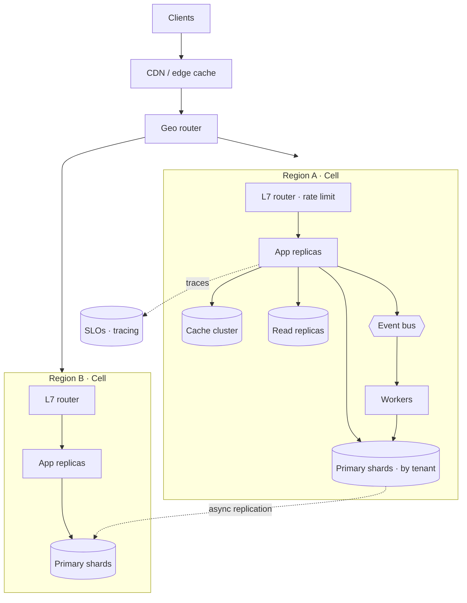
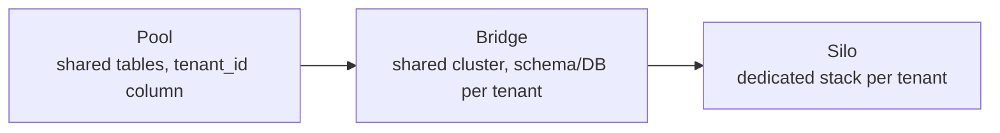
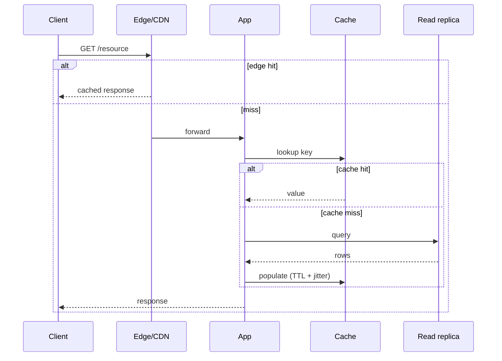

# 02 · SaaS Web/API — Architecture

The canonical read-heavy CRUD/API product: users, auth, dashboards, an API. It's the **reference
implementation of the [scaling spine](../00-scaling-spine.md)** — and it's also the games
[meta plane](../01-games/architecture.md), so it's written first among the non-game archetypes.

---

## Problem shape

- **Read-heavy**, often ~100:1 reads to writes (dashboards, lists, profiles read constantly,
  written occasionally).
- **Multi-tenant:** many customer orgs share the system; isolation between them is a first-class
  concern.
- **Latency-tolerant** relative to games — tens of ms is fine; correctness and uptime dominate.
- **Capacity metric:** **read QPS** and **cache hit rate** — the dominant lever is how much read
  load you can keep off the primary database.

---

## 5-tier evolution

| Tier | Move | Driver |
|---|---|---|
| **T0 ~100** | monolith + one DB | ship and measure |
| **T1 ~1k** | split DB out; add cache + backups; stateless app | box contention |
| **T2 ~10k** | N app replicas + LB; **read replicas**; look-aside cache; queue for slow work; CDN | read QPS + one-node saturation |
| **T3 ~100k** | shard by tenant; service decomposition; event bus; rate limit + SLOs | single primary write wall |
| **T4 ~1M** | multi-region cells; geo/tenant-partitioned data; edge cache | one-region blast radius + global latency |

---

## Topology at ~1M

- **CDN/edge** absorbs static + cacheable GETs before they reach origin — the cheapest read is the
  one that never hits your servers ([caching](../99-patterns/caching.md)).
- **Stateless app replicas** behind an [L7 router](../99-patterns/load-balancing.md) with
  [rate limiting + backpressure](../99-patterns/failure-and-resilience.md).
- **Read replicas** serve the 100:1 read load; the primary takes writes only.
- **Cache cluster** ([look-aside](../99-patterns/caching.md)) holds hot entities; guard against
  stampedes with TTL jitter + single-flight.
- **Tenant-sharded primary** ([sharding](../99-patterns/sharding-partitioning.md)) once one primary
  can't hold the write load.
- **Event bus + workers** for async work (emails, exports, webhooks, search indexing) via
  [outbox + idempotent consumers](../99-patterns/queues-and-eventing.md).

---

## Multi-tenant isolation ladder

The defining SaaS decision — how much do tenants share?

| Model | Isolation | Cost / density | Use when |
|---|---|---|---|
| **Pool** | row-level (`tenant_id`) | cheapest, highest density | most tenants, SMB |
| **Bridge** | schema/DB per tenant | medium | mid-market, noisy-neighbor concerns |
| **Silo** | stack per tenant | priciest, lowest density | enterprise, compliance, data residency |

Most SaaS run **pool by default, silo for enterprise** — and the shard key is naturally the tenant,
which makes [tenant-sharding](../99-patterns/sharding-partitioning.md) at T3 fall out cleanly.

---

## Primary read path (happy path)

Each layer exists to keep load off the next: edge → cache → replica → primary. The primary is
touched only on writes and cold reads.

---

## Key tradeoffs

- **Read replicas bring replication lag** → read-your-writes needs care (route a user's reads to
  the primary briefly after their write, or read from cache).
- **Sharding by tenant kills cross-tenant queries** → analytics/reporting move to a separate
  warehouse fed by the [event bus](../99-patterns/queues-and-eventing.md), not the OLTP store.
- **Pool density vs blast radius** → one bad query can hit all pooled tenants; rate-limit per tenant.

---

## Failure modes

- **Cache stampede** on a hot key expiry → TTL jitter + single-flight ([caching](../99-patterns/caching.md)).
- **Replica lag spike** under write bursts → fall back to primary for critical reads; alert on lag.
- **Noisy neighbor** in pool model → per-tenant [rate limits + quotas](../99-patterns/failure-and-resilience.md).
- **Region outage at T4** → [cells](../99-patterns/multi-region-cells.md) fail independently; geo
  router sheds the dead region.

---

## The three questions

- **Bottleneck:** the single primary's **write** capacity (reads are absorbed by cache + replicas).
- **Failure domain:** AZ → cell; pool tenants share a domain, silo tenants don't.
- **Capacity metric:** **read QPS + cache hit rate**, then **write QPS per shard** at T3+.
