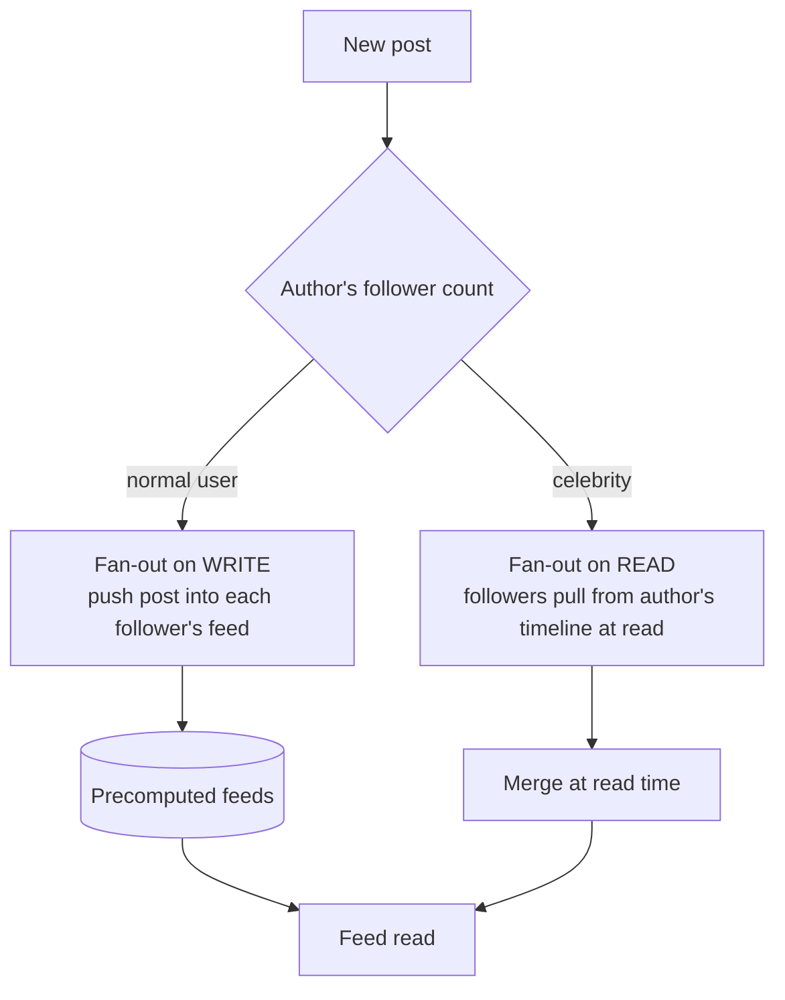
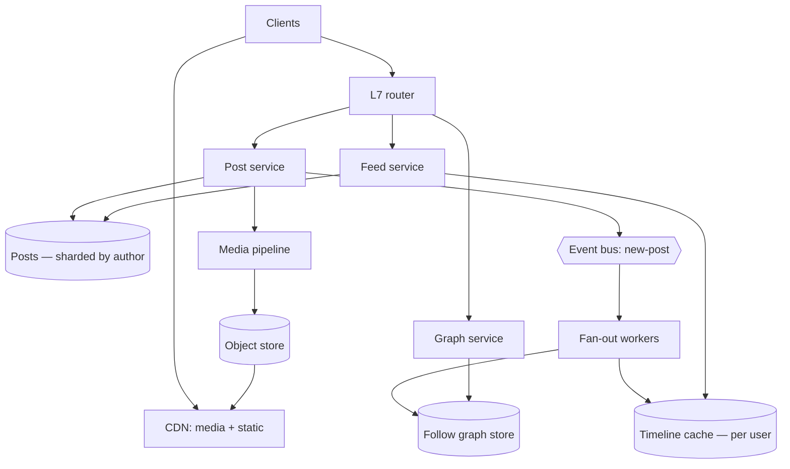
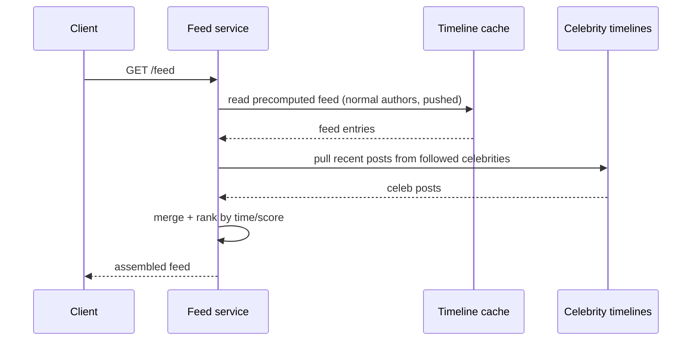

# 03 · Social / Feed — Architecture

User-generated content, a follow graph, and a timeline. The defining problem is **fan-out**: one
post by a popular account must reach millions of followers' feeds. This is the archetype where the
*write* amplifies, not the read.

---

## Problem shape

- **Write-amplified reads:** a single post (one write) becomes millions of feed entries (huge
  derived write or read fan-out). The amplification factor is the capacity metric — **not the post
  rate, the follower-weighted post rate**.
- **Skewed graph:** most users have hundreds of followers; a few have tens of millions. Any design
  that treats them the same falls over on the celebrities.
- **Eventually consistent is fine:** a post appearing in your feed 2 seconds late is acceptable;
  this slack is what makes the system tractable.
- **Capacity metric:** **fan-out amplification** (followers reached per post) and **timeline read
  QPS**.

---

## The central decision: fan-out on write vs on read

| Strategy | When you write | When you read | Good for | Bad for |
|---|---|---|---|---|
| **Fan-out on write** (push) | expensive — write to N feeds | cheap — read your prebuilt feed | normal users; read-heavy | celebrities (write storm) |
| **Fan-out on read** (pull) | cheap — one write | expensive — merge K authors | celebrities; write-heavy | active feeds (read storm) |
| **Hybrid** | push for normal, pull for celebs | merge precomputed + a few pulled | **everyone** | more moving parts |

**The answer is hybrid.** Push posts from normal accounts into follower feeds; for the handful of
celebrity accounts, *don't* fan out — followers pull the celebrity's recent posts at read time and
merge them into their precomputed feed. This caps the write storm at the long tail while keeping
normal feeds cheap to read.

---

## Topology at ~1M

- **Post service** writes the post once (sharded by author) and emits a `new-post`
  [event](../99-patterns/queues-and-eventing.md).
- **Fan-out workers** consume it, read the author's followers from the **graph store**, and push
  feed entries into each follower's **timeline cache** — *unless* the author is a celebrity (then
  skip; pull at read).
- **Feed service** reads the user's precomputed timeline from cache and merges in recent posts from
  any celebrities they follow.
- **Media pipeline** transcodes images/video async into an [object store](../99-patterns/queues-and-eventing.md)
  fronted by a [CDN](../99-patterns/caching.md) — media is the bulk of the bytes and never touches
  the feed path.

---

## Feed read (hybrid happy path)

The merge is cheap because the precomputed part is already there and the pulled part is only a
handful of high-follower accounts.

---

## Data stores

- **Follow graph:** a graph/adjacency store optimized for "followers of X" and "following of Y."
  This is the hot read in fan-out; it gets its own [cache](../99-patterns/caching.md) and is
  [sharded](../99-patterns/sharding-partitioning.md) by user.
- **Posts:** sharded by author; immutable once written (edits = new versions) → very cache-friendly.
- **Timeline cache:** per-user precomputed feed, bounded length (you don't store infinite history —
  old entries are recomputed on demand). This is the single largest cache.

---

## Key tradeoffs

- **Hybrid threshold:** the follower count at which an account flips from push to pull is a tuning
  knob — too low and you pull too much at read; too high and a semi-celebrity causes write storms.
- **Timeline cache size:** precomputing feeds for inactive users wastes memory → only maintain
  feeds for recently-active users; cold users get their feed built on next visit.
- **Ranking vs recency:** a purely chronological feed is simplest; a ranked feed adds a scoring
  service in the read path and more compute.

---

## Failure modes

- **Celebrity mis-classified as normal** → fan-out storm writes tens of millions of feed entries;
  guard with a follower-count gate on the fan-out workers.
- **Fan-out backlog** during a viral spike → the event bus buffers; workers scale on queue depth
  ([queues](../99-patterns/queues-and-eventing.md)); feeds go eventually-consistent, which is fine.
- **Hot author shard** → a single mega-account's posts shard hotspots; cache aggressively, it's
  immutable.
- **Graph cache miss storm** → followers-of-X for a celebrity is huge; cache + paginate the fan-out.

---

## The three questions

- **Bottleneck:** **fan-out write amplification** (celebrities) and **timeline cache memory**.
- **Failure domain:** AZ → cell; fan-out lag degrades freshness, not correctness.
- **Capacity metric:** **follower-weighted post rate** (amplification) and **feed read QPS** — never
  raw user count.
