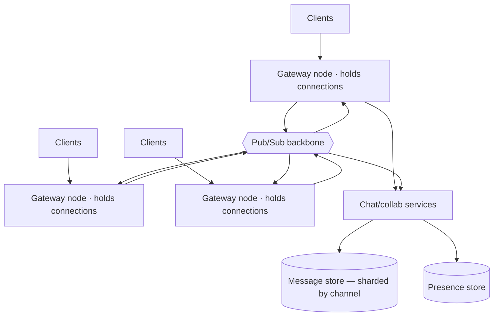
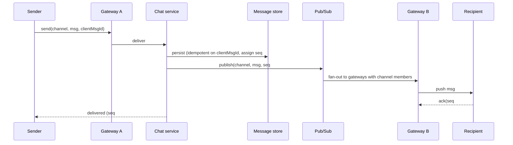

# 04 · Real-Time Chat / Collaboration — Architecture

Persistent connections, presence, and low-latency message delivery — chat, notifications, live
collaboration (docs, whiteboards). The defining problem is **millions of long-lived stateful
connections** and fanning messages across them. Shares DNA with the games
[real-time plane](../01-games/architecture.md) but optimizes for *delivery guarantees* over
*simulation*.

---

## Problem shape

- **Stateful connections:** every online user holds an open WebSocket (or similar). The system's
  primary resource is **concurrent connections**, not requests.
- **Fan-out delivery:** a message to a channel of N members must reach N connections, which may be
  spread across many gateway nodes.
- **Ordering + delivery guarantees** matter: messages should arrive in order, exactly/at-least once,
  and survive a brief disconnect.
- **Capacity metric:** **concurrent connections** and **messages × recipients/sec** (fan-out).

---

## The connection/gateway tier

The key structural move: **separate the stateful connection layer from the stateless logic.**

- **Gateway nodes** own the WebSocket connections and nothing else durable — they're the only
  stateful tier, and their state (which user is on which node) is soft and rebuildable on reconnect.
- **Pub/Sub backbone** is how a message published on one gateway reaches recipients connected to a
  *different* gateway. A gateway subscribes to the channels its connected users care about; the
  backbone fans out to the right gateways, which push to their local sockets.
- **Logic services** are stateless and scale on the [standard spine](../00-scaling-spine.md).

This split lets connections scale on gateway count and logic scale independently — the same
two-plane instinct as games.

---

## Message send (happy path)

- **Persist before publish:** the message is durable (with a channel **sequence number**) before
  fan-out, so a gateway crash mid-delivery doesn't lose it — recipients catch up from the store.
- **Idempotent on `clientMsgId`:** a retried send doesn't duplicate the message
  ([queues/idempotency](../99-patterns/queues-and-eventing.md)).
- **Sequence numbers** give per-channel ordering and let a reconnecting client request "everything
  after seq N."

---

## Presence

"Who's online / typing" — high-churn, low-durability:

- Presence lives in a fast, **ephemeral store** keyed by user, with TTL heartbeats; a missed
  heartbeat expires the user offline.
- Presence fan-out is **lossy by design** — a slightly stale "online" dot is fine, so it can ride a
  best-effort path separate from durable messages.
- At scale, presence fan-out (every status change to every interested party) can exceed message
  fan-out; **aggregate and rate-limit** it (batch status updates, coarse granularity).

---

## Delivery guarantees & catch-up

- **At-least-once + idempotent client:** the server retries delivery until acked; the client
  dedupes on sequence number. (Exactly-once is approximated this way.)
- **Offline catch-up:** on reconnect the client sends its last-seen seq per channel; the service
  streams the gap from the message store. The store is the source of truth; the live path is an
  optimization.
- **Ordering:** guaranteed *per channel* via the sequence number; cross-channel global order is not
  promised (and not needed).

---

## Collaboration (docs/whiteboards): CRDT vs OT

When many users edit the *same* document concurrently, you need a convergence strategy:

| Approach | Idea | Tradeoff |
|---|---|---|
| **OT (Operational Transform)** | transform concurrent ops against each other through a server | mature, but server-centric and tricky to implement correctly |
| **CRDT (Conflict-free Replicated Data Type)** | data types that merge deterministically without a coordinator | simpler concurrency + offline-friendly, but larger metadata/memory |

Both let edits converge without locking. The live edit stream rides the same gateway + pub/sub
plane as chat; the document state is persisted and snapshotted like
[game match state](../01-games/leaderboards-and-meta.md).

---

## Data stores

- **Message store:** sharded by channel; append-mostly; per-channel sequence. Very write-heavy hot
  channels need [hot-key handling](../99-patterns/sharding-partitioning.md).
- **Presence store:** ephemeral, TTL-based, fast — losing it just re-derives on reconnect.
- **Channel membership:** like the [social follow graph](../03-social-feed/architecture.md) —
  determines fan-out targets; cached aggressively.

---

## Key tradeoffs

- **Sticky connections vs rebalancing:** a connection is pinned to a gateway; draining a gateway
  forces mass reconnects → roll gateways slowly, let clients auto-reconnect with backoff.
- **Durable vs ephemeral paths:** messages durable + ordered; presence/typing best-effort. Mixing
  them wastes the durable path's capacity.
- **Huge channels** (100k-member broadcast) blur into the [feed fan-out](../03-social-feed/architecture.md)
  problem — at some size, switch a mega-channel from push to pull.

---

## Failure modes

- **Gateway crash** → its connections drop; clients reconnect (to any gateway) and catch up from
  the message store by seq#. No durable loss.
- **Pub/Sub backlog** during a fan-out spike → buffer; degrade presence first (it's lossy); never
  drop durable messages.
- **Thundering reconnect** after a gateway/region blip → jittered backoff on clients
  ([resilience](../99-patterns/failure-and-resilience.md)).
- **Hot channel** → one channel's fan-out dominates a shard; treat like a celebrity (pull/broadcast
  optimization).

---

## The three questions

- **Bottleneck:** **concurrent connections per gateway** and **pub/sub fan-out** on hot channels.
- **Failure domain:** a gateway node (soft state, rebuildable) → AZ → cell.
- **Capacity metric:** **concurrent connections** + **message×recipient fan-out/sec** — not user
  count.
