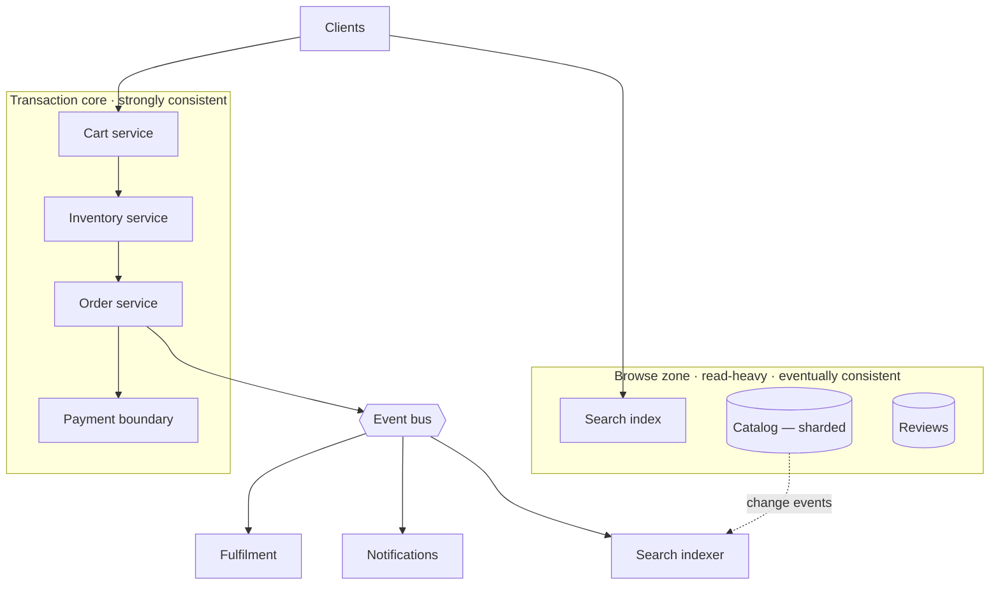
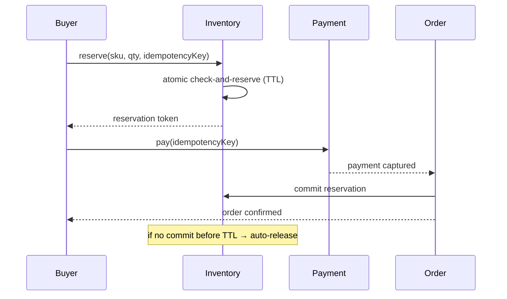
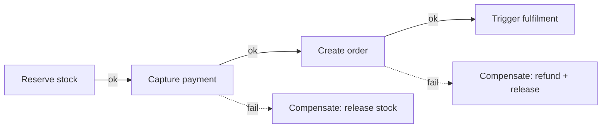

# 05 · Marketplace / E-Commerce — Architecture

Buyers, sellers, listings, carts, orders, payments. The defining problem is **correctness under
contention**: money and inventory must be exactly right even when thousands of buyers hit the same
hot item. This is the archetype where **strong consistency on a few critical paths** is
non-negotiable, while everything around it scales like [SaaS](../02-saas/architecture.md).

---

## Problem shape

- **Mixed consistency:** browsing/search is read-heavy and eventually-consistent (fine); **money and
  inventory are strongly consistent** (mandatory). The art is keeping the strong-consistency core
  small.
- **Hot-item contention:** a flash sale or drop concentrates writes on one SKU's stock count — a
  single-row hotspot that ordinary sharding doesn't solve.
- **Multi-party workflows:** checkout spans cart → inventory reserve → payment → order → fulfilment,
  across services that can each fail independently.
- **Capacity metric:** **write contention on hot inventory rows** and **checkout throughput**, plus
  standard search/browse read QPS.

---

## The two zones

- **Browse zone** scales exactly like [SaaS read paths](../02-saas/architecture.md): cache, read
  replicas, CDN, a search index kept fresh asynchronously via the
  [event bus](../99-patterns/queues-and-eventing.md). Slightly stale search results are acceptable.
- **Transaction core** is the small, carefully-guarded strongly-consistent island: cart, inventory,
  orders, payments.

Keeping these zones separate means 99% of traffic (browsing) never touches the consistency-critical
core.

---

## Correctness primitives

### Idempotency keys
Every mutating request (place order, charge) carries a client-generated **idempotency key**. A
retry with the same key returns the original result instead of charging twice. This is the single
most important e-commerce correctness rule — networks retry, users double-click, and money must not
double. See [queues/idempotency](../99-patterns/queues-and-eventing.md).

### Inventory reservation, not "decrement at pay"
Stock is **reserved** when added to cart/checkout (with a TTL), then **committed** on payment or
**released** on timeout/abandon. This prevents overselling without holding a DB lock for the whole
human-paced checkout.

### Saga + outbox for the multi-step checkout
Checkout spans services; a distributed transaction across them is impractical. Use a **saga**: each
step has a **compensating action** (release reservation, refund payment) so a failure midway unwinds
cleanly. State changes and the events that drive the next step are written together via the
**[outbox pattern](../99-patterns/queues-and-eventing.md)** so they can't diverge.

---

## Hot-item contention

A flash drop = thousands of buyers decrementing one stock row. Plain row-level locking serializes
everyone into a queue and collapses throughput. Mitigations:

- **Shard the counter:** split one SKU's stock into K sub-counters across rows/partitions; reserve
  from any sub-counter; sum for display. Spreads the write hotspot
  ([sharding hot keys](../99-patterns/sharding-partitioning.md)).
- **Queue the contention:** funnel reservations for the hot SKU through a single-writer
  [queue](../99-patterns/queues-and-eventing.md) that processes them in order at the row's max
  throughput, with the rest seeing an honest "in line" state — converts a lock stampede into an
  orderly stream.
- **Admission control:** a virtual waiting room / [rate limit](../99-patterns/failure-and-resilience.md)
  in front of the drop caps concurrent buyers to what the core can actually serve.

---

## 5-tier evolution

| Tier | Move | Driver |
|---|---|---|
| **T0 ~100** | monolith, one DB, in-process everything | ship |
| **T1 ~1k** | split DB + cache; payment via external boundary | box contention |
| **T2 ~10k** | app replicas + LB; read replicas + cache for browse; search index; queue | browse read load |
| **T3 ~100k** | shard catalog + orders; saga/outbox; event bus; strong-core isolation; SLOs | write wall + workflow complexity |
| **T4 ~1M** | multi-region cells; geo-routing; **payments/identity stay globally consistent**, catalog/inventory regionalized | region blast radius + global latency |

At **T4**, the central decision: **what must be globally consistent (identity, payment ledger) vs
cell-local (regional catalog, regional inventory)** — see
[multi-region cells](../99-patterns/multi-region-cells.md).

---

## Key tradeoffs

- **Reservation TTL:** short = stock frees fast but legit slow checkouts fail; long = abandoned
  carts lock stock. Tune per item velocity.
- **Counter sharding vs accuracy:** sharded counters make "exactly 1 left" displays approximate
  until summed — usually fine, sometimes not (last-item races need a single authority).
- **Saga complexity:** every step needs a correct compensator; more steps = more failure paths to
  reason about. Keep the transaction core minimal.

---

## Failure modes

- **Double charge** → prevented by idempotency keys; never retry a payment without one.
- **Oversell** → atomic reserve-with-TTL + (for drops) single-writer queue; never "check then
  decrement" in two steps.
- **Payment captured, order failed** → saga compensation refunds; outbox guarantees the compensating
  event fires.
- **Hot-SKU meltdown** → counter sharding + admission control + waiting room.
- **Region outage at T4** → cells fail independently; the **global payment ledger** is the one thing
  that must reconcile across regions.

---

## The three questions

- **Bottleneck:** **write contention on hot inventory rows** and **checkout/saga throughput** (the
  browse zone is just SaaS).
- **Failure domain:** AZ → cell; the strong-consistency core is the smallest, most-guarded zone.
- **Capacity metric:** **hot-row write contention** + **checkout throughput** — browse QPS is the
  easy part.
