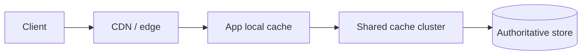
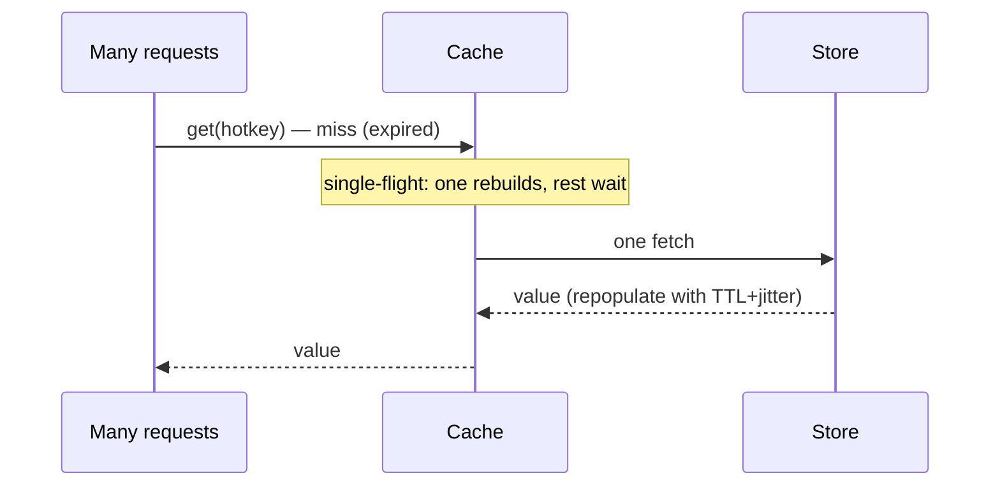

# Pattern · Caching

Keep load off the slow, expensive, authoritative store by serving from a fast copy. The cheapest
request is the one that never reaches the database.

---

## Where caches live (the layers)

Each layer absorbs what the one before it missed. Used across the playbook:
[SaaS read path](../02-saas/architecture.md), [social timelines](../03-social-feed/architecture.md),
[marketplace browse](../05-marketplace/architecture.md).

---

## Read strategies

| Strategy | How | Use when |
|---|---|---|
| **Look-aside (cache-aside)** | app checks cache; on miss, reads DB and populates | general default; app controls it |
| **Read-through** | cache library fetches from DB on miss | uniform access, less app code |
| **Write-through** | write goes to cache + DB together | reads must see latest write |
| **Write-behind** | write to cache, flush to DB async | write-heavy, can tolerate small loss window |

Default to **look-aside** — simple, explicit, and the app decides what's cacheable.

---

## The hard part: invalidation & stampedes

- **TTL + jitter:** never give many keys the same expiry — they expire together and stampede the DB.
  Add random jitter to TTLs.
- **Single-flight (request coalescing):** on a miss, let *one* request rebuild the key while others
  wait for it, instead of all hitting the DB at once.
- **Stale-while-revalidate:** serve the slightly-stale value while one background fetch refreshes it.
- **Explicit invalidation on write:** write-through or publish an invalidation event so caches drop
  the stale key.

---

## What to cache (and not)

- **Cache:** immutable or slow-changing, read-hot data — posts, profiles, catalog entries,
  rendered fragments, [follow graphs](../03-social-feed/architecture.md).
- **Don't cache:** the strongly-consistent core (money, [inventory](../05-marketplace/architecture.md)
  reservations) — or cache only for *display*, never for the decision.

---

## Per-tier (see [spine](../00-scaling-spine.md))

- **T0–T1:** in-process / one shared cache.
- **T2:** look-aside cache tier; stampede protection becomes necessary.
- **T3:** dedicated cache **cluster**, sized to hold the working set.
- **T4:** edge + regional + local layers; per-region caches in each [cell](multi-region-cells.md).

**Capacity metric:** **hit rate**. A few points of hit rate is the difference between coasting and
melting the primary.
