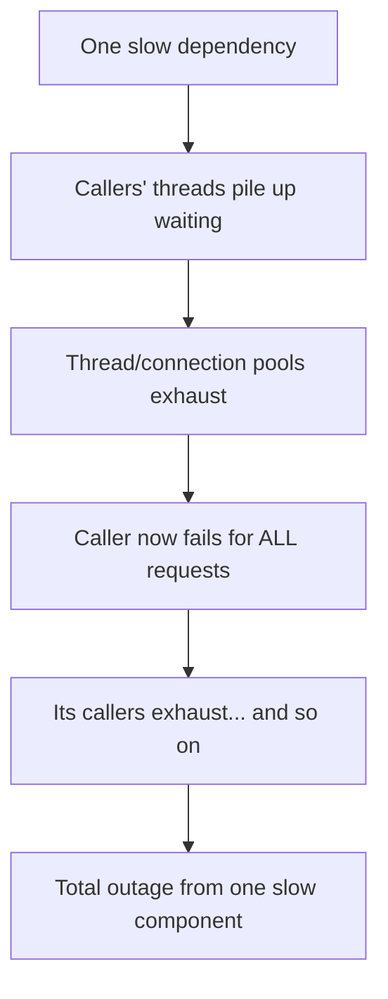
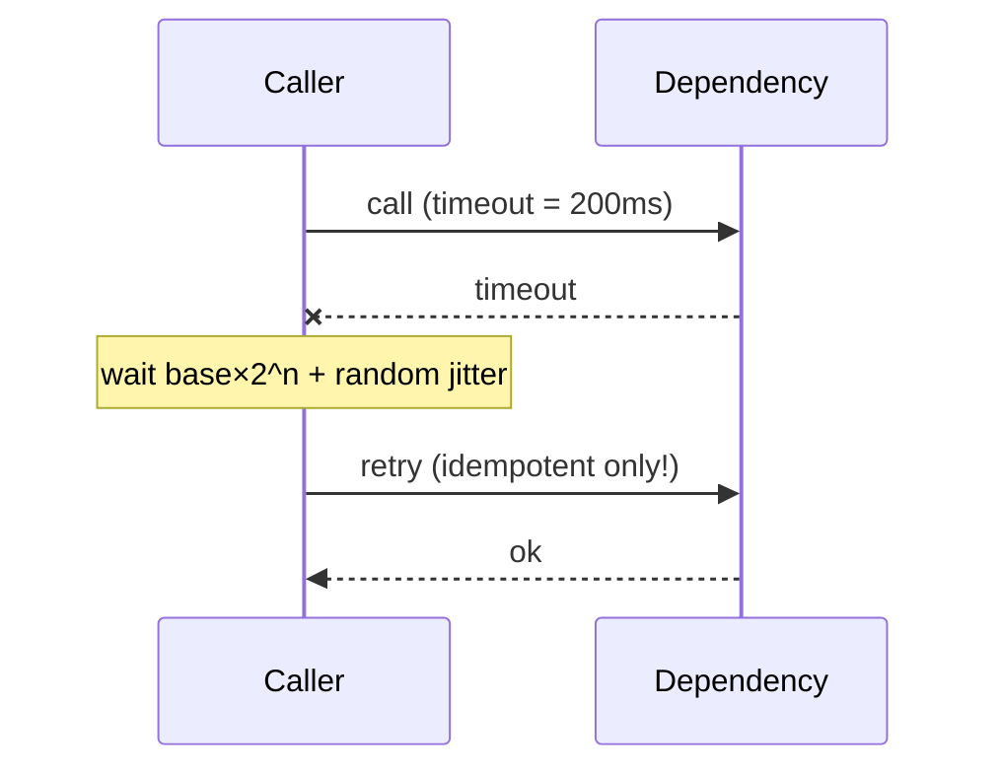
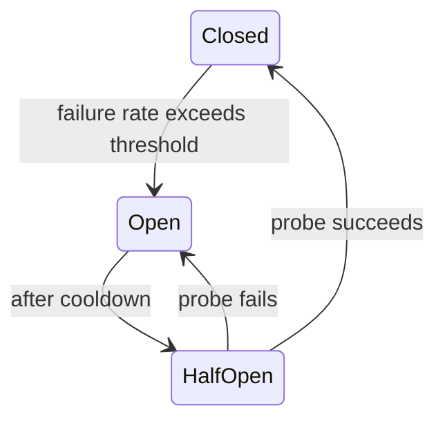

# Pattern · Failure & Resilience

At scale, failure is the steady state — something is always retrying, degraded, or down. Resilience
is designing so that **partial failure stays partial** instead of cascading into a full outage.

---

## The cascade you're preventing

Every pattern below is a brake on this chain.

---

## The resilience toolkit

| Pattern | What it does | Stops |
|---|---|---|
| **Timeouts** | cap how long you wait for any call | unbounded waits → thread pileup |
| **Retries + backoff + jitter** | retry transient failures, spaced out + randomized | retry storms / thundering herds |
| **Circuit breaker** | after N failures, stop calling a dead dependency; fail fast; probe to recover | hammering a down service |
| **Bulkheads** | isolate resources per dependency/tenant (separate pools) | one slow dependency draining all threads |
| **Backpressure** | signal upstream to slow down; bound queues | unbounded buildup → OOM |
| **Load shedding** | drop low-priority work when overloaded | total collapse under spike |
| **Graceful degradation** | serve a reduced experience, not an error | all-or-nothing failure |

### Timeouts + retries + jitter

- **Only retry [idempotent](queues-and-eventing.md) operations** — retrying a non-idempotent write
  double-charges. This is why idempotency keys are everywhere in this playbook.
- **Jitter is mandatory** — synchronized retries (everyone backs off the same amount) re-stampede
  in lockstep. Randomize.
- **Cap total retries + a budget** — infinite retries *are* a DoS on your own dependency.

### Circuit breaker states

Closed = calls flow. Open = fail fast, don't even try (give the dependency room to recover).
Half-open = send one probe to test recovery.

---

## Degradation over failure

When a dependency is down, **return less, not nothing**:
- [Feed](../03-social-feed/architecture.md) ranking service down → serve a chronological feed.
- [Marketplace](../05-marketplace/architecture.md) recommendations down → show the catalog without
  them.
- [Chat](../04-realtime-chat/architecture.md) presence down → hide the online dots, keep messaging.

Decide *in advance* what each feature degrades to. The core path (send message, place order, start
match) stays up; the garnish drops first.

---

## Testing failure: chaos

You don't know a failure path works until you've run it. **Chaos drills** inject failure on purpose
— kill a node, a [cell](multi-region-cells.md), a dependency — in controlled conditions, so the
[failover](multi-region-cells.md) and degradation paths are exercised before a real outage finds
the bug for you. Pair with [SLO](observability-slos.md) monitoring to measure the blast radius.

---

## Per-tier (see [spine](../00-scaling-spine.md))

- **T1–T2:** timeouts + idempotent retries on every cross-service/DB call. Non-negotiable from the
  start.
- **T3:** circuit breakers, bulkheads, [rate limiting + backpressure](load-balancing.md), load
  shedding; degradation paths defined.
- **T4:** chaos drills, per-[cell](multi-region-cells.md) failover rehearsal, regional load
  shedding.

**Capacity metric:** **blast radius** — when X fails, what fraction of users/requests fail with it.
Driving that number down is the whole point.
