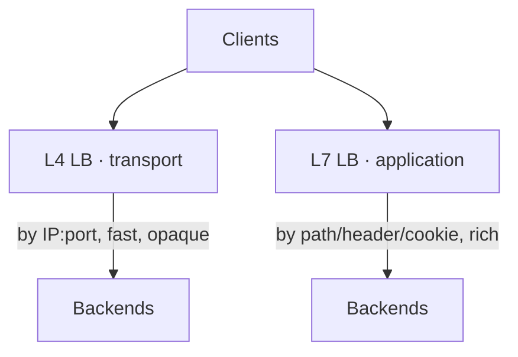
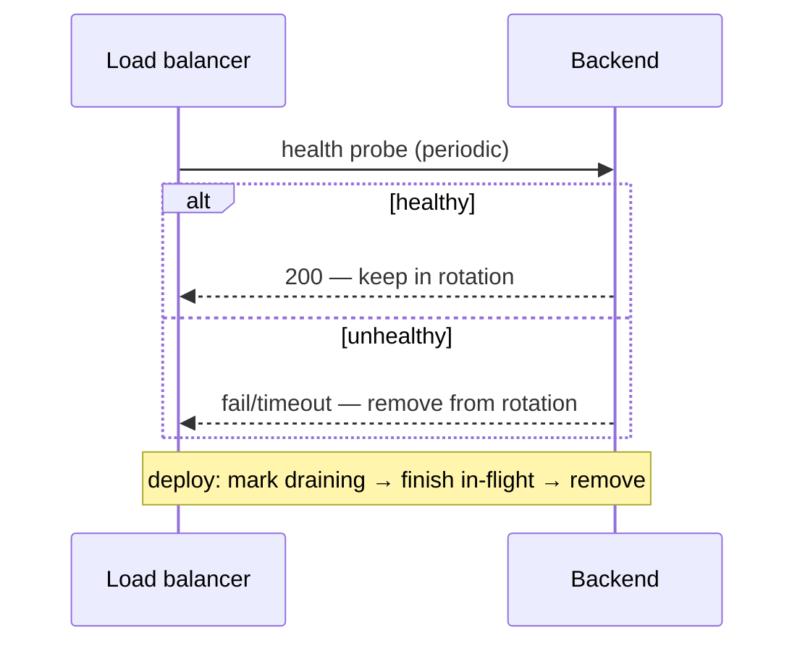

# Pattern · Load Balancing

Spread traffic across many backends so no single one saturates, and route around the dead ones.
The front door to every horizontally-scaled tier in this playbook.

> This repo already has a working load balancer (project 05, consistent hashing). This card is the
> conceptual companion.

---

## L4 vs L7

| Layer | Routes on | Can do | Cost |
|---|---|---|---|
| **L4** (transport) | IP/port | raw speed, any protocol | no app awareness |
| **L7** (application) | path, header, cookie, method | path routing, [rate limit](failure-and-resilience.md), retries, TLS | more CPU per request |

Most app tiers want **L7** (it enables routing + resilience features); ultra-high-throughput or
non-HTTP paths use **L4**.

---

## Balancing algorithms

| Algorithm | Idea | Use when |
|---|---|---|
| **Round-robin** | next backend in rotation | uniform, stateless backends |
| **Least-connections** | fewest in-flight | uneven request durations |
| **Weighted** | by backend capacity | mixed instance sizes |
| **Consistent hashing** | key → same backend | cache affinity, [sharded](sharding-partitioning.md) backends, [game allocation](../01-games/fleet-orchestration.md) |

**Consistent hashing** matters most when the backend holds state for a key (a cache shard, a
session) — it keeps a key on the same backend and moves minimal keys when the backend set changes.
(Note: a [game allocator](../01-games/fleet-orchestration.md) does the *opposite* of spread — it
packs — because game servers are stateful and capacity-quantized.)

---

## Health checks & draining

- **Active health checks** pull dead/slow backends out before users hit them.
- **Graceful draining** on deploy/scale-down: stop sending *new* requests, let in-flight finish,
  then remove — the standard for stateless tiers. (Stateful
  [game servers](../01-games/fleet-orchestration.md) drain by finishing the *match*, not the
  request.)
- **Outlier ejection:** temporarily eject a backend throwing errors even if it passes health checks.

---

## Beyond one LB (T4)

- **Geo / anycast routing:** send users to the nearest healthy [region/cell](multi-region-cells.md);
  shed an entire dead region by withdrawing it from routing.
- **Edge termination:** terminate TLS and serve [cached](caching.md) responses at the edge before
  traffic reaches origin.
- **Multi-tier:** global geo-router → regional L7 → service-level routing.

---

## Per-tier (see [spine](../00-scaling-spine.md))

- **T1:** one LB + health checks in front of the app.
- **T2:** LB + autoscaling group; round-robin/least-conn.
- **T3:** L7 routing with [rate limiting + backpressure + circuit breaking](failure-and-resilience.md).
- **T4:** geo/anycast routing across [cells](multi-region-cells.md) + edge.

**Capacity metric:** **backend saturation spread** (no hot backend) and **healthy-backend count**
vs offered load.
